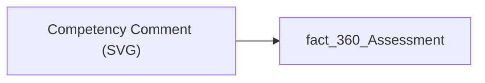

# Competency Comment (SVG)

## Технічний опис

| Властивість | Значення |
|---|---|
| Тип | міра |
| Home table | _Measures |
| displayFolder | — |
| formatString | — |
| dataType | — |
| Прихована | ні |

### DAX

```dax
-- Виводить текст поля fact_360_Assessment[Competency_Comment] як SVG-картку.
-- Рендер тексту з автоматичним переносом рядків зроблено через <foreignObject> + XHTML <div>,
-- бо нативний SVG-растеризатор Power BI не вміє переносити <text>; foreignObject дає word-wrap, justify і скрол.

VAR _raw = SELECTEDVALUE ( fact_360_Assessment[Competency_Comment] )

-- ЕКРАНУВАННЯ. Порядок строгий, інакше буде подвійне екранування.
-- 1) "%" -> "%25" робиться ПЕРШИМ, бо далі ми самі додаємо "%23" (для #) і його не можна повторно кодувати.
VAR _e1 = SUBSTITUTE ( _raw, "%", "%25" )
-- 2) "&" -> "&amp;" перед усіма іншими сутностями, інакше "&amp;" перетвориться на "&amp;amp;".
VAR _e2 = SUBSTITUTE ( _e1, "&", "&amp;" )
-- 3) "<" і ">" у тексті екрануються, щоб довільний символ не зламав XML-розмітку SVG.
VAR _e3 = SUBSTITUTE ( _e2, "<", "&lt;" )
VAR _e4 = SUBSTITUTE ( _e3, ">", "&gt;" )
-- 4) "#" -> "%23": у data-URI символ # інакше трактується як якір і обрізає рядок.
VAR _e5 = SUBSTITUTE ( _e4, "#", "%23" )
-- 5) подвійні лапки -> &quot; (не обов'язково для тексту-вмісту, але безпечно).
VAR _e6 = SUBSTITUTE ( _e5, """", "&quot;" )
-- 6) Переноси рядків -> <br/>. Робиться ПІСЛЯ екранування < >, щоб теги <br/> лишились тегами.
--    UNICHAR(13)=CR, UNICHAR(10)=LF. Спочатку пара CRLF, потім одиночні.
VAR _e7 = SUBSTITUTE ( _e6, UNICHAR ( 13 ) & UNICHAR ( 10 ), "<br/>" )
VAR _e8 = SUBSTITUTE ( _e7, UNICHAR ( 10 ), "<br/>" )
VAR _e9 = SUBSTITUTE ( _e8, UNICHAR ( 13 ), "<br/>" )

-- Заглушка, якщо в контексті нема рядка або текст порожній.
VAR _txt =
    IF ( ISBLANK ( _raw ) || LEN ( TRIM ( _raw ) ) = 0, "—", _e9 )

-- РОЗМІТКА.
-- viewBox і width/height = 1253x401 (точний розмір візуала).
-- Кольори записані вже як %23RRGGBB, лапки атрибутів — одинарні, символів & нема:
-- тому НЕ потрібен фінальний загальний SUBSTITUTE зі скіла (він би подвійно екранував текст).
VAR _svg =
    "<svg xmlns='http://www.w3.org/2000/svg' width='1253' height='401' viewBox='0 0 1253 401'>"
        & "<foreignObject x='0' y='0' width='1253' height='401'>"
            & "<div xmlns='http://www.w3.org/1999/xhtml' style='box-sizing:border-box;display:flex;flex-direction:column;position:relative;width:1253px;height:401px;font-family:Segoe UI,Arial,sans-serif;background:%23FFFFFF;border:1px solid %23E1E4E8;border-radius:12px;overflow:hidden;'>"
                -- стилізація скролбару (працює у Chromium-рендері HTML-візуала)
                & "<style>.cc-scroll::-webkit-scrollbar{width:8px}.cc-scroll::-webkit-scrollbar-thumb{background:%23063E61;border-radius:4px}.cc-scroll::-webkit-scrollbar-track{background:%23EEF1F4;border-radius:4px}</style>"
                -- область прокрутки: flex:1 + min-height:0 дозволяють вертикальний скрол усередині фіксованої висоти
                & "<div class='cc-scroll' style='flex:1 1 auto;min-height:0;overflow-y:auto;padding:20px 30px 26px 30px;'>"
                    & "<div style='max-width:900px;margin:0 auto;'>"
                        -- заголовок картки
                        & "<div style='font-size:11px;font-weight:600;letter-spacing:0.07em;text-transform:uppercase;color:%23063E61;border-bottom:2px solid %23063E61;padding-bottom:7px;margin-bottom:14px;'>Коментар &#183; оцінка компетенцій (360&#176;)</div>"
                        -- сам текст: 13.5px, міжрядковий 1.65, вирівнювання по ширині
                        & "<div style='font-size:13.5px;line-height:1.65;color:%23333333;text-align:justify;'>" & _txt & "</div>"
                    & "</div>"
                & "</div>"
                -- нижній градієнт-натяк, що текст продовжується (overlay, не блокує скрол)
                & "<div style='position:absolute;left:1px;right:1px;bottom:1px;height:26px;border-radius:0 0 11px 11px;background:linear-gradient(to top,%23FFFFFF,rgba(255,255,255,0));pointer-events:none;'></div>"
            & "</div>"
        & "</foreignObject>"
    & "</svg>"

RETURN
    "data:image/svg+xml;utf8," & _svg
```

### Джерела даних

Вихідні таблиці: `DM.vw_R27_fact_360_Assessment`

Колонки: `Competency_Comment`

Power Query: `fact_360_Assessment`

### Залежності (таблиці й колонки)

Таблиці: `fact_360_Assessment`

Колонки: `fact_360_Assessment[Competency_Comment]`

### Схема



---

## Бізнес-суть

!!! note "Бізнес-визначення відсутнє"
    Поля міри не зіставлено з wiki «Таблицями джерел даних». Можна заповнити вручну в `manualNotes`.

## На сторінках звіту

_Не використовується на основних сторінках звіту._

## Пов'язані міри

_Прямих зв'язків з іншими мірами немає._

## Нотатки

_порожньо_
