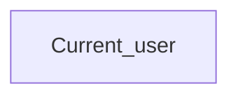

# Current_user

*тека `USER`*

## Технічний опис

| Властивість | Значення |
|---|---|
| Тип | міра |
| Home table | _Measures |
| displayFolder | `USER` |
| formatString | — |
| dataType | — |
| Прихована | ні |

### DAX

```dax
USERPRINCIPALNAME()
```

### Джерела даних

—

### Залежності (таблиці й колонки)

—

### Схема



---

## Бізнес-суть

!!! note "Бізнес-визначення відсутнє"
    Поля міри не зіставлено з wiki «Таблицями джерел даних». Можна заповнити вручну в `manualNotes`.

## На сторінках звіту

_Не використовується на основних сторінках звіту._

## Пов'язані міри

**Використовується в:** [GP.NavigationButton2](../measures/gp-navigationbutton2.md), [GP.Start_Page_NavigationButton](../measures/gp-start-page-navigationbutton.md)

## Нотатки

_порожньо_
