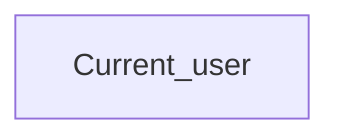

# Current_user

| Властивість | Значення |
|---|---|
| Тип | міра |
| Home table | _Measures |
| displayFolder | `USER` |
| formatString | — |
| dataType | — |
| Прихована | ні |

## DAX

```dax
USERPRINCIPALNAME()
```

## Джерела

—

## Бізнес-суть

!!! warning "Без бізнес-визначення"
    Поля міри не знайдено у wiki «Таблицях джерел даних». Заповніть `manualNotes`.

## Залежності

—

## Схема



## Нотатки

_порожньо_
