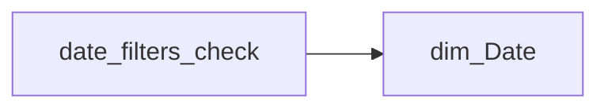

# date_filters_check

| Властивість | Значення |
|---|---|
| Тип | міра |
| Home table | _Measures |
| displayFolder | `_Technical` |
| formatString | — |
| dataType | — |
| Прихована | ні |

## DAX

```dax
VAR _period =                                               //Сюди підставляємо фільтр контексту
	VAR __Win =         
		VAR __EndMonth = EOMONTH( TODAY(), -1 ) 
	RETURN DATESINPERIOD( dim_Date[Date], __EndMonth, -3, MONTH )
RETURN 
	CALCULATETABLE(
		VALUES('dim_Date'[Date]),
		__Win
	)
VAR _mind = 
	CALCULATE(
		MIN('dim_Date'[Date]),
		
		_period
	)
VAR _maxd = 
	CALCULATE(
		MAX('dim_Date'[Date]),
		_period
	)
VAR result = 
FORMAT(_mind, "dd.mm.yyyy") & " - " & FORMAT(_maxd, "dd.mm.yyyy")
RETURN result
```

## Джерела


Колонки: `Date`

Power Query: `dim_Date`

## Бізнес-суть

!!! warning "Без бізнес-визначення"
    Поля міри не знайдено у wiki «Таблицях джерел даних». Заповніть `manualNotes`.

## Залежності

Таблиці: `dim_Date`

Колонки: `dim_Date[Date]`

## Схема



## Нотатки

_порожньо_
