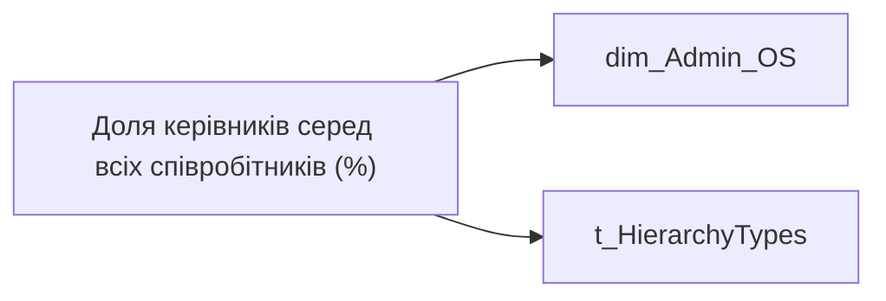

# Доля керівників серед всіх співробітників (%)

*тека `Group_Profile\Загальна інформація`*

## Технічний опис

| Властивість | Значення |
|---|---|
| Тип | міра |
| Home table | _Measures |
| displayFolder | `Group_Profile\Загальна інформація` |
| formatString | — |
| dataType | — |
| Прихована | ні |

### DAX

```dax
VAR _filter_lt= TREATAS(VALUES( dim_Admin_LT_OS[USER_ACCESS_ID] ), 'dim_Admin_OS'[USER_ACCESS_ID])
VAR _admin =
DIVIDE(
    CALCULATE(
        COUNTROWS('dim_Admin_OS'),
        FILTER(
            'dim_Admin_OS', 
            'dim_Admin_OS'[IS_MANAGER] = TRUE())),
    CALCULATE(
        COUNTROWS('dim_Admin_OS')),
    BLANK())

VAR _admin_lt = 
DIVIDE(
    CALCULATE(
        COUNTROWS('dim_Admin_OS'),
        FILTER(
            'dim_Admin_OS', 
            'dim_Admin_OS'[IS_MANAGER] = TRUE()),
        _filter_lt),
    CALCULATE(
        COUNTROWS('dim_Admin_OS'), _filter_lt),
    BLANK())

VAR _res = 
    SWITCH(
        SELECTEDVALUE('t_HierarchyTypes'[Index]),
        0, _admin_lt,
        1, _admin)
        
RETURN 
TRIM(
    FORMAT(
        COALESCE(_res, 0), 
        "0.00%"))
```

### Джерела даних

Вихідні таблиці: `DM.vw_R27_dim_Employee_Access_List`

Колонки: `IS_MANAGER`, `Index`, `USER_ACCESS_ID`

Power Query: `dim_Admin_OS`

### Залежності (таблиці й колонки)

Таблиці: `dim_Admin_OS`, `t_HierarchyTypes`

Колонки: `dim_Admin_OS[IS_MANAGER]`, `dim_Admin_OS[USER_ACCESS_ID]`, `t_HierarchyTypes[Index]`

### Схема



---

## Бізнес-суть

IS_MANAGER → Кількість керівників; IS_MANAGER → Керівник; IS_MANAGER → Доля керівників серед всіх співробітників (%); IS_MANAGER → Керівник - ПІБ керівника команди

Відібрати із переліку усіх членів команди тих, у кого поле is_manager = 1 Якщо lead team - то ПІБ керівника цієї команди (поточного користувача).  <br>Якщо структурна одиниця- ПІБ керівника визначати по кадровому підрозділу цієї одиниці.  <br>Потрібно відібрати в кадровому підрозділі запис в якому is_manager =true та вивести ПІБ.  <br>Якщо для кадрового підрозділу відсутній такий запис, то вивести "Дані відсутні"  <br>Це поле має бути доступне у візуалізаціях, побудованих на основі фактової таблиці [dm.vw_R27_fact_Employee_List]. Керівником вважається той працівник, який має підлеглих.

**Вимоги:** `Командний-профіль/Паспортна-частина-групового-профілю/Редизайн-паспортної-частини-групового-профілю`, `Командний-профіль/Паспортна-частина-групового-профілю/Сторінка-Картка-команди`, `Командний-профіль/Сторінка-Ефективність`, `Командний-профіль/Сторінка-Загальна-інформація-про-команду`

## На сторінках звіту

[Group Profile](../report/group-profile.md)

## Пов'язані міри

_Прямих зв'язків з іншими мірами немає._

## Нотатки

_порожньо_
