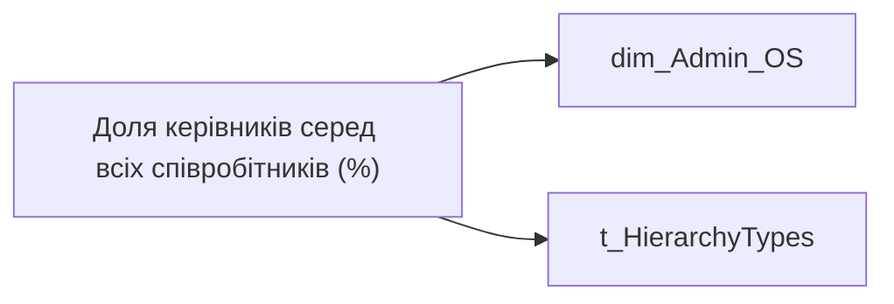

# Доля керівників серед всіх співробітників (%)

*тека `Group_Profile\Загальна інформація`*

## Технічний опис

| Властивість | Значення |
|---|---|
| Тип | міра |
| Home table | _Measures |
| displayFolder | `Group_Profile\Загальна інформація` |
| formatString | — |
| dataType | — |
| Прихована | ні |

### DAX

```dax
VAR _filter_lt= TREATAS(VALUES( dim_Admin_LT_OS[USER_ACCESS_ID] ), 'dim_Admin_OS'[USER_ACCESS_ID])
VAR _admin =
DIVIDE(
    CALCULATE(
        COUNTROWS('dim_Admin_OS'),
        FILTER(
            'dim_Admin_OS', 
            'dim_Admin_OS'[IS_MANAGER] = TRUE())),
    CALCULATE(
        COUNTROWS('dim_Admin_OS')),
    BLANK())

VAR _admin_lt = 
DIVIDE(
    CALCULATE(
        COUNTROWS('dim_Admin_OS'),
        FILTER(
            'dim_Admin_OS', 
            'dim_Admin_OS'[IS_MANAGER] = TRUE()),
        _filter_lt),
    CALCULATE(
        COUNTROWS('dim_Admin_OS'), _filter_lt),
    BLANK())

VAR _res = 
    SWITCH(
        SELECTEDVALUE('t_HierarchyTypes'[Index]),
        0, _admin_lt,
        1, _admin)
        
RETURN 
TRIM(
    FORMAT(
        COALESCE(_res, 0), 
        "0.00%"))
```

### Джерела даних

Вихідні таблиці: `DM.vw_R27_dim_Employee_Access_List`

Колонки: `IS_MANAGER`, `Index`, `USER_ACCESS_ID`

Power Query: `dim_Admin_OS`

### Залежності (таблиці й колонки)

Таблиці: `dim_Admin_OS`, `t_HierarchyTypes`

Колонки: `dim_Admin_OS[IS_MANAGER]`, `dim_Admin_OS[USER_ACCESS_ID]`, `t_HierarchyTypes[Index]`

### Схема



---

## Бізнес-суть

**Бізнес-назва:** Доля керівників серед всіх співробітників (%)

### Опис із ТЗ

Керівником вважається той працівник, який має підлеглих.

??? note "Поля-джерела та пов'язані бізнес-метрики (4)"
    | Поле | Бізнес-метрики |
    |---|---|
    | `IS_MANAGER` | Кількість керівників · Керівник · Доля керівників серед всіх співробітників (%) · Керівник - ПІБ керівника команди |

**Вимоги (ТЗ):**

- [Командний профіль › Паспортна частина групового профілю › Редизайн паспортної частини групового профілю](https://dev.azure.com/MHPITDepProjects/People%20Digital%20Profile%20%28PDP%29/_wiki/wikis/PDP.wiki?pagePath=/%D0%A4%D1%83%D0%BD%D0%BA%D1%86%D1%96%D0%BE%D0%BD%D0%B0%D0%BB%D1%8C%D0%BD%D1%96%20%D0%B2%D0%B8%D0%BC%D0%BE%D0%B3%D0%B8/%D0%92%D0%B8%D0%BC%D0%BE%D0%B3%D0%B8%20%D0%B4%D0%BE%20%D0%B7%D0%B2%D1%96%D1%82%D1%83%20People%20Digital%20Profile/%D0%9A%D0%BE%D0%BC%D0%B0%D0%BD%D0%B4%D0%BD%D0%B8%D0%B9%20%D0%BF%D1%80%D0%BE%D1%84%D1%96%D0%BB%D1%8C/%D0%9F%D0%B0%D1%81%D0%BF%D0%BE%D1%80%D1%82%D0%BD%D0%B0%20%D1%87%D0%B0%D1%81%D1%82%D0%B8%D0%BD%D0%B0%20%D0%B3%D1%80%D1%83%D0%BF%D0%BE%D0%B2%D0%BE%D0%B3%D0%BE%20%D0%BF%D1%80%D0%BE%D1%84%D1%96%D0%BB%D1%8E/%D0%A0%D0%B5%D0%B4%D0%B8%D0%B7%D0%B0%D0%B9%D0%BD%20%D0%BF%D0%B0%D1%81%D0%BF%D0%BE%D1%80%D1%82%D0%BD%D0%BE%D1%97%20%D1%87%D0%B0%D1%81%D1%82%D0%B8%D0%BD%D0%B8%20%D0%B3%D1%80%D1%83%D0%BF%D0%BE%D0%B2%D0%BE%D0%B3%D0%BE%20%D0%BF%D1%80%D0%BE%D1%84%D1%96%D0%BB%D1%8E)
- [Командний профіль › Паспортна частина групового профілю › Сторінка Картка команди](https://dev.azure.com/MHPITDepProjects/People%20Digital%20Profile%20%28PDP%29/_wiki/wikis/PDP.wiki?pagePath=/%D0%A4%D1%83%D0%BD%D0%BA%D1%86%D1%96%D0%BE%D0%BD%D0%B0%D0%BB%D1%8C%D0%BD%D1%96%20%D0%B2%D0%B8%D0%BC%D0%BE%D0%B3%D0%B8/%D0%92%D0%B8%D0%BC%D0%BE%D0%B3%D0%B8%20%D0%B4%D0%BE%20%D0%B7%D0%B2%D1%96%D1%82%D1%83%20People%20Digital%20Profile/%D0%9A%D0%BE%D0%BC%D0%B0%D0%BD%D0%B4%D0%BD%D0%B8%D0%B9%20%D0%BF%D1%80%D0%BE%D1%84%D1%96%D0%BB%D1%8C/%D0%9F%D0%B0%D1%81%D0%BF%D0%BE%D1%80%D1%82%D0%BD%D0%B0%20%D1%87%D0%B0%D1%81%D1%82%D0%B8%D0%BD%D0%B0%20%D0%B3%D1%80%D1%83%D0%BF%D0%BE%D0%B2%D0%BE%D0%B3%D0%BE%20%D0%BF%D1%80%D0%BE%D1%84%D1%96%D0%BB%D1%8E/%D0%A1%D1%82%D0%BE%D1%80%D1%96%D0%BD%D0%BA%D0%B0%20%D0%9A%D0%B0%D1%80%D1%82%D0%BA%D0%B0%20%D0%BA%D0%BE%D0%BC%D0%B0%D0%BD%D0%B4%D0%B8)
- [Командний профіль › Сторінка Ефективність](https://dev.azure.com/MHPITDepProjects/People%20Digital%20Profile%20%28PDP%29/_wiki/wikis/PDP.wiki?pagePath=/%D0%A4%D1%83%D0%BD%D0%BA%D1%86%D1%96%D0%BE%D0%BD%D0%B0%D0%BB%D1%8C%D0%BD%D1%96%20%D0%B2%D0%B8%D0%BC%D0%BE%D0%B3%D0%B8/%D0%92%D0%B8%D0%BC%D0%BE%D0%B3%D0%B8%20%D0%B4%D0%BE%20%D0%B7%D0%B2%D1%96%D1%82%D1%83%20People%20Digital%20Profile/%D0%9A%D0%BE%D0%BC%D0%B0%D0%BD%D0%B4%D0%BD%D0%B8%D0%B9%20%D0%BF%D1%80%D0%BE%D1%84%D1%96%D0%BB%D1%8C/%D0%A1%D1%82%D0%BE%D1%80%D1%96%D0%BD%D0%BA%D0%B0%20%D0%95%D1%84%D0%B5%D0%BA%D1%82%D0%B8%D0%B2%D0%BD%D1%96%D1%81%D1%82%D1%8C)
- [Командний профіль › Сторінка Загальна інформація про команду](https://dev.azure.com/MHPITDepProjects/People%20Digital%20Profile%20%28PDP%29/_wiki/wikis/PDP.wiki?pagePath=/%D0%A4%D1%83%D0%BD%D0%BA%D1%86%D1%96%D0%BE%D0%BD%D0%B0%D0%BB%D1%8C%D0%BD%D1%96%20%D0%B2%D0%B8%D0%BC%D0%BE%D0%B3%D0%B8/%D0%92%D0%B8%D0%BC%D0%BE%D0%B3%D0%B8%20%D0%B4%D0%BE%20%D0%B7%D0%B2%D1%96%D1%82%D1%83%20People%20Digital%20Profile/%D0%9A%D0%BE%D0%BC%D0%B0%D0%BD%D0%B4%D0%BD%D0%B8%D0%B9%20%D0%BF%D1%80%D0%BE%D1%84%D1%96%D0%BB%D1%8C/%D0%A1%D1%82%D0%BE%D1%80%D1%96%D0%BD%D0%BA%D0%B0%20%D0%97%D0%B0%D0%B3%D0%B0%D0%BB%D1%8C%D0%BD%D0%B0%20%D1%96%D0%BD%D1%84%D0%BE%D1%80%D0%BC%D0%B0%D1%86%D1%96%D1%8F%20%D0%BF%D1%80%D0%BE%20%D0%BA%D0%BE%D0%BC%D0%B0%D0%BD%D0%B4%D1%83)

## На сторінках звіту

[Group Profile](../report/group-profile.md)

## Пов'язані міри

_Прямих зв'язків з іншими мірами немає._

## Нотатки

_порожньо_
