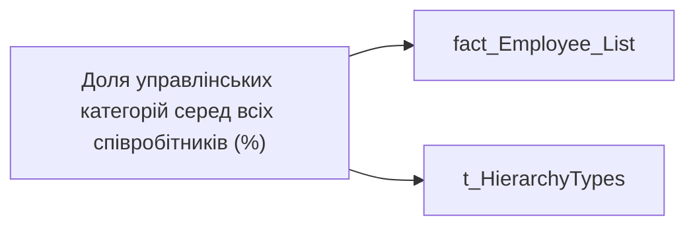

# Доля управлінських категорій серед всіх співробітників (%)

*тека `Group_Profile\Загальна інформація`*

## Технічний опис

| Властивість | Значення |
|---|---|
| Тип | міра |
| Home table | _Measures |
| displayFolder | `Group_Profile\Загальна інформація` |
| formatString | — |
| dataType | — |
| Прихована | ні |

### DAX

```dax
VAR _filter_lt= TREATAS(VALUES( dim_Admin_LT_OS[USER_ACCESS_ID] ), 'fact_Employee_List'[USER_ACCESS_ID])
VAR _admin =
DIVIDE(
    CALCULATE(
        COUNTROWS('fact_Employee_List'),
        FILTER(
            'fact_Employee_List', 
            'fact_Employee_List'[POSITION_CATEGORY_DETAIL] IN 
            {"Топ-менеджмент", "Середній менеджмент", "Старший менеджмент А+", "Старший менеджмент А", "Старший менеджмент В", "Старший менеджмент С", "Лінійні керівники"})),
    CALCULATE(
        COUNTROWS('fact_Employee_List')),
    BLANK())

VAR _admin_lt = 
DIVIDE(
    CALCULATE(
        COUNTROWS('fact_Employee_List'),
        FILTER(
            'fact_Employee_List', 
            'fact_Employee_List'[POSITION_CATEGORY_DETAIL] IN 
            {"Топ-менеджмент", "Середній менеджмент", "Старший менеджмент А+", "Старший менеджмент А", "Старший менеджмент В", "Старший менеджмент С", "Лінійні керівники"}),
        _filter_lt),
    CALCULATE(
        COUNTROWS('fact_Employee_List'), _filter_lt),
    BLANK())

VAR _res = 
    SWITCH(
        SELECTEDVALUE('t_HierarchyTypes'[Index]),
        0, _admin_lt,
        1, _admin)
        
RETURN 
TRIM(
    FORMAT(
        COALESCE(_res, 0), 
        "0.00%"))
```

### Джерела даних


Колонки: `Index`, `POSITION_CATEGORY_DETAIL`, `USER_ACCESS_ID`

Power Query: `fact_Employee_List`

### Залежності (таблиці й колонки)

Таблиці: `fact_Employee_List`, `t_HierarchyTypes`

Колонки: `fact_Employee_List[POSITION_CATEGORY_DETAIL]`, `fact_Employee_List[USER_ACCESS_ID]`, `t_HierarchyTypes[Index]`

### Схема



---

## Бізнес-суть

!!! note "Бізнес-визначення відсутнє"
    Поля міри не зіставлено з wiki «Таблицями джерел даних». Можна заповнити вручну в `manualNotes`.

## На сторінках звіту

[Group Profile](../report/group-profile.md)

## Пов'язані міри

_Прямих зв'язків з іншими мірами немає._

## Нотатки

_порожньо_
