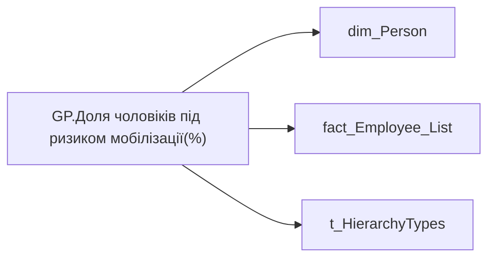

# GP.Доля чоловіків під ризиком мобілізації(%)

| Властивість | Значення |
|---|---|
| Тип | міра |
| Home table | _Measures |
| displayFolder | `Group_Profile\_Main\Дані про команду` |
| formatString | — |
| dataType | — |
| Прихована | ні |

## DAX

```dax
VAR _admin = 
	DIVIDE(
		CALCULATE(
			COUNTROWS(VALUES('fact_Employee_List'[EMPLOYEE_ID])),
			'fact_Employee_List'[IS_AT_RISK] = 1,
			'dim_Person'[GENDER] = "ЧОЛОВІКИ"
		),
		CALCULATE(
			COUNTROWS(VALUES('fact_Employee_List'[EMPLOYEE_ID])),
			'dim_Person'[GENDER] = "ЧОЛОВІКИ"
		)
	)
VAR _admin_lt = 
	CALCULATE(
		DIVIDE(
			CALCULATE(
				COUNTROWS(VALUES('fact_Employee_List'[EMPLOYEE_ID])),
				'fact_Employee_List'[IS_AT_RISK] = 1,
				'dim_Person'[GENDER] = "ЧОЛОВІКИ"
			),
			CALCULATE(
				COUNTROWS(VALUES('fact_Employee_List'[EMPLOYEE_ID])),
				'dim_Person'[GENDER] = "ЧОЛОВІКИ"
			)
		),
		TREATAS( VALUES( 'dim_Admin_LT_OS'[USER_ACCESS_ID] ), fact_Employee_List[USER_ACCESS_ID] )
	) 
VAR _res = 
	SWITCH(
		SELECTEDVALUE('t_HierarchyTypes'[Index]),
		0, _admin_lt,
		1, _admin
	)
RETURN 
	TRIM(
		FORMAT(
			COALESCE(_res, 0),
			"0.00%"
		) 
	)
```

## Джерела

Вихідні таблиці: `DM.vw_R27_dim_Person_PDP`

Колонки: `EMPLOYEE_ID`, `GENDER`, `IS_AT_RISK`, `Index`, `USER_ACCESS_ID`

Power Query: `dim_Person`

## Бізнес-суть

GENDER → Стать; IS_AT_RISK → Під ризиком мобілізації; IS_AT_RISK → Ризик мобілізації; IS_AT_RISK → Доля чоловіків під ризиком мобілізації (%)

1 - під ризиком. 0 - ризик відсутній <br>  <br>Якщо 1 - Так, якщо 0 - Ні. Розрахункове поле. Відношення кількості чоловіків під ризиком мобілізації, is_at_risk = 1 до загальної кількості чоловіків у команді Розрахункове поле. Відношення кількості чоловіків під ризиком мобілізації, is_at_risk = 1 до загальної кількості чоловіків у команді  <br>

**Вимоги:** `Індивідуальний-профіль-працівника/Паспортна-частина-індивідуального-профілю-співробітника`, `Індивідуальний-профіль-працівника/Паспортна-частина-індивідуального-профілю-співробітника/Сторінка-Картка-(паспорт)-працівника/Редизайн-паспортної-частини`, `Індивідуальний-профіль-працівника/Сторінка-Загальна-інформація-про-працівника`, `Індивідуальний-профіль-працівника/Сторінка-Результативність-та-оцінка`, `Командний-профіль/Паспортна-частина-групового-профілю/Сторінка-Картка-команди`, `Командний-профіль/Сторінка-Загальна-інформація-про-команду`, `Командний-профіль/Сторінка-Загальна-інформація-про-команду/Редизайн-сторінки-Загальна-інформація`, `Командний-профіль/Сторінка-Моя-команда/ТЗ.-Деталізація-метрик-групового-профілю-звіту`, `Командний-профіль/Сторінка-Результативність-та-оцінка-команди/Створити-блок-Виконання-OKR`

## Залежності

Таблиці: `dim_Person`, `fact_Employee_List`, `t_HierarchyTypes`

Колонки: `dim_Admin_LT_OS[USER_ACCESS_ID]`, `dim_Person[GENDER]`, `fact_Employee_List[EMPLOYEE_ID]`, `fact_Employee_List[IS_AT_RISK]`, `fact_Employee_List[USER_ACCESS_ID]`, `t_HierarchyTypes[Index]`

## Схема



## Нотатки

_порожньо_
