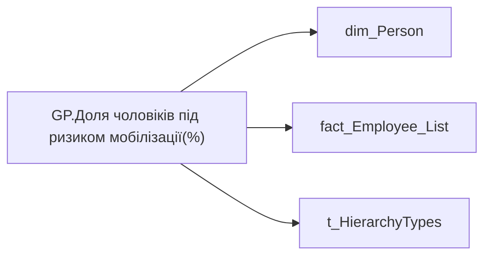

# GP.Доля чоловіків під ризиком мобілізації(%)

*тека `Group_Profile\_Main\Дані про команду`*

## Технічний опис

| Властивість | Значення |
|---|---|
| Тип | міра |
| Home table | _Measures |
| displayFolder | `Group_Profile\_Main\Дані про команду` |
| formatString | — |
| dataType | — |
| Прихована | ні |

### DAX

```dax
VAR _admin = 
	DIVIDE(
		CALCULATE(
			COUNTROWS(VALUES('fact_Employee_List'[EMPLOYEE_ID])),
			'fact_Employee_List'[IS_AT_RISK] = 1,
			'dim_Person'[GENDER] = "ЧОЛОВІКИ"
		),
		CALCULATE(
			COUNTROWS(VALUES('fact_Employee_List'[EMPLOYEE_ID])),
			'dim_Person'[GENDER] = "ЧОЛОВІКИ"
		)
	)
VAR _admin_lt = 
	CALCULATE(
		DIVIDE(
			CALCULATE(
				COUNTROWS(VALUES('fact_Employee_List'[EMPLOYEE_ID])),
				'fact_Employee_List'[IS_AT_RISK] = 1,
				'dim_Person'[GENDER] = "ЧОЛОВІКИ"
			),
			CALCULATE(
				COUNTROWS(VALUES('fact_Employee_List'[EMPLOYEE_ID])),
				'dim_Person'[GENDER] = "ЧОЛОВІКИ"
			)
		),
		TREATAS( VALUES( 'dim_Admin_LT_OS'[USER_ACCESS_ID] ), fact_Employee_List[USER_ACCESS_ID] )
	) 
VAR _res = 
	SWITCH(
		SELECTEDVALUE('t_HierarchyTypes'[Index]),
		0, _admin_lt,
		1, _admin
	)
RETURN 
	TRIM(
		FORMAT(
			COALESCE(_res, 0),
			"0.00%"
		) 
	)
```

### Джерела даних

Вихідні таблиці: `DM.vw_R27_dim_Person_PDP`

Колонки: `EMPLOYEE_ID`, `GENDER`, `IS_AT_RISK`, `Index`, `USER_ACCESS_ID`

Power Query: `dim_Person`

### Залежності (таблиці й колонки)

Таблиці: `dim_Person`, `fact_Employee_List`, `t_HierarchyTypes`

Колонки: `dim_Admin_LT_OS[USER_ACCESS_ID]`, `dim_Person[GENDER]`, `fact_Employee_List[EMPLOYEE_ID]`, `fact_Employee_List[IS_AT_RISK]`, `fact_Employee_List[USER_ACCESS_ID]`, `t_HierarchyTypes[Index]`

### Схема



---

## Бізнес-суть

!!! note "Бізнес-визначення відсутнє"
    Поля міри не зіставлено з wiki «Таблицями джерел даних». Можна заповнити вручну в `manualNotes`.

## На сторінках звіту

[Group Profile](../report/group-profile.md)

## Пов'язані міри

**Використовується в:** [GP.Ризик мобілізації (%)](../measures/gp-ryzyk-mobilizatsii.md)

## Нотатки

_порожньо_
