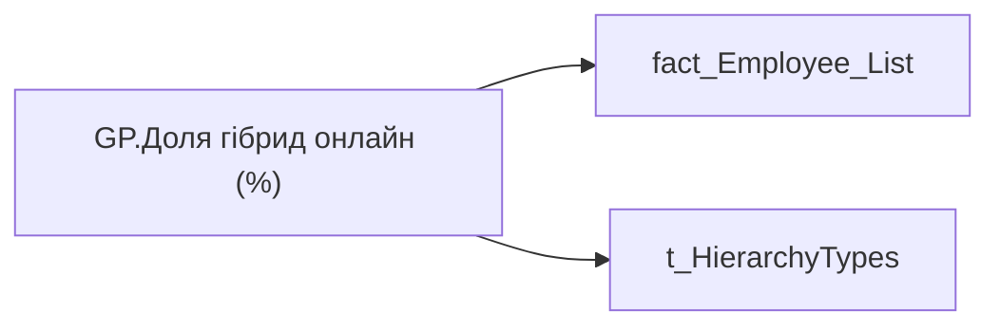

# GP.Доля гібрид онлайн (%)

*тека `Group_Profile\_Main\Дані про команду`*

## Бізнес-суть

Доля гібрид онлайн (%)

Розрахункове поле: відношення кількості працівників із форматом роботи Гібрид Онлайн у команді до загальної кількості працівників.  <br>Відношення кількості працівників, для яких work_format_on_employee_key = 4 до загальної чисельності команди (метрика Кількість співробітників всього, чол.) Розрахункове поле: ідношення кількості працівників із форматом роботи Гібрид Онлайн у команді до загальної кількості працівників.  <br>Відношення кількості працівників, для яких work_format_on_employee_key = 4 до загальної чисельності команди (людей)

**Вимоги:** `Командний-профіль/Паспортна-частина-групового-профілю/Сторінка-Картка-команди`, `Командний-профіль/Сторінка-Загальна-інформація-про-команду`

## На сторінках звіту

[Group Profile](../report/group-profile.md)

## Пов'язані міри

_Прямих зв'язків з іншими мірами немає._

---

## Технічний опис

| Властивість | Значення |
|---|---|
| Тип | міра |
| Home table | _Measures |
| displayFolder | `Group_Profile\_Main\Дані про команду` |
| formatString | — |
| dataType | — |
| Прихована | ні |

### DAX

```dax
VAR _admin = 
CALCULATE(
	DIVIDE(
		CALCULATE(
			COUNTROWS('fact_Employee_List'), 
			'fact_Employee_List'[WORK_FORMAT_ON_EMPLOYEE_KEY] = "4"
		),
		COUNTROWS('fact_Employee_List')
	)
)
VAR _admin_lt = 
	CALCULATE(
		DIVIDE(
			CALCULATE(
				COUNTROWS('fact_Employee_List'), 
				'fact_Employee_List'[WORK_FORMAT_ON_EMPLOYEE_KEY] = "4"
			),
			COUNTROWS('fact_Employee_List')
		),
		TREATAS( VALUES( 'dim_Admin_LT_OS'[USER_ACCESS_ID] ), fact_Employee_List[USER_ACCESS_ID] )
	) 
VAR _res = 
	SWITCH(
		SELECTEDVALUE('t_HierarchyTypes'[Index]),
		0, _admin_lt,
		1, _admin
	)
RETURN 
	TRIM(
		FORMAT(
			COALESCE(_res, "-"),
			"0.00%"
		) 
	)
```

### Джерела даних


Колонки: `Index`, `USER_ACCESS_ID`, `WORK_FORMAT_ON_EMPLOYEE_KEY`

Power Query: `fact_Employee_List`

### Залежності (таблиці й колонки)

Таблиці: `fact_Employee_List`, `t_HierarchyTypes`

Колонки: `dim_Admin_LT_OS[USER_ACCESS_ID]`, `fact_Employee_List[USER_ACCESS_ID]`, `fact_Employee_List[WORK_FORMAT_ON_EMPLOYEE_KEY]`, `t_HierarchyTypes[Index]`

### Схема



## Нотатки

_порожньо_
