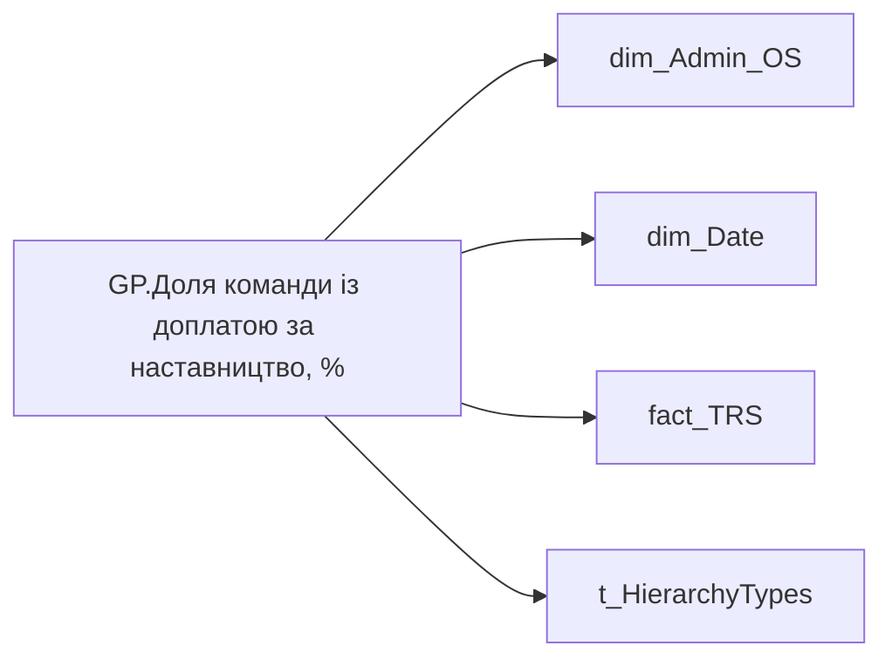

# GP.Доля команди із доплатою за наставництво, %

*тека `Group_Profile\TRS` · формат `0.00%;-0.00%;0.00%`*

## Технічний опис

| Властивість | Значення |
|---|---|
| Тип | міра |
| Home table | _Measures |
| displayFolder | `Group_Profile\TRS` |
| formatString | `0.00%;-0.00%;0.00%` |
| dataType | — |
| Прихована | ні |

### DAX

```dax
//************* ROLE FILTERS **************
VAR _roleIndex = SELECTEDVALUE ( 't_HierarchyTypes'[Index], 1 )   -- 0 = LT, 1 = Admin
VAR _filter_lt = TREATAS ( VALUES ( 'dim_Admin_LT_OS'[USER_ACCESS_ID] ),dim_Admin_OS[USER_ACCESS_ID] )

/* *********** ADMIN *********** */
VAR _admin =
	VAR _Employees =VALUES('dim_Admin_OS'[USER_ACCESS_ID])
	VAR _table0 = 
		ADDCOLUMNS(
			_Employees,
			"@Indicator",
			CALCULATE(
				SUM(fact_TRS[payments_fact_UAH]),
				fact_TRS[accrual_types_key]="83ce68c2-8a36-d6d5-21bd-27fc6b970114",
				fact_TRS[category_of_accrual_sort]=3,
				DATESINPERIOD('dim_Date'[Date],EOMONTH(TODAY(),-1),-12,MONTH)
			)
		)
	VAR _ShareOfSomeIndicator = 
		VAR _Nominator = 
		COUNTROWS(
			FILTER(
				_table0, 
				NOT ISBLANK([@Indicator]) && [@Indicator] > 0
			)
		)
		VAR _Denominator = COUNTROWS(_table0)
		RETURN DIVIDE(_Nominator, _Denominator)
	RETURN _ShareOfSomeIndicator

/* *********** LT *********** */
VAR _admin_lt =
	VAR _table0 = 
		CALCULATETABLE(
			ADDCOLUMNS(
				VALUES( 'dim_Admin_OS'[USER_ACCESS_ID] ),
				"@Indicator",
				CALCULATE(
					SUM(fact_TRS[payments_fact_UAH]),
					fact_TRS[accrual_types_key]="83ce68c2-8a36-d6d5-21bd-27fc6b970114",
					fact_TRS[category_of_accrual_sort]=3,
					DATESINPERIOD( 'dim_Date'[Date], EOMONTH( TODAY(), - 1 ), - 12, MONTH )
				)
			),
			_filter_lt
		)
	VAR _ShareOfSomeIndicator = 
		VAR _Nominator = 
		COUNTROWS(
			FILTER(
				_table0, 
				NOT ISBLANK([@Indicator]) && [@Indicator] > 0
			)
		)
		VAR _Denominator = COUNTROWS(_table0)
		RETURN DIVIDE(_Nominator, _Denominator)
	RETURN _ShareOfSomeIndicator

VAR _res =
	SWITCH (
		_roleIndex,
		0, _admin_lt,    -- LT
		1, _admin,       -- Admin
		_admin
	)
RETURN 
COALESCE(
	_res, "-")
```

### Джерела даних

Вихідні таблиці: `DM.vw_R27_dim_Employee_Access_List`, `DM.vw_R27_fact_TRS_PDP`

Колонки: `Date`, `Index`, `USER_ACCESS_ID`, `accrual_types_key`, `category_of_accrual_sort`, `payments_fact_UAH`

Power Query: `dim_Admin_OS`

### Залежності (таблиці й колонки)

Таблиці: `dim_Admin_OS`, `dim_Date`, `fact_TRS`, `t_HierarchyTypes`

Колонки: `dim_Admin_LT_OS[USER_ACCESS_ID]`, `dim_Admin_OS[USER_ACCESS_ID]`, `dim_Date[Date]`, `fact_TRS[accrual_types_key]`, `fact_TRS[category_of_accrual_sort]`, `fact_TRS[payments_fact_UAH]`, `t_HierarchyTypes[Index]`

### Схема



---

## Бізнес-суть

**Бізнес-назва:** Доля команди із доплатою за наставництво, %

### Опис із ТЗ

Потрібно підрахувати унікальну кількість працівників у команді на поточний момент, для яких значення `payments_fact_UAH` > 0.00 по  `accrual_types_key` = '83ce68c2-8a36-d6d5-21bd-27fc6b970114'    та `category_of_accrual_sort`  = '3' хоча б один раз за останні 12 місяців, НЕ включаючи поточний, та поділити на поточну кількість членів команди.

**Вимоги (ТЗ):**

- [Командний профіль › Сторінка TRS команди](https://dev.azure.com/MHPITDepProjects/People%20Digital%20Profile%20%28PDP%29/_wiki/wikis/PDP.wiki?pagePath=/%D0%A4%D1%83%D0%BD%D0%BA%D1%86%D1%96%D0%BE%D0%BD%D0%B0%D0%BB%D1%8C%D0%BD%D1%96%20%D0%B2%D0%B8%D0%BC%D0%BE%D0%B3%D0%B8/%D0%92%D0%B8%D0%BC%D0%BE%D0%B3%D0%B8%20%D0%B4%D0%BE%20%D0%B7%D0%B2%D1%96%D1%82%D1%83%20People%20Digital%20Profile/%D0%9A%D0%BE%D0%BC%D0%B0%D0%BD%D0%B4%D0%BD%D0%B8%D0%B9%20%D0%BF%D1%80%D0%BE%D1%84%D1%96%D0%BB%D1%8C/%D0%A1%D1%82%D0%BE%D1%80%D1%96%D0%BD%D0%BA%D0%B0%20TRS%20%D0%BA%D0%BE%D0%BC%D0%B0%D0%BD%D0%B4%D0%B8)
- [Командний профіль › Сторінка TRS команди › Сторінка Винагорода групового профілю › вимоги до звіту](https://dev.azure.com/MHPITDepProjects/People%20Digital%20Profile%20%28PDP%29/_wiki/wikis/PDP.wiki?pagePath=/%D0%A4%D1%83%D0%BD%D0%BA%D1%86%D1%96%D0%BE%D0%BD%D0%B0%D0%BB%D1%8C%D0%BD%D1%96%20%D0%B2%D0%B8%D0%BC%D0%BE%D0%B3%D0%B8/%D0%92%D0%B8%D0%BC%D0%BE%D0%B3%D0%B8%20%D0%B4%D0%BE%20%D0%B7%D0%B2%D1%96%D1%82%D1%83%20People%20Digital%20Profile/%D0%9A%D0%BE%D0%BC%D0%B0%D0%BD%D0%B4%D0%BD%D0%B8%D0%B9%20%D0%BF%D1%80%D0%BE%D1%84%D1%96%D0%BB%D1%8C/%D0%A1%D1%82%D0%BE%D1%80%D1%96%D0%BD%D0%BA%D0%B0%20TRS%20%D0%BA%D0%BE%D0%BC%D0%B0%D0%BD%D0%B4%D0%B8/%D0%A1%D1%82%D0%BE%D1%80%D1%96%D0%BD%D0%BA%D0%B0%20%D0%92%D0%B8%D0%BD%D0%B0%D0%B3%D0%BE%D1%80%D0%BE%D0%B4%D0%B0%20%D0%B3%D1%80%D1%83%D0%BF%D0%BE%D0%B2%D0%BE%D0%B3%D0%BE%20%D0%BF%D1%80%D0%BE%D1%84%D1%96%D0%BB%D1%8E)

## На сторінках звіту

[Group Profile](../report/group-profile.md)

## Пов'язані міри

_Прямих зв'язків з іншими мірами немає._

## Нотатки

_порожньо_
