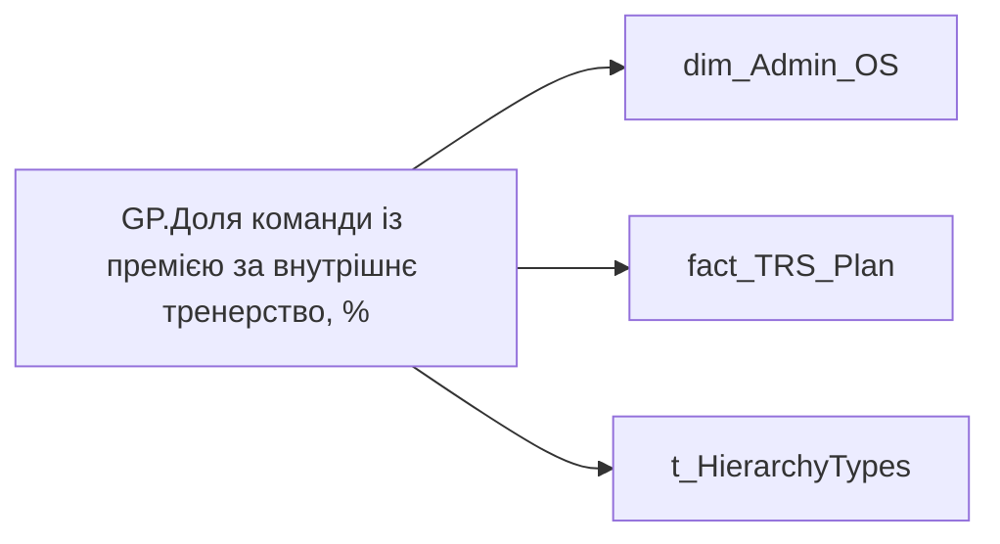

# GP.Доля команди із премією за внутрішнє тренерство, %

*тека `Group_Profile\TRS` · формат `0.00%;-0.00%;0.00%`*

## Бізнес-суть

END_DATE → Термін без відпустки в днях по пріоритетному місцю роботи на поточну дату; PAYMENT_PLAN_SUM → Річний цільовий дохід; PAYMENT_PLAN_SUM → Розмір фіксованої винагороди плановий, за місяць ПОТОЧНИЙ; PAYMENT_PLAN_SUM → Сума (на поточний момент); PAYMENT_PLAN_SUM → Середній розмір премії за місяць; PAYMENT_PLAN_SUM → Доля учасників із зміною фіксованої винагороди; PAYMENT_PLAN_SUM → Діапазон фіксованої винагороди (план)

TODAY - остання Дата виходу. Якщо дата виходу майбутня дата, то значення буде від'ємне. Розрахунок вести по пріоритетному місцю роботи. Тобто, якщо у працівника кілька працевлаштувань, по кожному із них будуть відображатися дані по пріоритетному місцю.<br>Аналогічний розрахуноку є в таблиці DM.vw_R27_fact_Vacation_Reserve PAYMENT_PLAN_SUMх(BONUS_MONTH_SALARY_CNTх12 +BONUS_QUARTER_SALARY_CNTх4+BONUS_YEAR_SALARY_CNT+12) Відібрати записи по працівнику [person_key], періоду [Period], організації [organization_key], підрозділу [division_key], де category_name = Фіксована винагорода, IS_ACTUAL  = "1

**Вимоги:** `Індивідуальний-профіль-працівника/Історія-по-посадам`, `Індивідуальний-профіль-працівника/Історія-по-посадам/Реліз-1.-Історія-по-посадам`, `Індивідуальний-профіль-працівника/Сторінка-Винагорода-працівника`, `Індивідуальний-профіль-працівника/Сторінка-Винагорода-працівника/Деталізація-на-сторінці-Винагорода`, `Індивідуальний-профіль-працівника/Сторінка-Винагорода-працівника/Доопрацювання-сторінки-ТРС`, `Допоміжні-вітрини-для-звіту/Таблиця-для-розрахунку-агрегованих-метрик-по-звіту`, `Командний-профіль/Сторінка-TRS-команди`, `Командний-профіль/Сторінка-TRS-команди/Доопрацювання-сторінки-TRS`, `Командний-профіль/Сторінка-TRS-команди/Сторінка-Винагорода-групового-профілю#вимоги-до-звіту`

## На сторінках звіту

[Group Profile](../report/group-profile.md)

## Пов'язані міри

_Прямих зв'язків з іншими мірами немає._

---

## Технічний опис

| Властивість | Значення |
|---|---|
| Тип | міра |
| Home table | _Measures |
| displayFolder | `Group_Profile\TRS` |
| formatString | `0.00%;-0.00%;0.00%` |
| dataType | — |
| Прихована | ні |

### DAX

```dax
//************* ROLE FILTERS **************
VAR _roleIndex = SELECTEDVALUE ( 't_HierarchyTypes'[Index], 1 )   -- 0 = LT, 1 = Admin
VAR _filter_lt = TREATAS ( VALUES ( 'dim_Admin_LT_OS'[USER_ACCESS_ID] ),dim_Admin_OS[USER_ACCESS_ID] )

/* *********** ADMIN *********** */
VAR _admin =
	VAR _Employees =VALUES('dim_Admin_OS'[USER_ACCESS_ID])
	VAR _table0 = 
		ADDCOLUMNS(
			_Employees,
			"@Indicator",
			CALCULATE(
				MAX(fact_TRS_Plan[PAYMENT_PLAN_SUM]),
				fact_TRS_Plan[IS_ACTUAL]=TRUE(),
				fact_TRS_Plan[ACCRUAL_ORG_CODE]="00148",
				fact_TRS_Plan[END_DATE]>TODAY() || fact_TRS_Plan[END_DATE]=DATE(2001,1,1)
			)
		)
	VAR _ShareOfSomeIndicator = 
		VAR _Nominator = 
		COUNTROWS(
			FILTER(
				_table0, 
				NOT ISBLANK([@Indicator]) && [@Indicator] > 0
			)
		)
		VAR _Denominator = COUNTROWS(_table0)
		RETURN DIVIDE(_Nominator, _Denominator)
	RETURN _ShareOfSomeIndicator

/* *********** LT *********** */
VAR _admin_lt =
	VAR _table0 = 
		CALCULATETABLE(
			ADDCOLUMNS(
				VALUES( 'dim_Admin_OS'[USER_ACCESS_ID] ),
				"@Indicator",
				CALCULATE(
					MAX( fact_TRS_Plan[PAYMENT_PLAN_SUM] ),
					fact_TRS_Plan[IS_ACTUAL] = TRUE(),
					fact_TRS_Plan[ACCRUAL_ORG_CODE] = "00148",
					fact_TRS_Plan[END_DATE] > TODAY() || fact_TRS_Plan[END_DATE] = DATE( 2001, 1, 1 )
				)
			),
			_filter_lt
		)
	VAR _ShareOfSomeIndicator = 
		VAR _Nominator = 
		COUNTROWS(
			FILTER(
				_table0, 
				NOT ISBLANK([@Indicator]) && [@Indicator] > 0
			)
		)
		VAR _Denominator = COUNTROWS(_table0)
		RETURN DIVIDE(_Nominator, _Denominator)
	RETURN _ShareOfSomeIndicator

VAR _res =
	SWITCH (
		_roleIndex,
		0, _admin_lt,    -- LT
		1, _admin,       -- Admin
		_admin
	)
RETURN 
COALESCE(
	_res, "-")
```

### Джерела даних

Вихідні таблиці: `DM.vw_R27_dim_Employee_Access_List`, `DM.vw_R27_fact_TRS_Plan_PDP`

Колонки: `ACCRUAL_ORG_CODE`, `END_DATE`, `IS_ACTUAL`, `Index`, `PAYMENT_PLAN_SUM`, `USER_ACCESS_ID`

Power Query: `dim_Admin_OS`

### Залежності (таблиці й колонки)

Таблиці: `dim_Admin_OS`, `fact_TRS_Plan`, `t_HierarchyTypes`

Колонки: `dim_Admin_LT_OS[USER_ACCESS_ID]`, `dim_Admin_OS[USER_ACCESS_ID]`, `fact_TRS_Plan[ACCRUAL_ORG_CODE]`, `fact_TRS_Plan[END_DATE]`, `fact_TRS_Plan[IS_ACTUAL]`, `fact_TRS_Plan[PAYMENT_PLAN_SUM]`, `t_HierarchyTypes[Index]`

### Схема



## Нотатки

_порожньо_
