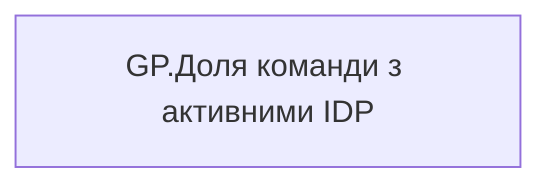

# GP.Доля команди з активними IDP

*тека `Group_Profile\_Main\Дані про команду`*

## Технічний опис

| Властивість | Значення |
|---|---|
| Тип | міра |
| Home table | _Measures |
| displayFolder | `Group_Profile\_Main\Дані про команду` |
| formatString | — |
| dataType | — |
| Прихована | ні |

### DAX

```dax
"В розробці"
```

### Джерела даних

—

### Залежності (таблиці й колонки)

—

### Схема



---

## Бізнес-суть

!!! note "Бізнес-визначення відсутнє"
    Поля міри не зіставлено з wiki «Таблицями джерел даних». Можна заповнити вручну в `manualNotes`.

## На сторінках звіту

- [Group Profile](../report/group-profile.md) — Версія 1

## Пов'язані міри

_Прямих зв'язків з іншими мірами немає._

## Нотатки

_порожньо_
