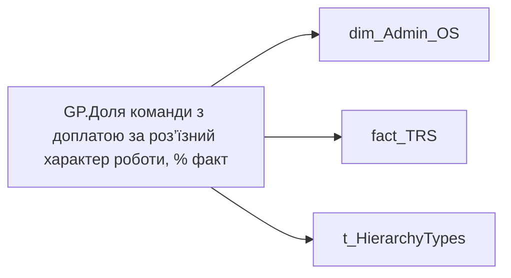

# GP.Доля команди з доплатою за роз’їзний характер роботи, % факт

*тека `Group_Profile\TRS` · формат `#,0%;-#,0%;#,0%`*

## Технічний опис

| Властивість | Значення |
|---|---|
| Тип | міра |
| Home table | _Measures |
| displayFolder | `Group_Profile\TRS` |
| formatString | `#,0%;-#,0%;#,0%` |
| dataType | — |
| Прихована | ні |

### DAX

```dax
//************* ROLE FILTERS **************
VAR _roleIndex = SELECTEDVALUE ( 't_HierarchyTypes'[Index], 1 )   -- 0 = LT, 1 = Admin
VAR _filter_lt = TREATAS ( VALUES ( 'dim_Admin_LT_OS'[USER_ACCESS_ID] ),dim_Admin_OS[USER_ACCESS_ID] )

/* *********** ADMIN *********** */
VAR _admin = 
DIVIDE(
    CALCULATE(
        DISTINCTCOUNT('fact_TRS'[USER_ACCESS_ID]),
        'fact_TRS'[ACCRUAL_TYPES_KEY] = "d8d58e4c-8800-ea51-9ff6-0bec21ff170f",
        'fact_TRS'[PAYMENTS_FACT_UAH] > 0,
        DATESINPERIOD( 'fact_TRS'[PERIOD], EOMONTH( TODAY(), - 1 ), - 12, MONTH )),
    [GP.Кількість співробітників всього, чол. - Integer], blank())

VAR test = DATESINPERIOD( 'fact_TRS'[PERIOD], EOMONTH( TODAY(), - 1 ), - 12, MONTH )

/* *********** LT *********** */
VAR _admin_lt =
DIVIDE(
    CALCULATE(
        DISTINCTCOUNT('fact_TRS'[USER_ACCESS_ID]),
        'fact_TRS'[ACCRUAL_TYPES_KEY] = "d8d58e4c-8800-ea51-9ff6-0bec21ff170f",
        'fact_TRS'[PAYMENTS_FACT_UAH] > 0,
        DATESINPERIOD( 'fact_TRS'[PERIOD], EOMONTH( TODAY(), - 1 ), - 12, MONTH ),
        _filter_lt),
    [GP.Кількість співробітників всього, чол. - Integer], blank())

VAR _res =
	SWITCH (
		_roleIndex,
		0, _admin_lt,    -- LT
		1, _admin,       -- Admin
		_admin
	)

RETURN
COALESCE(
	_res, "-")
```

### Джерела даних

Вихідні таблиці: `DM.vw_R27_dim_Employee_Access_List`, `DM.vw_R27_fact_TRS_PDP`

Колонки: `ACCRUAL_TYPES_KEY`, `Index`, `PAYMENTS_FACT_UAH`, `PERIOD`, `USER_ACCESS_ID`

Power Query: `dim_Admin_OS`

### Залежності (таблиці й колонки)

Таблиці: `dim_Admin_OS`, `fact_TRS`, `t_HierarchyTypes`

Колонки: `dim_Admin_LT_OS[USER_ACCESS_ID]`, `dim_Admin_OS[USER_ACCESS_ID]`, `fact_TRS[ACCRUAL_TYPES_KEY]`, `fact_TRS[PAYMENTS_FACT_UAH]`, `fact_TRS[PERIOD]`, `fact_TRS[USER_ACCESS_ID]`, `t_HierarchyTypes[Index]`

### Схема



---

## Бізнес-суть

**Бізнес-назва:** Доля команди з доплатою за роз’їзний характер роботи, % факт

### Опис із ТЗ

Розрахункове поле.   Потрібно підрахувати кількість працівників у команді для яких є хоча б один запис за останні 12 міс. по `accrual_types_key` = d8d58e4c-8800-ea51-9ff6-0bec21ff170f, де  поле `PAYMENTS_FACT_UAH`>0 та поділити на поточну кількість членів команди.

**Вимоги (ТЗ):**

- [Командний профіль › Сторінка TRS команди › Доопрацювання сторінки TRS](https://dev.azure.com/MHPITDepProjects/People%20Digital%20Profile%20%28PDP%29/_wiki/wikis/PDP.wiki?pagePath=/%D0%A4%D1%83%D0%BD%D0%BA%D1%86%D1%96%D0%BE%D0%BD%D0%B0%D0%BB%D1%8C%D0%BD%D1%96%20%D0%B2%D0%B8%D0%BC%D0%BE%D0%B3%D0%B8/%D0%92%D0%B8%D0%BC%D0%BE%D0%B3%D0%B8%20%D0%B4%D0%BE%20%D0%B7%D0%B2%D1%96%D1%82%D1%83%20People%20Digital%20Profile/%D0%9A%D0%BE%D0%BC%D0%B0%D0%BD%D0%B4%D0%BD%D0%B8%D0%B9%20%D0%BF%D1%80%D0%BE%D1%84%D1%96%D0%BB%D1%8C/%D0%A1%D1%82%D0%BE%D1%80%D1%96%D0%BD%D0%BA%D0%B0%20TRS%20%D0%BA%D0%BE%D0%BC%D0%B0%D0%BD%D0%B4%D0%B8/%D0%94%D0%BE%D0%BE%D0%BF%D1%80%D0%B0%D1%86%D1%8E%D0%B2%D0%B0%D0%BD%D0%BD%D1%8F%20%D1%81%D1%82%D0%BE%D1%80%D1%96%D0%BD%D0%BA%D0%B8%20TRS)

## На сторінках звіту

- [Group Profile](../report/group-profile.md) — TRS

## Пов'язані міри

**Використовує:** [GP.Кількість співробітників всього, чол. - Integer](../measures/gp-kilkist-spivrobitnykiv-vsoho-chol-integer.md)

## Нотатки

_порожньо_
