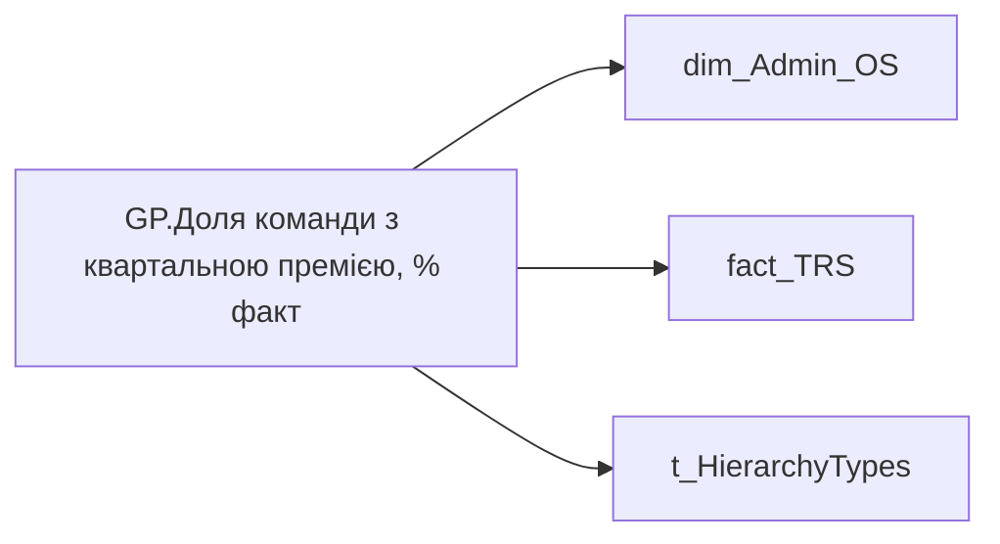

# GP.Доля команди з квартальною премією, % факт

*тека `Group_Profile\TRS` · формат `0.00%;-0.00%;0.00%`*

## Технічний опис

| Властивість | Значення |
|---|---|
| Тип | міра |
| Home table | _Measures |
| displayFolder | `Group_Profile\TRS` |
| formatString | `0.00%;-0.00%;0.00%` |
| dataType | — |
| Прихована | ні |

### DAX

```dax
//************* ROLE FILTERS **************
VAR _roleIndex = SELECTEDVALUE ( 't_HierarchyTypes'[Index], 1 )   -- 0 = LT, 1 = Admin
VAR _filter_lt = TREATAS ( VALUES ( 'dim_Admin_LT_OS'[USER_ACCESS_ID] ),dim_Admin_OS[USER_ACCESS_ID] )

/* *********** ADMIN *********** */
VAR _admin = 
DIVIDE(
    CALCULATE(
        DISTINCTCOUNT('fact_TRS'[USER_ACCESS_ID]),
        'fact_TRS'[PAYMENTS_FACT_UAH] > 0,
        'fact_TRS'[TRS_CATEGORY] = "Змінна винагорода",
        'fact_TRS'[SUBCATEGORY_OF_ACCRUAL_TYPE] = "Квартальні премії",
        DATESINPERIOD( 'fact_TRS'[PERIOD], EOMONTH( TODAY(), - 1 ), - 12, MONTH )),
    [GP.Кількість співробітників всього, чол. - Integer])

/* *********** LT *********** */
VAR _admin_lt =
DIVIDE(
    CALCULATE(
        DISTINCTCOUNT('fact_TRS'[USER_ACCESS_ID]),
        'fact_TRS'[PAYMENTS_FACT_UAH] > 0,
        'fact_TRS'[TRS_CATEGORY] = "Змінна винагорода",
        'fact_TRS'[SUBCATEGORY_OF_ACCRUAL_TYPE] = "Квартальні премії",
        DATESINPERIOD( 'fact_TRS'[PERIOD], EOMONTH( TODAY(), - 1 ), - 12, MONTH ),
        _filter_lt),
    [GP.Кількість співробітників всього, чол. - Integer])

VAR _res =
	SWITCH (
		_roleIndex,
		0, _admin_lt,    -- LT
		1, _admin,       -- Admin
		_admin
	)
RETURN 
COALESCE(_res, "-")
```

### Джерела даних

Вихідні таблиці: `DM.vw_R27_dim_Employee_Access_List`, `DM.vw_R27_fact_TRS_PDP`

Колонки: `Index`, `PAYMENTS_FACT_UAH`, `PERIOD`, `SUBCATEGORY_OF_ACCRUAL_TYPE`, `TRS_CATEGORY`, `USER_ACCESS_ID`

Power Query: `dim_Admin_OS`

### Залежності (таблиці й колонки)

Таблиці: `dim_Admin_OS`, `fact_TRS`, `t_HierarchyTypes`

Колонки: `dim_Admin_LT_OS[USER_ACCESS_ID]`, `dim_Admin_OS[USER_ACCESS_ID]`, `fact_TRS[PAYMENTS_FACT_UAH]`, `fact_TRS[PERIOD]`, `fact_TRS[SUBCATEGORY_OF_ACCRUAL_TYPE]`, `fact_TRS[TRS_CATEGORY]`, `fact_TRS[USER_ACCESS_ID]`, `t_HierarchyTypes[Index]`

### Схема



---

## Бізнес-суть

!!! note "Бізнес-визначення відсутнє"
    Поля міри не зіставлено з wiki «Таблицями джерел даних». Можна заповнити вручну в `manualNotes`.

## На сторінках звіту

[Group Profile](../report/group-profile.md)

## Пов'язані міри

**Використовує:** [GP.Кількість співробітників всього, чол. - Integer](../measures/gp-kilkist-spivrobitnykiv-vsoho-chol-integer.md)

## Нотатки

_порожньо_
