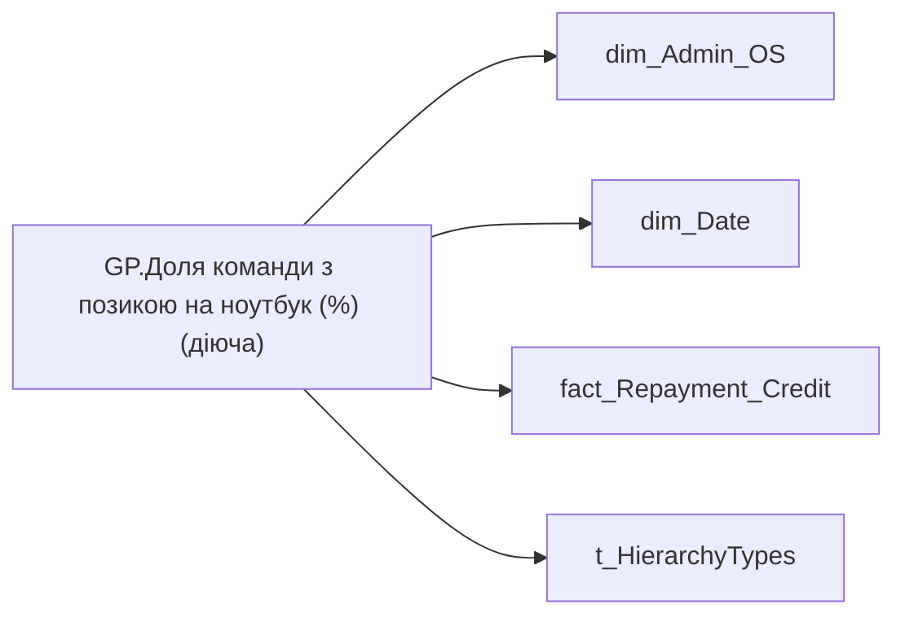

# GP.Доля команди з позикою на ноутбук (%) (діюча)

| Властивість | Значення |
|---|---|
| Тип | міра |
| Home table | _Measures |
| displayFolder | `Group_Profile\TRS` |
| formatString | `0%;-0%;0%` |
| dataType | — |
| Прихована | ні |

## DAX

```dax
//************* ROLE FILTERS **************
VAR _roleIndex = SELECTEDVALUE ( 't_HierarchyTypes'[Index], 1 )   -- 0 = LT, 1 = Admin
VAR _filter_lt = TREATAS ( VALUES ( 'dim_Admin_LT_OS'[USER_ACCESS_ID] ),dim_Admin_OS[USER_ACCESS_ID] )

/* *********** ADMIN *********** */
VAR _admin =
	VAR _Employees =VALUES('dim_Admin_OS'[EMPLOYEE_ID])
	VAR _table0 = 
		ADDCOLUMNS(
			_Employees,
			"@Indicator",
			CALCULATE(
				LASTNONBLANKVALUE(
					VALUES('dim_Date'[Date]),
					CALCULATE(SUM('fact_Repayment_Credit'[LAND_SHARE_CONTRACT_SUM]))
				),
				fact_Repayment_Credit[BUDGET_ITEM_CODE]="0000008240",
				'fact_Repayment_Credit'[IS_INCOMING] = TRUE()
			)
		)
	VAR _ShareOfSomeIndicator = 
		VAR _Nominator = 
		COUNTROWS(
			FILTER(
				_table0, 
				NOT ISBLANK([@Indicator]) && [@Indicator] > 0
			)
		)
		VAR _Denominator = COUNTROWS(_table0)
		RETURN DIVIDE(_Nominator, _Denominator)
	RETURN _ShareOfSomeIndicator

/* *********** LT *********** */
VAR _admin_lt =
	VAR _table0 = 
		CALCULATETABLE(
			ADDCOLUMNS(
				VALUES( 'dim_Admin_OS'[EMPLOYEE_ID] ),
				"@Indicator",
				CALCULATE(
					LASTNONBLANKVALUE(
						VALUES('dim_Date'[Date]),
						CALCULATE(SUM('fact_Repayment_Credit'[LAND_SHARE_CONTRACT_SUM]))
					),
					fact_Repayment_Credit[BUDGET_ITEM_CODE]="0000008240",
					'fact_Repayment_Credit'[IS_INCOMING] = TRUE()
				)
			),
			_filter_lt
		)
	VAR _ShareOfSomeIndicator = 
		VAR _Nominator = 
		COUNTROWS(
			FILTER(
				_table0, 
				NOT ISBLANK([@Indicator]) && [@Indicator] > 0
			)
		)
		VAR _Denominator = COUNTROWS(_table0)
		RETURN DIVIDE(_Nominator, _Denominator)
	RETURN _ShareOfSomeIndicator

VAR _res =
	SWITCH (
		_roleIndex,
		0, _admin_lt,    -- LT
		1, _admin,       -- Admin
		_admin
	)
RETURN 
COALESCE(
	_res, "-")
```

## Джерела

Вихідні таблиці: `DM.vw_R27_dim_Employee_Access_List`, `DM.vw_R27_fact_Repayment_Credit_PDP`

Колонки: `BUDGET_ITEM_CODE`, `Date`, `EMPLOYEE_ID`, `IS_INCOMING`, `Index`, `LAND_SHARE_CONTRACT_SUM`, `USER_ACCESS_ID`

Power Query: `dim_Admin_OS`

## Бізнес-суть

LAND_SHARE_CONTRACT_SUM → Сума позики; LAND_SHARE_CONTRACT_SUM → Позика на ноутбук (остання); LAND_SHARE_CONTRACT_SUM → Доля команди з позикою на ноутбук (%) (діюча); LAND_SHARE_CONTRACT_SUM → Середній розмір позики; LAND_SHARE_CONTRACT_SUM → Позики

Потрібно відібрати всі записи по працівнику [person_key], періоду [Period], організації [organization_key] ,  договору [CONTRACT_KEY], де [BUDGET_ITEM_CODE] = '0000008240'  <br>Якщо по працівнику не знайшлося запису, то вивести прочерк "-" Розрахункове поле: відношення кількості працівників із діючою на поточний день позикою на ноутбук до загальної чисельності команди Потрібно зсумувати значення поля land_share_contract_sum по всім працівникам із діючою позикою та подялити на кількість таких працівників.

**Вимоги:** `Індивідуальний-профіль-працівника/Сторінка-Винагорода-працівника`, `Індивідуальний-профіль-працівника/Сторінка-Винагорода-працівника/Доопрацювання-сторінки-ТРС`, `Командний-профіль/Сторінка-TRS-команди`, `Командний-профіль/Сторінка-TRS-команди/Доопрацювання-сторінки-TRS`, `Командний-профіль/Сторінка-TRS-команди/Сторінка-Винагорода-групового-профілю#вимоги-до-звіту`, `Командний-профіль/Сторінка-Моя-команда/ТЗ.-Деталізація-метрик-групового-профілю-звіту`

## Залежності

Таблиці: `dim_Admin_OS`, `dim_Date`, `fact_Repayment_Credit`, `t_HierarchyTypes`

Колонки: `dim_Admin_LT_OS[USER_ACCESS_ID]`, `dim_Admin_OS[EMPLOYEE_ID]`, `dim_Admin_OS[USER_ACCESS_ID]`, `dim_Date[Date]`, `fact_Repayment_Credit[BUDGET_ITEM_CODE]`, `fact_Repayment_Credit[IS_INCOMING]`, `fact_Repayment_Credit[LAND_SHARE_CONTRACT_SUM]`, `t_HierarchyTypes[Index]`

## Схема



## Нотатки

_порожньо_
