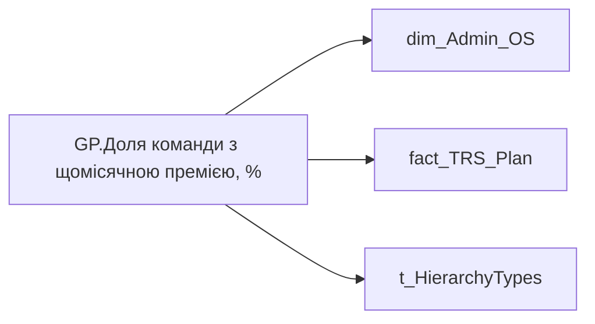

# GP.Доля команди з щомісячною премією, %

*тека `Group_Profile\TRS` · формат `0.00%;-0.00%;0.00%`*

## Технічний опис

| Властивість | Значення |
|---|---|
| Тип | міра |
| Home table | _Measures |
| displayFolder | `Group_Profile\TRS` |
| formatString | `0.00%;-0.00%;0.00%` |
| dataType | — |
| Прихована | ні |

### DAX

```dax
//************* ROLE FILTERS **************
VAR _roleIndex = SELECTEDVALUE ( 't_HierarchyTypes'[Index], 1 )   -- 0 = LT, 1 = Admin
VAR _filter_lt = TREATAS ( VALUES ( 'dim_Admin_LT_OS'[USER_ACCESS_ID] ),dim_Admin_OS[USER_ACCESS_ID] )

/* *********** ADMIN *********** */
VAR _admin =
	VAR _Employees =VALUES('dim_Admin_OS'[USER_ACCESS_ID])
	VAR _table0 = 
		ADDCOLUMNS(
			_Employees,
			"@Indicator",
			CALCULATE(
				SUMX(
					'fact_TRS_Plan',
					fact_TRS_Plan[MIN_TARIFF_RATE] * 'fact_TRS_Plan'[BONUS_MONTH_SALARY_CNT]
				),
				fact_TRS_Plan[IS_ACTUAL]=TRUE(),
				fact_TRS_Plan[CALC_TYPE_CODE]="UAH",
				fact_TRS_Plan[category_name]="Фіксована винагорода"
			)
		)
	VAR _ShareOfSomeIndicator = 
		VAR _Nominator = 
		COUNTROWS(
			FILTER(
				_table0, 
				NOT ISBLANK([@Indicator]) && [@Indicator] > 0 && [@Indicator] > 0
			)
		)
		VAR _Denominator = COUNTROWS(_table0)
		RETURN DIVIDE(_Nominator, _Denominator)
	RETURN _ShareOfSomeIndicator

/* *********** LT *********** */
VAR _admin_lt =
	VAR _table0 = 
		CALCULATETABLE(
			ADDCOLUMNS(
				VALUES( 'dim_Admin_OS'[USER_ACCESS_ID] ),
				"@Indicator",
				CALCULATE(
					SUMX(
						'fact_TRS_Plan',
						fact_TRS_Plan[MIN_TARIFF_RATE] * 'fact_TRS_Plan'[BONUS_MONTH_SALARY_CNT]
					),
					fact_TRS_Plan[IS_ACTUAL]=TRUE(),
					fact_TRS_Plan[CALC_TYPE_CODE]="UAH",
					fact_TRS_Plan[category_name]="Фіксована винагорода"
				)
			),
			_filter_lt
		)
	VAR _ShareOfSomeIndicator = 
		VAR _Nominator = 
		COUNTROWS(
			FILTER(
				_table0, 
				NOT ISBLANK([@Indicator]) && [@Indicator] > 0 && [@Indicator] > 0
			)
		)
		VAR _Denominator = COUNTROWS(_table0)
		RETURN DIVIDE(_Nominator, _Denominator)
	RETURN _ShareOfSomeIndicator

VAR _res =
	SWITCH (
		_roleIndex,
		0, _admin_lt,    -- LT
		1, _admin,       -- Admin
		_admin
	)
RETURN 
COALESCE(
	_res, "-")
```

### Джерела даних

Вихідні таблиці: `DM.vw_R27_dim_Employee_Access_List`, `DM.vw_R27_fact_TRS_Plan_PDP`

Колонки: `BONUS_MONTH_SALARY_CNT`, `CALC_TYPE_CODE`, `IS_ACTUAL`, `Index`, `MIN_TARIFF_RATE`, `USER_ACCESS_ID`, `category_name`

Power Query: `dim_Admin_OS`

### Залежності (таблиці й колонки)

Таблиці: `dim_Admin_OS`, `fact_TRS_Plan`, `t_HierarchyTypes`

Колонки: `dim_Admin_LT_OS[USER_ACCESS_ID]`, `dim_Admin_OS[USER_ACCESS_ID]`, `fact_TRS_Plan[BONUS_MONTH_SALARY_CNT]`, `fact_TRS_Plan[CALC_TYPE_CODE]`, `fact_TRS_Plan[IS_ACTUAL]`, `fact_TRS_Plan[MIN_TARIFF_RATE]`, `fact_TRS_Plan[category_name]`, `t_HierarchyTypes[Index]`

### Схема



---

## Бізнес-суть

BONUS_MONTH_SALARY_CNT → Премія місячна кіл-ть окладів; BONUS_MONTH_SALARY_CNT → Щомісячна премія; BONUS_MONTH_SALARY_CNT → Доля команди з щомісячною премією, %; BONUS_MONTH_SALARY_CNT → Місячна премія; MIN_TARIFF_RATE → Оклад; MIN_TARIFF_RATE → Позиція в окладній вилці; MIN_TARIFF_RATE → Зарплата (вилки); MIN_TARIFF_RATE → Розподіл за вилкою зарплат; MIN_TARIFF_RATE → Положення у вилці; category_name → Назва блоку

Станом на дату події <br>Це поле має бути доступне у візуалізаціях, побудованих на основі фактової таблиці [DM.vw_R27_fact_Employee_List_PDP]  <br>Відібрати записи по працівнику по працівнику [person_key], періоду [Period], організації [organization_key], підрозділу [division_key], посаді [position_key]<br>BONUS_MONTH_SALARY_CNT  - кількість окладів  <br>Розмір премії = Min_Tariff_Rate помножити на BONUS_MONTH_SALARY_CNT - сума (к-сть окладів*оклад)  <br>Якщо по працівнику записи відсутні, то показати прочерк "-" <br>Відбір робити за період станом на 12 міс. тому  <br>BONUS_MONTH_SALARY_CNT  -

**Вимоги:** `Індивідуальний-профіль-працівника/Історія-по-посадам`, `Індивідуальний-профіль-працівника/Історія-по-посадам/Реліз-1.-Історія-по-посадам`, `Індивідуальний-профіль-працівника/Сторінка-Винагорода-працівника`, `Індивідуальний-профіль-працівника/Сторінка-Винагорода-працівника/Деталізація-на-сторінці-Винагорода`, `Індивідуальний-профіль-працівника/Сторінка-Винагорода-працівника/Доопрацювання-сторінки-ТРС`, `Індивідуальний-профіль-працівника/Сторінка-Результативність-та-оцінка/Блок-Оцінка-компетенцій`, `Допоміжні-вітрини-для-звіту/Таблиця-для-розрахунку-агрегованих-метрик-по-звіту`, `Командний-профіль/Сторінка-TRS-команди`, `Командний-профіль/Сторінка-TRS-команди/Сторінка-Винагорода-групового-профілю#вимоги-до-звіту`, `Командний-профіль/Сторінка-Моя-команда/ТЗ.-Деталізація-метрик-групового-профілю-звіту`, `Командний-профіль/Сторінка-Результативність-та-оцінка-команди/Блок-Оцінка-компетенцій-(груповий-профіль)`

## На сторінках звіту

[Group Profile](../report/group-profile.md)

## Пов'язані міри

_Прямих зв'язків з іншими мірами немає._

## Нотатки

_порожньо_
