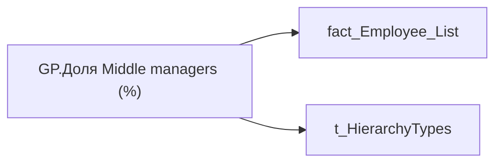

# GP.Доля Middle managers (%)

*тека `Group_Profile\Загальна інформація`*

## Бізнес-суть

POSITION_CATEGORY_INTERNAL_SORT → Доля Senior managers (%); POSITION_CATEGORY_INTERNAL_SORT → Доля Middle managers (%); POSITION_CATEGORY_INTERNAL_SORT → Доля Line  (%); POSITION_CATEGORY_INTERNAL_SORT → Доля Specialists (%); POSITION_CATEGORY_INTERNAL_SORT → Доля Workers (%)

Розрахункове поле: відношення кількості Senior managers у команді до загальної кількості працівників.  <br>Відношення кількості працівників, для яких position_category_internal_sort = 2 до загальної чисельності команди (метрика Кількість співробітників всього, чол.) Розрахункове поле: відношення кількості Middle managers у команді до загальної кількості працівників.  <br>Відношення кількості працівників, для яких position_category_internal_sort = 3 до загальної чисельності команди (метрика Кількість співробітників всього, чол.) Розрахункове поле: відношення кількості Line  у команді до загальн

**Вимоги:** `Командний-профіль/Сторінка-Загальна-інформація-про-команду`

## На сторінках звіту

[Group Profile](../report/group-profile.md)

## Пов'язані міри

_Прямих зв'язків з іншими мірами немає._

---

## Технічний опис

| Властивість | Значення |
|---|---|
| Тип | міра |
| Home table | _Measures |
| displayFolder | `Group_Profile\Загальна інформація` |
| formatString | — |
| dataType | — |
| Прихована | ні |

### DAX

```dax
VAR _filter_lt= TREATAS(VALUES( dim_Admin_LT_OS[USER_ACCESS_ID] ), 'fact_Employee_List'[USER_ACCESS_ID])
VAR _admin = 
	DIVIDE(
		CALCULATE(
			COUNTROWS('fact_Employee_List'), 
			'fact_Employee_List'[POSITION_CATEGORY_INTERNAL_SORT] = 3
		),
		COUNTROWS('fact_Employee_List')
	)
VAR _admin_lt = 
	CALCULATE(
		DIVIDE(
			CALCULATE(
				COUNTROWS( 'fact_Employee_List' ),
				'fact_Employee_List'[POSITION_CATEGORY_INTERNAL_SORT] = 3
			),
			COUNTROWS( 'fact_Employee_List' )
		),
		_filter_lt
	)
VAR _res = 
	SWITCH(
		SELECTEDVALUE('t_HierarchyTypes'[Index]),
		0, _admin_lt,
		1, _admin
	)
RETURN  
	TRIM(
		FORMAT(
			COALESCE(_res, "-"),
			"0.00%"
		) 
	)
```

### Джерела даних


Колонки: `Index`, `POSITION_CATEGORY_INTERNAL_SORT`, `USER_ACCESS_ID`

Power Query: `fact_Employee_List`

### Залежності (таблиці й колонки)

Таблиці: `fact_Employee_List`, `t_HierarchyTypes`

Колонки: `fact_Employee_List[POSITION_CATEGORY_INTERNAL_SORT]`, `fact_Employee_List[USER_ACCESS_ID]`, `t_HierarchyTypes[Index]`

### Схема



## Нотатки

_порожньо_
