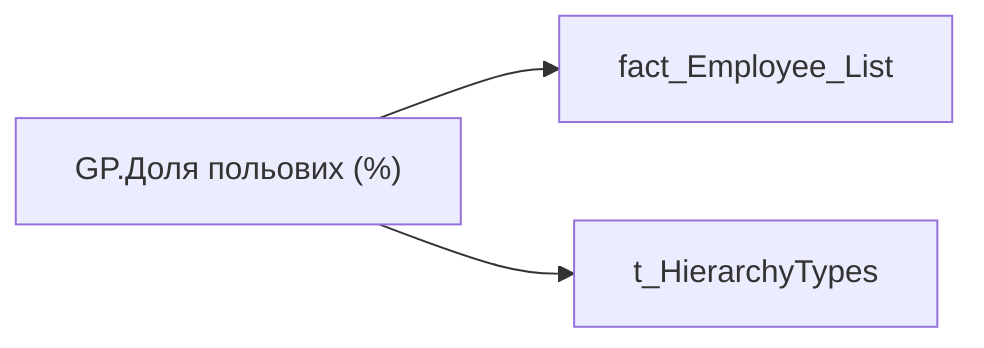

# GP.Доля польових (%)

*тека `Group_Profile\_Main\Дані про команду`*

## Технічний опис

| Властивість | Значення |
|---|---|
| Тип | міра |
| Home table | _Measures |
| displayFolder | `Group_Profile\_Main\Дані про команду` |
| formatString | — |
| dataType | — |
| Прихована | ні |

### DAX

```dax
VAR _admin = 
CALCULATE(
	DIVIDE(
		CALCULATE(
			COUNTROWS('fact_Employee_List'), 
			'fact_Employee_List'[WORK_FORMAT_ON_EMPLOYEE_KEY] = "5"
		),
		COUNTROWS('fact_Employee_List')
	)
)
VAR _admin_lt = 
	CALCULATE(
		DIVIDE(
			CALCULATE(
				COUNTROWS('fact_Employee_List'), 
				'fact_Employee_List'[WORK_FORMAT_ON_EMPLOYEE_KEY] = "5"
			),
			COUNTROWS('fact_Employee_List')
		),
		TREATAS( VALUES( 'dim_Admin_LT_OS'[USER_ACCESS_ID] ), fact_Employee_List[USER_ACCESS_ID] )
	) 
VAR _res = 
	SWITCH(
		SELECTEDVALUE('t_HierarchyTypes'[Index]),
		0, _admin_lt,
		1, _admin
	)
RETURN 
	TRIM(
		FORMAT(
			COALESCE(_res, "-"),
			"0.00%"
		) 
	)
```

### Джерела даних


Колонки: `Index`, `USER_ACCESS_ID`, `WORK_FORMAT_ON_EMPLOYEE_KEY`

Power Query: `fact_Employee_List`

### Залежності (таблиці й колонки)

Таблиці: `fact_Employee_List`, `t_HierarchyTypes`

Колонки: `dim_Admin_LT_OS[USER_ACCESS_ID]`, `fact_Employee_List[USER_ACCESS_ID]`, `fact_Employee_List[WORK_FORMAT_ON_EMPLOYEE_KEY]`, `t_HierarchyTypes[Index]`

### Схема



---

## Бізнес-суть

**Бізнес-назва:** Доля польових (%)

### Опис із ТЗ

Розрахункове поле: відношення кількості працівників із форматом роботи Польовий у команді до загальної кількості працівників.   Відношення кількості працівників, для яких `work_format_on_employee_key` = 5 до загальної чисельності команди (метрика Кількість співробітників всього, чол.)

Розрахункове поле: ідношення кількості працівників із форматом роботи Польовий у команді до загальної кількості працівників.   Відношення кількості працівників, для яких `work_format_on_employee_key` = 5 до загальної чисельності команди (людей)

**Вимоги (ТЗ):**

- [Командний профіль › Паспортна частина групового профілю › Сторінка Картка команди](https://dev.azure.com/MHPITDepProjects/People%20Digital%20Profile%20%28PDP%29/_wiki/wikis/PDP.wiki?pagePath=/%D0%A4%D1%83%D0%BD%D0%BA%D1%86%D1%96%D0%BE%D0%BD%D0%B0%D0%BB%D1%8C%D0%BD%D1%96%20%D0%B2%D0%B8%D0%BC%D0%BE%D0%B3%D0%B8/%D0%92%D0%B8%D0%BC%D0%BE%D0%B3%D0%B8%20%D0%B4%D0%BE%20%D0%B7%D0%B2%D1%96%D1%82%D1%83%20People%20Digital%20Profile/%D0%9A%D0%BE%D0%BC%D0%B0%D0%BD%D0%B4%D0%BD%D0%B8%D0%B9%20%D0%BF%D1%80%D0%BE%D1%84%D1%96%D0%BB%D1%8C/%D0%9F%D0%B0%D1%81%D0%BF%D0%BE%D1%80%D1%82%D0%BD%D0%B0%20%D1%87%D0%B0%D1%81%D1%82%D0%B8%D0%BD%D0%B0%20%D0%B3%D1%80%D1%83%D0%BF%D0%BE%D0%B2%D0%BE%D0%B3%D0%BE%20%D0%BF%D1%80%D0%BE%D1%84%D1%96%D0%BB%D1%8E/%D0%A1%D1%82%D0%BE%D1%80%D1%96%D0%BD%D0%BA%D0%B0%20%D0%9A%D0%B0%D1%80%D1%82%D0%BA%D0%B0%20%D0%BA%D0%BE%D0%BC%D0%B0%D0%BD%D0%B4%D0%B8)
- [Командний профіль › Сторінка Загальна інформація про команду](https://dev.azure.com/MHPITDepProjects/People%20Digital%20Profile%20%28PDP%29/_wiki/wikis/PDP.wiki?pagePath=/%D0%A4%D1%83%D0%BD%D0%BA%D1%86%D1%96%D0%BE%D0%BD%D0%B0%D0%BB%D1%8C%D0%BD%D1%96%20%D0%B2%D0%B8%D0%BC%D0%BE%D0%B3%D0%B8/%D0%92%D0%B8%D0%BC%D0%BE%D0%B3%D0%B8%20%D0%B4%D0%BE%20%D0%B7%D0%B2%D1%96%D1%82%D1%83%20People%20Digital%20Profile/%D0%9A%D0%BE%D0%BC%D0%B0%D0%BD%D0%B4%D0%BD%D0%B8%D0%B9%20%D0%BF%D1%80%D0%BE%D1%84%D1%96%D0%BB%D1%8C/%D0%A1%D1%82%D0%BE%D1%80%D1%96%D0%BD%D0%BA%D0%B0%20%D0%97%D0%B0%D0%B3%D0%B0%D0%BB%D1%8C%D0%BD%D0%B0%20%D1%96%D0%BD%D1%84%D0%BE%D1%80%D0%BC%D0%B0%D1%86%D1%96%D1%8F%20%D0%BF%D1%80%D0%BE%20%D0%BA%D0%BE%D0%BC%D0%B0%D0%BD%D0%B4%D1%83)

## На сторінках звіту

[Group Profile](../report/group-profile.md)

## Пов'язані міри

_Прямих зв'язків з іншими мірами немає._

## Нотатки

_порожньо_
