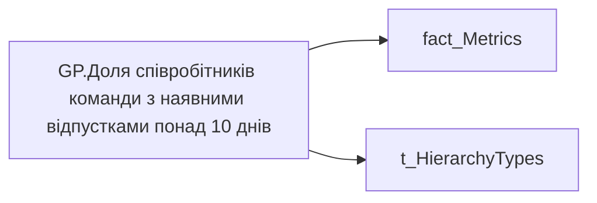

# GP.Доля співробітників команди з наявними відпустками понад 10 днів

| Властивість | Значення |
|---|---|
| Тип | міра |
| Home table | _Measures |
| displayFolder | `Group_Profile\_Main\Дані про команду` |
| formatString | — |
| dataType | — |
| Прихована | ні |

## DAX

```dax
VAR _filter0 = TREATAS(VALUES( dim_Admin_LT_OS[USER_ACCESS_ID] ), 'fact_Metrics'[USER_ACCESS_ID])
VAR _admin =
	DIVIDE(
		CALCULATE(
			COUNTROWS('fact_Metrics'),
			'fact_Metrics'[LONG_VACATION_BY_MAIN_POSITION] > 0
		),
		CALCULATE(COUNTROWS('fact_Metrics'))
	)
VAR _admin_lt =
	CALCULATE(
		DIVIDE(
			CALCULATE(
				COUNTROWS('fact_Metrics'),
				'fact_Metrics'[LONG_VACATION_BY_MAIN_POSITION] > 0
			),
			CALCULATE(COUNTROWS('fact_Metrics'))
		),
		_filter0
	)
VAR _res = 
	SWITCH(
		SELECTEDVALUE( t_HierarchyTypes[Index] ),
		0, _admin_lt,
		1, _admin
	)
RETURN
	TRIM( 
		COALESCE( 
			FORMAT( _res, "0.00%" ), "-"
		)
	)
```

## Джерела


Колонки: `Index`, `LONG_VACATION_BY_MAIN_POSITION`, `USER_ACCESS_ID`

Power Query: `fact_Metrics`

## Бізнес-суть

Доля співробітників команди з наявними відпустками понад 10 днів

Розрахункове поле. Відношення кількості працівників, у яких utilized по кожній окремій відпустці  >=10 за останні 12 місяців (включно із поточним) до загальної кількості працівників Розрахункове поле. Відношення кількості працівників, у яких utilized >=10 за останні 12 місяців до загальної кількості працівників

**Вимоги:** `Командний-профіль/Паспортна-частина-групового-профілю/Сторінка-Картка-команди`, `Командний-профіль/Сторінка-Здоров'я-та-благополуччя-команди`

## Залежності

Таблиці: `fact_Metrics`, `t_HierarchyTypes`

Колонки: `fact_Metrics[LONG_VACATION_BY_MAIN_POSITION]`, `fact_Metrics[USER_ACCESS_ID]`, `t_HierarchyTypes[Index]`

## Схема



## Нотатки

_порожньо_
