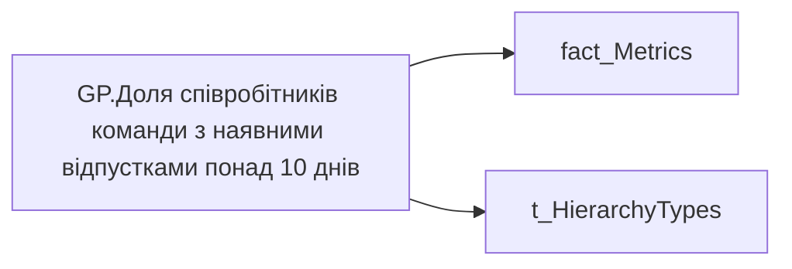

# GP.Доля співробітників команди з наявними відпустками понад 10 днів

*тека `Group_Profile\_Main\Дані про команду`*

## Технічний опис

| Властивість | Значення |
|---|---|
| Тип | міра |
| Home table | _Measures |
| displayFolder | `Group_Profile\_Main\Дані про команду` |
| formatString | — |
| dataType | — |
| Прихована | ні |

### DAX

```dax
VAR _filter0 = TREATAS(VALUES( dim_Admin_LT_OS[USER_ACCESS_ID] ), 'fact_Metrics'[USER_ACCESS_ID])
VAR _admin =
	DIVIDE(
		CALCULATE(
			COUNTROWS('fact_Metrics'),
			'fact_Metrics'[LONG_VACATION_BY_MAIN_POSITION] > 0
		),
		CALCULATE(COUNTROWS('fact_Metrics'))
	)
VAR _admin_lt =
	CALCULATE(
		DIVIDE(
			CALCULATE(
				COUNTROWS('fact_Metrics'),
				'fact_Metrics'[LONG_VACATION_BY_MAIN_POSITION] > 0
			),
			CALCULATE(COUNTROWS('fact_Metrics'))
		),
		_filter0
	)
VAR _res = 
	SWITCH(
		SELECTEDVALUE( t_HierarchyTypes[Index] ),
		0, _admin_lt,
		1, _admin
	)
RETURN
	TRIM( 
		COALESCE( 
			FORMAT( _res, "0.00%" ), "-"
		)
	)
```

### Джерела даних


Колонки: `Index`, `LONG_VACATION_BY_MAIN_POSITION`, `USER_ACCESS_ID`

Power Query: `fact_Metrics`

### Залежності (таблиці й колонки)

Таблиці: `fact_Metrics`, `t_HierarchyTypes`

Колонки: `fact_Metrics[LONG_VACATION_BY_MAIN_POSITION]`, `fact_Metrics[USER_ACCESS_ID]`, `t_HierarchyTypes[Index]`

### Схема



---

## Бізнес-суть

**Бізнес-назва:** Доля співробітників команди з наявними відпустками понад 10 днів

### Опис із ТЗ

Розрахункове поле. Відношення кількості працівників, у яких utilized по кожній окремій відпустці  >=10 за останні 12 місяців (включно із поточним) до загальної кількості працівників

Розрахункове поле. Відношення кількості працівників, у яких utilized >=10 за останні 12 місяців до загальної кількості працівників

**Вимоги (ТЗ):**

- [Командний профіль › Паспортна частина групового профілю › Сторінка Картка команди](https://dev.azure.com/MHPITDepProjects/People%20Digital%20Profile%20%28PDP%29/_wiki/wikis/PDP.wiki?pagePath=/%D0%A4%D1%83%D0%BD%D0%BA%D1%86%D1%96%D0%BE%D0%BD%D0%B0%D0%BB%D1%8C%D0%BD%D1%96%20%D0%B2%D0%B8%D0%BC%D0%BE%D0%B3%D0%B8/%D0%92%D0%B8%D0%BC%D0%BE%D0%B3%D0%B8%20%D0%B4%D0%BE%20%D0%B7%D0%B2%D1%96%D1%82%D1%83%20People%20Digital%20Profile/%D0%9A%D0%BE%D0%BC%D0%B0%D0%BD%D0%B4%D0%BD%D0%B8%D0%B9%20%D0%BF%D1%80%D0%BE%D1%84%D1%96%D0%BB%D1%8C/%D0%9F%D0%B0%D1%81%D0%BF%D0%BE%D1%80%D1%82%D0%BD%D0%B0%20%D1%87%D0%B0%D1%81%D1%82%D0%B8%D0%BD%D0%B0%20%D0%B3%D1%80%D1%83%D0%BF%D0%BE%D0%B2%D0%BE%D0%B3%D0%BE%20%D0%BF%D1%80%D0%BE%D1%84%D1%96%D0%BB%D1%8E/%D0%A1%D1%82%D0%BE%D1%80%D1%96%D0%BD%D0%BA%D0%B0%20%D0%9A%D0%B0%D1%80%D1%82%D0%BA%D0%B0%20%D0%BA%D0%BE%D0%BC%D0%B0%D0%BD%D0%B4%D0%B8)
- [Командний профіль › Сторінка Здоров'я та благополуччя команди](https://dev.azure.com/MHPITDepProjects/People%20Digital%20Profile%20%28PDP%29/_wiki/wikis/PDP.wiki?pagePath=/%D0%A4%D1%83%D0%BD%D0%BA%D1%86%D1%96%D0%BE%D0%BD%D0%B0%D0%BB%D1%8C%D0%BD%D1%96%20%D0%B2%D0%B8%D0%BC%D0%BE%D0%B3%D0%B8/%D0%92%D0%B8%D0%BC%D0%BE%D0%B3%D0%B8%20%D0%B4%D0%BE%20%D0%B7%D0%B2%D1%96%D1%82%D1%83%20People%20Digital%20Profile/%D0%9A%D0%BE%D0%BC%D0%B0%D0%BD%D0%B4%D0%BD%D0%B8%D0%B9%20%D0%BF%D1%80%D0%BE%D1%84%D1%96%D0%BB%D1%8C/%D0%A1%D1%82%D0%BE%D1%80%D1%96%D0%BD%D0%BA%D0%B0%20%D0%97%D0%B4%D0%BE%D1%80%D0%BE%D0%B2%27%D1%8F%20%D1%82%D0%B0%20%D0%B1%D0%BB%D0%B0%D0%B3%D0%BE%D0%BF%D0%BE%D0%BB%D1%83%D1%87%D1%87%D1%8F%20%D0%BA%D0%BE%D0%BC%D0%B0%D0%BD%D0%B4%D0%B8)

## На сторінках звіту

- [Group Profile](../report/group-profile.md) — Версія 1

## Пов'язані міри

_Прямих зв'язків з іншими мірами немає._

## Нотатки

_порожньо_
