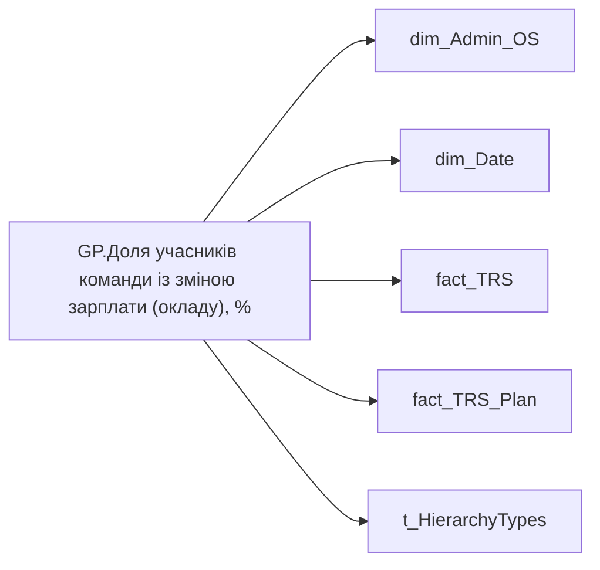

# GP.Доля учасників команди із зміною зарплати (окладу), %

*тека `Group_Profile\TRS` · формат `0%;-0%;0%`*

!!! abstract "Джерела даних"
    `DM.vw_R27_dim_Employee_Access_List`, `DM.vw_R27_fact_TRS_PDP`, `DM.vw_R27_fact_TRS_Plan_PDP`

## Бізнес-суть

PAYMENTS_PLAN_UAH → Розмір фіксованої винагороди плановий, за місяць СТАНОМ НА РІК НАЗАД; PAYMENTS_PLAN_UAH → Сума (рік тому); PAYMENTS_PLAN_UAH → Оклад по годинам (рік тому); PAYMENTS_PLAN_UAH → % зміни фіксованої винагороди; PAYMENT_PLAN_SUM → Річний цільовий дохід; PAYMENT_PLAN_SUM → Розмір фіксованої винагороди плановий, за місяць ПОТОЧНИЙ; PAYMENT_PLAN_SUM → Сума (на поточний момент); PAYMENT_PLAN_SUM → Середній розмір премії за місяць; PAYMENT_PLAN_SUM → Доля учасників із зміною фіксованої винагороди; PAYMENT_PLAN_SUM → Діапазон фіксованої винагороди (план)

Відібрати записи по працівнику [person_key], періоду [Period], організації [organization_key], підрозділу [division_key], де trs_category = Фіксована винагорода, is_payments_plan  = "1" Потрібно відібрати записи станом на 12 міс. тому, де ACCRUAL_TYPES_KEY = 5e416521-f6d6-80e3-bcde-48aec8a474fe та IS_PAYMENTS_PLAN =1 Сума за поточний місяць (план) - Відібрати записи по працівнику [person_key], періоду [Period], організації [organization_key], підрозділу [division_key], де category_name = Фіксована винагорода, IS_ACTUAL  = "1", END_DATE > поточна дата, або END_DATE = "01.01.2001".  <br>Сума ста

**Вимоги:** `Індивідуальний-профіль-працівника/Історія-по-посадам`, `Індивідуальний-профіль-працівника/Історія-по-посадам/Реліз-1.-Історія-по-посадам`, `Індивідуальний-профіль-працівника/Сторінка-Винагорода-працівника`, `Індивідуальний-профіль-працівника/Сторінка-Винагорода-працівника/Деталізація-на-сторінці-Винагорода`, `Індивідуальний-профіль-працівника/Сторінка-Винагорода-працівника/Доопрацювання-сторінки-ТРС`, `Командний-профіль/Сторінка-TRS-команди`, `Командний-профіль/Сторінка-TRS-команди/Доопрацювання-сторінки-TRS`, `Командний-профіль/Сторінка-TRS-команди/Сторінка-Винагорода-групового-профілю#вимоги-до-звіту`, `Командний-профіль/Сторінка-Моя-команда/ТЗ.-Деталізація-метрик-групового-профілю-звіту`

## На сторінках звіту

[Group Profile](../report/group-profile.md)

## Пов'язані міри

_Прямих зв'язків з іншими мірами немає._

---

## Технічний опис

| Властивість | Значення |
|---|---|
| Тип | міра |
| Home table | _Measures |
| displayFolder | `Group_Profile\TRS` |
| formatString | `0%;-0%;0%` |
| dataType | — |
| Прихована | ні |

### DAX

```dax
//************* ROLE FILTERS **************
VAR _roleIndex = SELECTEDVALUE ( 't_HierarchyTypes'[Index], 1 )   -- 0 = LT, 1 = Admin
VAR _filter_lt_plan_trs = TREATAS ( VALUES ( 'dim_Admin_LT_OS'[USER_ACCESS_ID] ),'fact_TRS_Plan'[USER_ACCESS_ID] )
VAR _filter_lt_fact_trs = TREATAS ( VALUES ( 'dim_Admin_LT_OS'[USER_ACCESS_ID] ),'fact_TRS'[USER_ACCESS_ID] )

/* *********** ADMIN *********** */
VAR _admin =
	VAR _Employees =VALUES('dim_Admin_OS'[USER_ACCESS_ID])
	VAR _EmployeesSalary = 
		ADDCOLUMNS(
			_Employees,
			"@Now",
			CALCULATE(
				MAX(fact_TRS_Plan[PAYMENT_PLAN_SUM]),
				fact_TRS_Plan[IS_ACTUAL]=TRUE(),
				fact_TRS_Plan[ACCRUAL_ORG_BASE_CODE] IN { "00002","00001" }
			),
			"@YearAgo",
				VAR _CurrMonthStart =
					DATE ( YEAR ( TODAY() ), MONTH ( TODAY() ), 1 )
				VAR _PrevYearSameMonthStart =
					EDATE ( _CurrMonthStart, -12 )
				VAR _prev_year = 
					CALCULATE(
						AVERAGE(fact_TRS[PAYMENTS_PLAN_UAH]),
						fact_TRS[ACCRUAL_TYPES_KEY] IN { "5e416521-f6d6-80e3-bcde-48aec8a474fe", "5b975c51-df44-fbad-4b67-73abd98b7e0e" },
						TREATAS({_PrevYearSameMonthStart}, 'dim_Date'[Date])
					)
				RETURN _prev_year
		)
	VAR _ShareOfEmployeesWithSalaryChange = 
		VAR _isTrue = 
		COUNTROWS(
			FILTER(
				_EmployeesSalary, 
				NOT ISBLANK([@YearAgo]) && [@Now] - [@YearAgo] > 0
			)
		)
		VAR _Total = 
			COUNTROWS(
				FILTER(
					_EmployeesSalary, 
					NOT ISBLANK([@YearAgo])
				)
			)
		RETURN DIVIDE(_isTrue, _Total)
	RETURN _ShareOfEmployeesWithSalaryChange

/* *********** LT *********** */
VAR _admin_lt =
	VAR _Employees =VALUES('dim_Admin_OS'[USER_ACCESS_ID])
	VAR _EmployeesSalary = 
		ADDCOLUMNS(
			_Employees,
			"@Now",
			CALCULATE(
				MAX(fact_TRS_Plan[PAYMENT_PLAN_SUM]),
				fact_TRS_Plan[IS_ACTUAL]=TRUE(),
				fact_TRS_Plan[ACCRUAL_ORG_BASE_CODE] IN { "00002","00001" },
				_filter_lt_plan_trs
			),
			"@YearAgo",
				VAR _CurrMonthStart =
					DATE ( YEAR ( TODAY() ), MONTH ( TODAY() ), 1 )
				VAR _PrevYearSameMonthStart =
					EDATE ( _CurrMonthStart, -12 )
				VAR _prev_year = 
					CALCULATE(
						AVERAGE(fact_TRS[PAYMENTS_PLAN_UAH]),
						fact_TRS[ACCRUAL_TYPES_KEY] IN { "5e416521-f6d6-80e3-bcde-48aec8a474fe", "5b975c51-df44-fbad-4b67-73abd98b7e0e" },
						TREATAS({_PrevYearSameMonthStart}, 'dim_Date'[Date]),
						_filter_lt_fact_trs
					)
				RETURN _prev_year
		)
	VAR _ShareOfEmployeesWithSalaryChange = 
		VAR _isTrue = 
		COUNTROWS(
			FILTER(
				_EmployeesSalary, 
				NOT ISBLANK([@YearAgo]) && [@Now] - [@YearAgo] > 0
			)
		)
		VAR _Total = 
			COUNTROWS(
				FILTER(
					_EmployeesSalary, 
					NOT ISBLANK([@YearAgo])
				)
			)
		RETURN DIVIDE(_isTrue, _Total)
	RETURN _ShareOfEmployeesWithSalaryChange

VAR _res =
	SWITCH (
		_roleIndex,
		0, _admin_lt,    -- LT
		1, _admin,       -- Admin
		_admin
	)
RETURN 
COALESCE(
	_res, "-")
```

### Джерела даних

Вихідні таблиці: `DM.vw_R27_dim_Employee_Access_List`, `DM.vw_R27_fact_TRS_PDP`, `DM.vw_R27_fact_TRS_Plan_PDP`

Колонки: `ACCRUAL_ORG_BASE_CODE`, `ACCRUAL_TYPES_KEY`, `Date`, `IS_ACTUAL`, `Index`, `PAYMENTS_PLAN_UAH`, `PAYMENT_PLAN_SUM`, `USER_ACCESS_ID`

Power Query: `dim_Admin_OS`

### Залежності (таблиці й колонки)

Таблиці: `dim_Admin_OS`, `dim_Date`, `fact_TRS`, `fact_TRS_Plan`, `t_HierarchyTypes`

Колонки: `dim_Admin_LT_OS[USER_ACCESS_ID]`, `dim_Admin_OS[USER_ACCESS_ID]`, `dim_Date[Date]`, `fact_TRS[ACCRUAL_TYPES_KEY]`, `fact_TRS[PAYMENTS_PLAN_UAH]`, `fact_TRS[USER_ACCESS_ID]`, `fact_TRS_Plan[ACCRUAL_ORG_BASE_CODE]`, `fact_TRS_Plan[IS_ACTUAL]`, `fact_TRS_Plan[PAYMENT_PLAN_SUM]`, `fact_TRS_Plan[USER_ACCESS_ID]`, `t_HierarchyTypes[Index]`

### Схема



## Нотатки

_порожньо_
