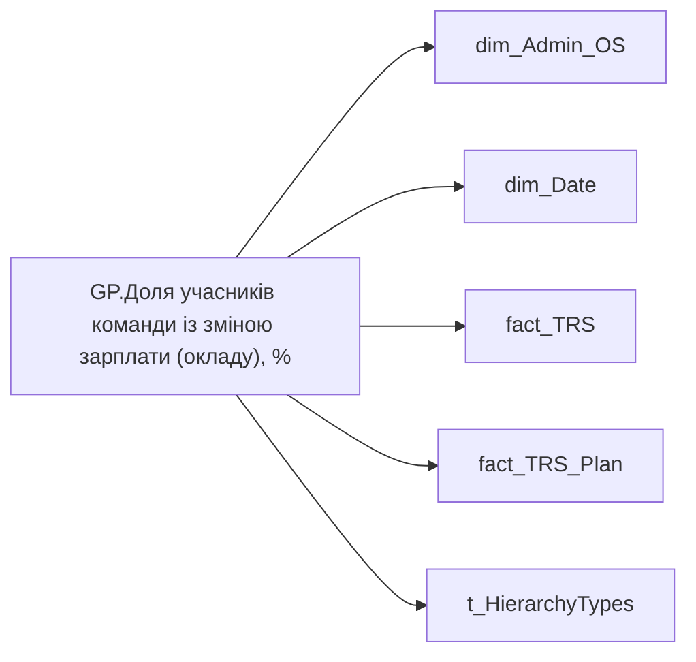

# GP.Доля учасників команди із зміною зарплати (окладу), %

*тека `Group_Profile\TRS` · формат `0%;-0%;0%`*

## Технічний опис

| Властивість | Значення |
|---|---|
| Тип | міра |
| Home table | _Measures |
| displayFolder | `Group_Profile\TRS` |
| formatString | `0%;-0%;0%` |
| dataType | — |
| Прихована | ні |

### DAX

```dax
//************* ROLE FILTERS **************
VAR _roleIndex = SELECTEDVALUE ( 't_HierarchyTypes'[Index], 1 )   -- 0 = LT, 1 = Admin
VAR _filter_lt_plan_trs = TREATAS ( VALUES ( 'dim_Admin_LT_OS'[USER_ACCESS_ID] ),'fact_TRS_Plan'[USER_ACCESS_ID] )
VAR _filter_lt_fact_trs = TREATAS ( VALUES ( 'dim_Admin_LT_OS'[USER_ACCESS_ID] ),'fact_TRS'[USER_ACCESS_ID] )

/* *********** ADMIN *********** */
VAR _admin =
	VAR _Employees =VALUES('dim_Admin_OS'[USER_ACCESS_ID])
	VAR _EmployeesSalary = 
		ADDCOLUMNS(
			_Employees,
			"@Now",
			CALCULATE(
				MAX(fact_TRS_Plan[PAYMENT_PLAN_SUM]),
				fact_TRS_Plan[IS_ACTUAL]=TRUE(),
				fact_TRS_Plan[ACCRUAL_ORG_BASE_CODE] IN { "00002","00001" }
			),
			"@YearAgo",
				VAR _CurrMonthStart =
					DATE ( YEAR ( TODAY() ), MONTH ( TODAY() ), 1 )
				VAR _PrevYearSameMonthStart =
					EDATE ( _CurrMonthStart, -12 )
				VAR _prev_year = 
					CALCULATE(
						AVERAGE(fact_TRS[PAYMENTS_PLAN_UAH]),
						fact_TRS[ACCRUAL_TYPES_KEY] IN { "5e416521-f6d6-80e3-bcde-48aec8a474fe", "5b975c51-df44-fbad-4b67-73abd98b7e0e" },
						TREATAS({_PrevYearSameMonthStart}, 'dim_Date'[Date])
					)
				RETURN _prev_year
		)
	VAR _ShareOfEmployeesWithSalaryChange = 
		VAR _isTrue = 
		COUNTROWS(
			FILTER(
				_EmployeesSalary, 
				NOT ISBLANK([@YearAgo]) && [@Now] - [@YearAgo] > 0
			)
		)
		VAR _Total = 
			COUNTROWS(
				FILTER(
					_EmployeesSalary, 
					NOT ISBLANK([@YearAgo])
				)
			)
		RETURN DIVIDE(_isTrue, _Total)
	RETURN _ShareOfEmployeesWithSalaryChange

/* *********** LT *********** */
VAR _admin_lt =
	VAR _Employees =VALUES('dim_Admin_OS'[USER_ACCESS_ID])
	VAR _EmployeesSalary = 
		ADDCOLUMNS(
			_Employees,
			"@Now",
			CALCULATE(
				MAX(fact_TRS_Plan[PAYMENT_PLAN_SUM]),
				fact_TRS_Plan[IS_ACTUAL]=TRUE(),
				fact_TRS_Plan[ACCRUAL_ORG_BASE_CODE] IN { "00002","00001" },
				_filter_lt_plan_trs
			),
			"@YearAgo",
				VAR _CurrMonthStart =
					DATE ( YEAR ( TODAY() ), MONTH ( TODAY() ), 1 )
				VAR _PrevYearSameMonthStart =
					EDATE ( _CurrMonthStart, -12 )
				VAR _prev_year = 
					CALCULATE(
						AVERAGE(fact_TRS[PAYMENTS_PLAN_UAH]),
						fact_TRS[ACCRUAL_TYPES_KEY] IN { "5e416521-f6d6-80e3-bcde-48aec8a474fe", "5b975c51-df44-fbad-4b67-73abd98b7e0e" },
						TREATAS({_PrevYearSameMonthStart}, 'dim_Date'[Date]),
						_filter_lt_fact_trs
					)
				RETURN _prev_year
		)
	VAR _ShareOfEmployeesWithSalaryChange = 
		VAR _isTrue = 
		COUNTROWS(
			FILTER(
				_EmployeesSalary, 
				NOT ISBLANK([@YearAgo]) && [@Now] - [@YearAgo] > 0
			)
		)
		VAR _Total = 
			COUNTROWS(
				FILTER(
					_EmployeesSalary, 
					NOT ISBLANK([@YearAgo])
				)
			)
		RETURN DIVIDE(_isTrue, _Total)
	RETURN _ShareOfEmployeesWithSalaryChange

VAR _res =
	SWITCH (
		_roleIndex,
		0, _admin_lt,    -- LT
		1, _admin,       -- Admin
		_admin
	)
RETURN 
COALESCE(
	_res, "-")
```

### Джерела даних

Вихідні таблиці: `DM.vw_R27_dim_Employee_Access_List`, `DM.vw_R27_fact_TRS_PDP`, `DM.vw_R27_fact_TRS_Plan_PDP`

Колонки: `ACCRUAL_ORG_BASE_CODE`, `ACCRUAL_TYPES_KEY`, `Date`, `IS_ACTUAL`, `Index`, `PAYMENTS_PLAN_UAH`, `PAYMENT_PLAN_SUM`, `USER_ACCESS_ID`

Power Query: `dim_Admin_OS`

### Залежності (таблиці й колонки)

Таблиці: `dim_Admin_OS`, `dim_Date`, `fact_TRS`, `fact_TRS_Plan`, `t_HierarchyTypes`

Колонки: `dim_Admin_LT_OS[USER_ACCESS_ID]`, `dim_Admin_OS[USER_ACCESS_ID]`, `dim_Date[Date]`, `fact_TRS[ACCRUAL_TYPES_KEY]`, `fact_TRS[PAYMENTS_PLAN_UAH]`, `fact_TRS[USER_ACCESS_ID]`, `fact_TRS_Plan[ACCRUAL_ORG_BASE_CODE]`, `fact_TRS_Plan[IS_ACTUAL]`, `fact_TRS_Plan[PAYMENT_PLAN_SUM]`, `fact_TRS_Plan[USER_ACCESS_ID]`, `t_HierarchyTypes[Index]`

### Схема



---

## Бізнес-суть

**Бізнес-назва:** Доля учасників команди із зміною зарплати (окладу), %

### Опис із ТЗ

Розрахункове поле   Відношення кількості працівників із зміною з/п за останні 12 місяців (включно із поточним місяцем)  кількості працівників, які є членами команди станом на поточний момент і 12 міс. назад.   Зміна (%) = ((Оклад на кінець − Оклад на початок) / Оклад на початок) × 100   Для працівників на відрядній оплаті праці даний показник не розраховується.

**Вимоги (ТЗ):**

- [Командний профіль › Сторінка TRS команди](https://dev.azure.com/MHPITDepProjects/People%20Digital%20Profile%20%28PDP%29/_wiki/wikis/PDP.wiki?pagePath=/%D0%A4%D1%83%D0%BD%D0%BA%D1%86%D1%96%D0%BE%D0%BD%D0%B0%D0%BB%D1%8C%D0%BD%D1%96%20%D0%B2%D0%B8%D0%BC%D0%BE%D0%B3%D0%B8/%D0%92%D0%B8%D0%BC%D0%BE%D0%B3%D0%B8%20%D0%B4%D0%BE%20%D0%B7%D0%B2%D1%96%D1%82%D1%83%20People%20Digital%20Profile/%D0%9A%D0%BE%D0%BC%D0%B0%D0%BD%D0%B4%D0%BD%D0%B8%D0%B9%20%D0%BF%D1%80%D0%BE%D1%84%D1%96%D0%BB%D1%8C/%D0%A1%D1%82%D0%BE%D1%80%D1%96%D0%BD%D0%BA%D0%B0%20TRS%20%D0%BA%D0%BE%D0%BC%D0%B0%D0%BD%D0%B4%D0%B8)
- [Командний профіль › Сторінка TRS команди › Сторінка Винагорода групового профілю › вимоги до звіту](https://dev.azure.com/MHPITDepProjects/People%20Digital%20Profile%20%28PDP%29/_wiki/wikis/PDP.wiki?pagePath=/%D0%A4%D1%83%D0%BD%D0%BA%D1%86%D1%96%D0%BE%D0%BD%D0%B0%D0%BB%D1%8C%D0%BD%D1%96%20%D0%B2%D0%B8%D0%BC%D0%BE%D0%B3%D0%B8/%D0%92%D0%B8%D0%BC%D0%BE%D0%B3%D0%B8%20%D0%B4%D0%BE%20%D0%B7%D0%B2%D1%96%D1%82%D1%83%20People%20Digital%20Profile/%D0%9A%D0%BE%D0%BC%D0%B0%D0%BD%D0%B4%D0%BD%D0%B8%D0%B9%20%D0%BF%D1%80%D0%BE%D1%84%D1%96%D0%BB%D1%8C/%D0%A1%D1%82%D0%BE%D1%80%D1%96%D0%BD%D0%BA%D0%B0%20TRS%20%D0%BA%D0%BE%D0%BC%D0%B0%D0%BD%D0%B4%D0%B8/%D0%A1%D1%82%D0%BE%D1%80%D1%96%D0%BD%D0%BA%D0%B0%20%D0%92%D0%B8%D0%BD%D0%B0%D0%B3%D0%BE%D1%80%D0%BE%D0%B4%D0%B0%20%D0%B3%D1%80%D1%83%D0%BF%D0%BE%D0%B2%D0%BE%D0%B3%D0%BE%20%D0%BF%D1%80%D0%BE%D1%84%D1%96%D0%BB%D1%8E)

## На сторінках звіту

[Group Profile](../report/group-profile.md)

## Пов'язані міри

_Прямих зв'язків з іншими мірами немає._

## Нотатки

_порожньо_
