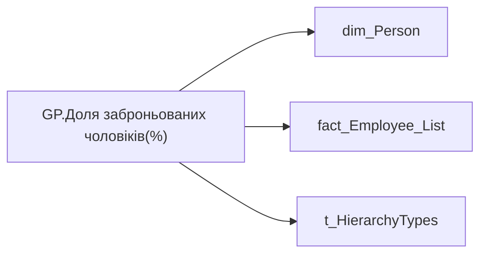

# GP.Доля заброньованих чоловіків(%)

*тека `Group_Profile\_Main\Дані про команду`*

## Бізнес-суть

GENDER → Стать; IS_RESERVED → Доля заброньованих чоловіків (%); IS_RESERVED → Заброньований

Розрахункове поле. Відношення кількості заброньованих чоловіків, у яких поле is_reserved = 1 до загальної кількості чоловіків у команді.  <br>Для визначення статі служить поле gender довідника [DM.vw_R27_dim_Person]  <br>Буде також додано деталізацію по документу бронювання: Організвція, яка забронювала, Дата закінчення бронювання, Звання, ВУС, Військомат, Вік, Інвалідність, Діти до 18р., Сума нарахувань за ост. 12 місяців для екон.бронювання (врахувати не повність відпрацьований місяць при підрахунку днів).  <br>Частина ТЗ по деталізації буде виконана після побудови або оновлення відповідних 

**Вимоги:** `Індивідуальний-профіль-працівника/Сторінка-Результативність-та-оцінка`, `Командний-профіль/Паспортна-частина-групового-профілю/Сторінка-Картка-команди`, `Командний-профіль/Сторінка-Загальна-інформація-про-команду`, `Командний-профіль/Сторінка-Загальна-інформація-про-команду/Редизайн-сторінки-Загальна-інформація`, `Командний-профіль/Сторінка-Результативність-та-оцінка-команди/Створити-блок-Виконання-OKR`

## На сторінках звіту

[Group Profile](../report/group-profile.md)

## Пов'язані міри

_Прямих зв'язків з іншими мірами немає._

---

## Технічний опис

| Властивість | Значення |
|---|---|
| Тип | міра |
| Home table | _Measures |
| displayFolder | `Group_Profile\_Main\Дані про команду` |
| formatString | — |
| dataType | — |
| Прихована | ні |

### DAX

```dax
VAR _filter_lt= TREATAS(VALUES( dim_Admin_LT_OS[USER_ACCESS_ID] ), 'fact_Employee_List'[USER_ACCESS_ID])
VAR _admin = 
	DIVIDE(
		CALCULATE(
			COUNTROWS(VALUES('fact_Employee_List'[EMPLOYEE_ID])),
			'fact_Employee_List'[IS_RESERVED] = 1,
			'dim_Person'[GENDER] = "ЧОЛОВІКИ"
		),
		CALCULATE(
			COUNTROWS(VALUES('fact_Employee_List'[EMPLOYEE_ID])),
			'dim_Person'[GENDER] = "ЧОЛОВІКИ"
		)
	)
VAR _admin_lt = 
	DIVIDE(
		CALCULATE(
			COUNTROWS(VALUES('fact_Employee_List'[EMPLOYEE_ID])),
			'fact_Employee_List'[IS_RESERVED] = 1,
			'dim_Person'[GENDER] = "ЧОЛОВІКИ",
			_filter_lt
		),
		CALCULATE(
			COUNTROWS(VALUES('fact_Employee_List'[EMPLOYEE_ID])),
			'dim_Person'[GENDER] = "ЧОЛОВІКИ",
			_filter_lt
		)
	)
VAR _res = 
	SWITCH(
		SELECTEDVALUE('t_HierarchyTypes'[Index]),
		0, _admin_lt,
		1, _admin
	)
RETURN  
	TRIM(
		FORMAT(
			COALESCE(_res, "-"),
			"0.00%"
		) 
	)
	
```

### Джерела даних

Вихідні таблиці: `DM.vw_R27_dim_Person_PDP`

Колонки: `EMPLOYEE_ID`, `GENDER`, `IS_RESERVED`, `Index`, `USER_ACCESS_ID`

Power Query: `dim_Person`

### Залежності (таблиці й колонки)

Таблиці: `dim_Person`, `fact_Employee_List`, `t_HierarchyTypes`

Колонки: `dim_Person[GENDER]`, `fact_Employee_List[EMPLOYEE_ID]`, `fact_Employee_List[IS_RESERVED]`, `fact_Employee_List[USER_ACCESS_ID]`, `t_HierarchyTypes[Index]`

### Схема



## Нотатки

_порожньо_
