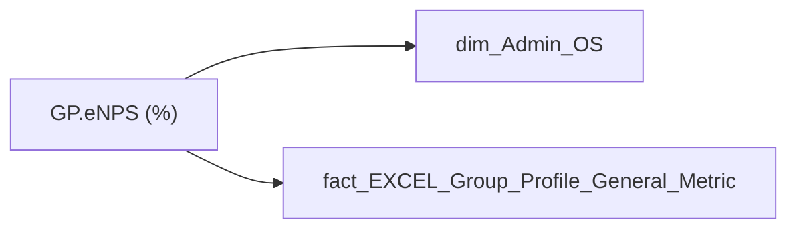

# GP.eNPS (%)

*тека `Group_Profile\_Main\Індикатори здоров'я команди`*

!!! abstract "Джерела даних"
    `DM.vw_R27_dim_Employee_Access_List`, `DWH.t_SPO_HR_Group_Profile_General_Metric`

## Бізнес-суть

DIRECTION → Напрям; DIRECTION → direction_name; DIRECTION → direction; POSITION_CATEGORY_DETAIL → Деталізація категорії посади (внутрішня); POSITION_CATEGORY_DETAIL → Категорія посади; POSITION_CATEGORY_DETAIL → Категорія посади (внутрішня); POSITION_CATEGORY_DETAIL → Доля менеджерів серед всіх співробітників (%); SUB_DIRECTION → Піднапрям; SUB_DIRECTION → subdirection; SUB_DIRECTION → sub_direction; Record_Type → Тип винятку із плинності; eNPS → eNPS (%)

division_person_id = unit_key Поле зберігається в довіднику [dm.vw_R27_dim_unit]  <br>Це поле має бути доступне у візуалізаціях, побудованих на основі фактової таблиці [dm.vw_R27_fact_Employee_List], через відповідний зв’язок за ключем [division_key] = [unit_key].  <br>Поле завжди має значення, пусте поле не допускається  <br>Якщо не вміщається в одну строку, перенести на іншу Поле зберігається в довіднику [dm.vw_R27_dim_unit]  <br>Це поле має бути доступне у візуалізаціях, побудованих на основі фактової таблиці [dm.vw_R27_fact_Employee_List_PDP], через відповідний зв’язок за ключем [division_

**Вимоги:** `Індивідуальний-профіль-працівника/Історія-по-посадам`, `Індивідуальний-профіль-працівника/Історія-по-посадам/Реліз-1.-Історія-по-посадам`, `Індивідуальний-профіль-працівника/Паспортна-частина-індивідуального-профілю-співробітника`, `Індивідуальний-профіль-працівника/Паспортна-частина-індивідуального-профілю-співробітника/Сторінка-Картка-(паспорт)-працівника`, `Індивідуальний-профіль-працівника/Сторінка-Індивідуальний-профіль-працівника`, `Індивідуальний-профіль-працівника/Сторінка-Взаємодія-Viva-та-залученість-працівника/Таблиця-vw_R27_calc_Viva_Direction_PDP`, `Індивідуальний-профіль-працівника/Сторінка-Загальна-інформація-про-працівника`, `Допоміжні-вітрини-для-звіту/Таблиця-для-розрахунку-агрегованих-метрик-по-звіту`, `Командний-профіль/Паспортна-частина-групового-профілю/Метрики-рекрутингу`, `Командний-профіль/Паспортна-частина-групового-профілю/Метрики-рекрутингу/ТЗ-на-розробку-вітрин-по-метрикам-рекрутингу`, `Командний-профіль/Паспортна-частина-групового-профілю/Редизайн-паспортної-частини-групового-профілю`, `Командний-профіль/Сторінка-Ефективність`, `Командний-профіль/Сторінка-Загальна-інформація-про-команду`, `Командний-профіль/Сторінка-Моя-команда/ТЗ.-Деталізація-метрик-групового-профілю-звіту`, `Командний-профіль/Сторінка-Навчання-і-розвиток/Блок-Розвиток-сторінки-Навчання-і-розвиток`, `Командний-профіль/Сторінка-Плинність-та-Exits/Плинність-(вітрина)`, `Командний-профіль/Сторінка-Плинність-та-Exits/Плинність-(вітрина)/Додаткові-вимоги-до-вітрини-Плинність`, `Командний-профіль/Сторінка-Плинність-та-Exits/ТЗ-на-вітрину-Exits`, `Командний-профіль/Сторінка-Результативність-та-оцінка-команди`, `Командний-профіль/Сторінка-Результативність-та-оцінка-команди/Блок-Додаткові-інструменти`

## На сторінках звіту

[Group Profile](../report/group-profile.md)

## Пов'язані міри

_Прямих зв'язків з іншими мірами немає._

---

## Технічний опис

| Властивість | Значення |
|---|---|
| Тип | міра |
| Home table | _Measures |
| displayFolder | `Group_Profile\_Main\Індикатори здоров'я команди` |
| formatString | — |
| dataType | — |
| Прихована | ні |

### DAX

```dax
VAR _current_direction = 
	FIRSTNONBLANKVALUE(
		'dim_Admin_OS'[ORDER_NUM_2],
		MIN('dim_Admin_OS'[DIRECTION])
	)

VAR _current_sub_direction = 
	FIRSTNONBLANKVALUE(
		'dim_Admin_OS'[ORDER_NUM_2],
		MIN('dim_Admin_OS'[SUB_DIRECTION])
	)

VAR _current_email = 
	FIRSTNONBLANKVALUE(
		'dim_Admin_OS'[ORDER_NUM_2],
		MIN('dim_Admin_OS'[EMPLOYEE_EMAIL])
	)

VAR _current_user = USERPRINCIPALNAME()

VAR _direction_res = 
CALCULATE(
	SUM('fact_EXCEL_Group_Profile_General_Metric'[eNPS]),
	FILTER(
		'fact_EXCEL_Group_Profile_General_Metric',
		'fact_EXCEL_Group_Profile_General_Metric'[Record_Type] = "DIRECTION"
		&&'fact_EXCEL_Group_Profile_General_Metric'[Direction_Name] = _current_direction))

VAR _sub_direction_res = 
CALCULATE(
	SUM('fact_EXCEL_Group_Profile_General_Metric'[eNPS]),
	FILTER(
		'fact_EXCEL_Group_Profile_General_Metric',
		fact_EXCEL_Group_Profile_General_Metric[Record_Type] = "SUBDIRECTION"
		&& 'fact_EXCEL_Group_Profile_General_Metric'[Direction_Name] = _current_sub_direction))

VAR top_employee_list = 
    SELECTCOLUMNS(
        FILTER(
        ALL('dim_Admin_OS'), 
        'dim_Admin_OS'[POSITION_CATEGORY_DETAIL] = "Топ-менеджмент" 
        || 'dim_Admin_OS'[EMPLOYEE_EMAIL] in 
            {
            "yu.kosyuk@mhp.com.ua",
            "andriy.bulakh@mhp.com.ua",
            "a.h.bulakh@mhp.com.ua",
            "a.gromova@mhp.com.ua",
            "o.tsaltsalko@mhp.com.ua",
            "a.androsiuk@mhp.com.ua",
            "a.horbenko@mhp.com.ua",
            "o.sulima@mhp.com.ua",
            "v.alimov@mhp.com.ua",
            "v.korinevskyi@mhp.com.ua",
            "a.domanskyi@mhp.com.ua",
            "d.konogray@mhp.com.ua",
            "r.zvonenko@mhp.com.ua",
            "s.p.nikolaiev@mhp.com.ua",
            "a.evshel@mhp.com.ua",
            "t.sakhno@mhp.com.ua",
            "i.zakharchuk@mhp.com.ua",
            "yu.polovyna@mhp.com.ua",
            "o.neskromnyy@mhp.com.ua",
            "n.heizburh@mhp.com.ua",
            "ole.va.moroz@mhp.com.ua",
            "i.savinska@mhp.com.ua",
            "v.malakhova@mhp.com.ua",
            "a.kiriiak@mhp.com.ua",
            "t.hrytseniuk@mhp.com.ua",
            "s.perepichka@mhp.com.ua",
            "o.pasko@mhp.com.ua",
            "m.vyshnevetskyi@mhp.com.ua",
            "ka.m.shevchenko@mhp.com.ua",
            "i.tverdokhlib@mhp.com.ua",
            "d.i.mazurenko@mhp.com.ua",
            "d.bohdanova@mhp.com.ua",
            "v.o.gusak@mhp.com.ua",
            "v.vorontsov@mhp.com.ua",
            "srv_powerbi_ebitda@mhp.com.ua",
            "o.tsaltsalko0@mhpo365.onmicrosoft.com"
        }),
        "EmailColumn", 
        'dim_Admin_OS'[EMPLOYEE_EMAIL]
    )

VAR _res = IF(_current_user in top_employee_list, _direction_res)

RETURN 
IF(
    ISBLANK(_res),
    "-", 
    TRIM(_res) & "%" & ", (60%)"
)
```

### Джерела даних

Вихідні таблиці: `DM.vw_R27_dim_Employee_Access_List`, `DWH.t_SPO_HR_Group_Profile_General_Metric`

Колонки: `DIRECTION`, `Direction_Name`, `EMPLOYEE_EMAIL`, `ORDER_NUM_2`, `POSITION_CATEGORY_DETAIL`, `Record_Type`, `SUB_DIRECTION`, `eNPS`

Power Query: `dim_Admin_OS`

### Залежності (таблиці й колонки)

Таблиці: `dim_Admin_OS`, `fact_EXCEL_Group_Profile_General_Metric`

Колонки: `dim_Admin_OS[DIRECTION]`, `dim_Admin_OS[EMPLOYEE_EMAIL]`, `dim_Admin_OS[ORDER_NUM_2]`, `dim_Admin_OS[POSITION_CATEGORY_DETAIL]`, `dim_Admin_OS[SUB_DIRECTION]`, `fact_EXCEL_Group_Profile_General_Metric[Direction_Name]`, `fact_EXCEL_Group_Profile_General_Metric[Record_Type]`, `fact_EXCEL_Group_Profile_General_Metric[eNPS]`

### Схема



## Нотатки

_порожньо_
