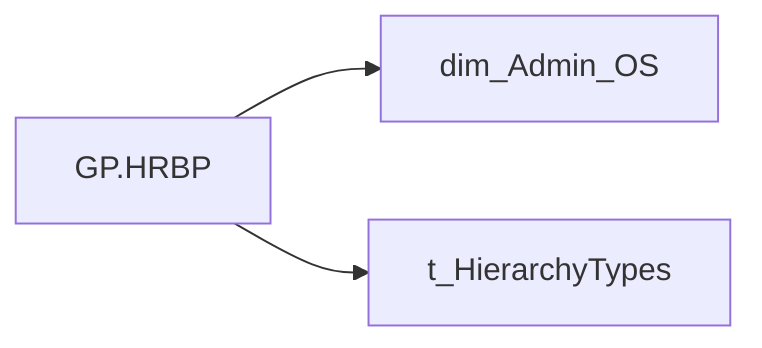

# GP.HRBP

*тека `Group_Profile\Загальна інформація`*

## Технічний опис

| Властивість | Значення |
|---|---|
| Тип | міра |
| Home table | _Measures |
| displayFolder | `Group_Profile\Загальна інформація` |
| formatString | — |
| dataType | — |
| Прихована | ні |

### DAX

```dax
VAR _filter_lt= TREATAS(VALUES( dim_Admin_LT_OS[USER_ACCESS_ID] ), 'dim_Admin_OS'[USER_ACCESS_ID])

--1. Якщо у вибірку для HR BP потрапляють керівники рівня N-1, то конкатинацію робити лише по категоріях посади Старший менеджмент А, Старший менеджмент А+ і Топ-менеджмент

VAR _sample_of_users = 
    CALCULATETABLE(
        VALUES('dim_Admin_OS'[USER_ACCESS_ID]),
        OR(
            'dim_Admin_OS'[POSITION_CATEGORY_DETAIL] IN {"Старший менеджмент А", "Старший менеджмент А+", "Топ-менеджмент"} && 'dim_Admin_OS'[path_length] = 2,
            dim_Admin_OS[path_length] > 2
        )
    )
VAR _sample_of_users_lt = 
    CALCULATETABLE(
        VALUES('dim_Admin_OS'[USER_ACCESS_ID]),
        OR(
            'dim_Admin_OS'[POSITION_CATEGORY_DETAIL] IN {"Старший менеджмент А", "Старший менеджмент А+", "Топ-менеджмент"} && 'dim_Admin_OS'[path_length] = 2,
            dim_Admin_OS[path_length] > 2
        ),
        _filter_lt
    )

--2. Визначення найвищого рівня ієрархії, за яким конкатенується атрибут

VAR _highest_ADMIN_hierarchy_level = CALCULATE(MINX('dim_Admin_OS', 'dim_Admin_OS'[path_length]))
VAR _highest_ADMIN_hierarchy_level_lt = CALCULATE(MINX('dim_Admin_OS', 'dim_Admin_OS'[path_length]))
VAR _highest_HRBP_hierarchy_level = CALCULATE(MINX('dim_Admin_OS', 'dim_Admin_OS'[path_length]),_sample_of_users)
VAR _highest_HRBP_hierarchy_level_lt = CALCULATE(MINX('dim_Admin_OS', 'dim_Admin_OS'[path_length]),_sample_of_users_lt)

--3. Розрахунок метрики для ADMIN ролі

VAR _admin =
    CALCULATE(
        CONCATENATEX(
            VALUES('dim_Admin_OS'[FULL_NAME_HRBP]),
            'dim_Admin_OS'[FULL_NAME_HRBP],
            ", "
        ),
        'dim_Admin_OS'[path_length] = _highest_ADMIN_hierarchy_level
    )
VAR _admin_lt = 
    CALCULATE(
        CONCATENATEX(
            VALUES('dim_Admin_OS'[FULL_NAME_HRBP]),
            'dim_Admin_OS'[FULL_NAME_HRBP],
            ", "
        ),
        'dim_Admin_OS'[path_length] = _highest_ADMIN_hierarchy_level_lt
    )

--4. Розрахунок метрики для HRBP ролі

VAR _HRBP =
    CALCULATE(
        CONCATENATEX(
            VALUES('dim_Admin_OS'[FULL_NAME_HRBP]),
            'dim_Admin_OS'[FULL_NAME_HRBP],
            ", "
        ),
        'dim_Admin_OS'[path_length] = _highest_HRBP_hierarchy_level,
        _sample_of_users
    )
VAR _HRBP_lt = 
    CALCULATE(
        CONCATENATEX(
            VALUES('dim_Admin_OS'[FULL_NAME_HRBP]),
            'dim_Admin_OS'[FULL_NAME_HRBP],
            ", "
        ),
        'dim_Admin_OS'[path_length] = _highest_HRBP_hierarchy_level_lt,
        _sample_of_users_lt
    )

--5. Визначення результату
VAR _res = 
    SWITCH(
        SELECTEDVALUE('t_HierarchyTypes'[Index]),
        0, 
        SWITCH(
            SELECTEDVALUE('dim_Admin_OS'[USER_ROLE]),
            "Адміністративний керівник", _admin_lt,
            "HRBP", _HRBP_lt
        ),
        1,
        SWITCH(
            SELECTEDVALUE('dim_Admin_OS'[USER_ROLE]),
            "Адміністративний керівник", _admin,
            "HRBP", _HRBP
        )
    )
RETURN COALESCE(_res, "-")
```

### Джерела даних

Вихідні таблиці: `DM.vw_R27_dim_Employee_Access_List`

Колонки: `FULL_NAME_HRBP`, `Index`, `POSITION_CATEGORY_DETAIL`, `USER_ACCESS_ID`, `USER_ROLE`, `path_length`

Power Query: `dim_Admin_OS`

### Залежності (таблиці й колонки)

Таблиці: `dim_Admin_OS`, `t_HierarchyTypes`

Колонки: `dim_Admin_OS[FULL_NAME_HRBP]`, `dim_Admin_OS[POSITION_CATEGORY_DETAIL]`, `dim_Admin_OS[USER_ACCESS_ID]`, `dim_Admin_OS[USER_ROLE]`, `dim_Admin_OS[path_length]`, `t_HierarchyTypes[Index]`

### Схема



---

## Бізнес-суть

**Бізнес-назва:** HRBP

### Опис із ТЗ

Поле зберігається в довіднику ` dm.vw_R27_dim_person`   Це поле має бути доступне у візуалізаціях, побудованих на основі фактової таблиці `dm.vw_R27_fact_Employee_List_PDP` та таблиці dm.`vw_R27_dim_Employee_Special_Head_HRBP`, через відповідний зв’язок за ключем `emp_hrbp_id` = id, щоб із  таблиці dm.`vw_R27_dim_person` по ключу `emp_hrbp_id` =`person_key` витягти значення  `full_name`.   Якщо значення в полі відсутнє, то показати текст "Дані відсутні"   Якщо ПІБ HRBP не вміщається в одну строку, перенести на іншу

ПІБ HRBP керівника команди   А якщо різні у керівника і членів команди? Подивитися в звіті 1С   Поле зберігається в довіднику ` dm.vw_R27_dim_person`   Це поле має бути доступне у візуалізаціях, побудованих на основі фактової таблиці `dm.vw_R27_fact_Employee_List` та таблиці dm.`vw_R27_dim_Employee_Special_Head_FinBP`, через відповідний зв’язок за ключем `emp_finbp_id` = id, щоб із  таблиці dm.`vw_R27_dim_person` по ключу `emp_finbp_id` =`person_key` витягти значення  `full_name`.   Якщо значення в полі відсутнє, то показати текст "Дані відсутні"   Якщо ПІБ FinBP не вміщається в одну строку, перенести на іншу

ПІБ HRBP керівника команди   Поле зберігається в довіднику ` dm.vw_R27_dim_person`   Це поле має бути доступне у візуалізаціях, побудованих на основі фактової таблиці `dm.vw_R27_fact_Employee_List` та таблиці dm.`vw_R27_dim_Employee_Special_Head_HRBP`, через відповідний зв’язок за ключем `emp_finbp_id` = id, щоб із  таблиці dm.`vw_R27_dim_person` по ключу `emp_finbp_id` =`person_key` витягти значення  `full_name`.   Якщо значення в полі відсутнє, то показати текст "Дані відсутні"   Якщо ПІБ FinBP не вміщається в одну строку, перенести на іншу

??? note "Поля-джерела та пов'язані бізнес-метрики (4)"
    | Поле | Бізнес-метрики |
    |---|---|
    | `POSITION_CATEGORY_DETAIL` | Деталізація категорії посади (внутрішня) · Категорія посади · Категорія посади (внутрішня) · Доля менеджерів серед всіх співробітників (%) |

**Вимоги (ТЗ):**

- [Індивідуальний профіль працівника › Історія по посадам](https://dev.azure.com/MHPITDepProjects/People%20Digital%20Profile%20%28PDP%29/_wiki/wikis/PDP.wiki?pagePath=/%D0%A4%D1%83%D0%BD%D0%BA%D1%86%D1%96%D0%BE%D0%BD%D0%B0%D0%BB%D1%8C%D0%BD%D1%96%20%D0%B2%D0%B8%D0%BC%D0%BE%D0%B3%D0%B8/%D0%92%D0%B8%D0%BC%D0%BE%D0%B3%D0%B8%20%D0%B4%D0%BE%20%D0%B7%D0%B2%D1%96%D1%82%D1%83%20People%20Digital%20Profile/%D0%86%D0%BD%D0%B4%D0%B8%D0%B2%D1%96%D0%B4%D1%83%D0%B0%D0%BB%D1%8C%D0%BD%D0%B8%D0%B9%20%D0%BF%D1%80%D0%BE%D1%84%D1%96%D0%BB%D1%8C%20%D0%BF%D1%80%D0%B0%D1%86%D1%96%D0%B2%D0%BD%D0%B8%D0%BA%D0%B0/%D0%86%D1%81%D1%82%D0%BE%D1%80%D1%96%D1%8F%20%D0%BF%D0%BE%20%D0%BF%D0%BE%D1%81%D0%B0%D0%B4%D0%B0%D0%BC)
- [Індивідуальний профіль працівника › Історія по посадам › Реліз 1. Історія по посадам](https://dev.azure.com/MHPITDepProjects/People%20Digital%20Profile%20%28PDP%29/_wiki/wikis/PDP.wiki?pagePath=/%D0%A4%D1%83%D0%BD%D0%BA%D1%86%D1%96%D0%BE%D0%BD%D0%B0%D0%BB%D1%8C%D0%BD%D1%96%20%D0%B2%D0%B8%D0%BC%D0%BE%D0%B3%D0%B8/%D0%92%D0%B8%D0%BC%D0%BE%D0%B3%D0%B8%20%D0%B4%D0%BE%20%D0%B7%D0%B2%D1%96%D1%82%D1%83%20People%20Digital%20Profile/%D0%86%D0%BD%D0%B4%D0%B8%D0%B2%D1%96%D0%B4%D1%83%D0%B0%D0%BB%D1%8C%D0%BD%D0%B8%D0%B9%20%D0%BF%D1%80%D0%BE%D1%84%D1%96%D0%BB%D1%8C%20%D0%BF%D1%80%D0%B0%D1%86%D1%96%D0%B2%D0%BD%D0%B8%D0%BA%D0%B0/%D0%86%D1%81%D1%82%D0%BE%D1%80%D1%96%D1%8F%20%D0%BF%D0%BE%20%D0%BF%D0%BE%D1%81%D0%B0%D0%B4%D0%B0%D0%BC/%D0%A0%D0%B5%D0%BB%D1%96%D0%B7%201.%20%D0%86%D1%81%D1%82%D0%BE%D1%80%D1%96%D1%8F%20%D0%BF%D0%BE%20%D0%BF%D0%BE%D1%81%D0%B0%D0%B4%D0%B0%D0%BC)
- [Індивідуальний профіль працівника › Паспортна частина індивідуального профілю співробітника](https://dev.azure.com/MHPITDepProjects/People%20Digital%20Profile%20%28PDP%29/_wiki/wikis/PDP.wiki?pagePath=/%D0%A4%D1%83%D0%BD%D0%BA%D1%86%D1%96%D0%BE%D0%BD%D0%B0%D0%BB%D1%8C%D0%BD%D1%96%20%D0%B2%D0%B8%D0%BC%D0%BE%D0%B3%D0%B8/%D0%92%D0%B8%D0%BC%D0%BE%D0%B3%D0%B8%20%D0%B4%D0%BE%20%D0%B7%D0%B2%D1%96%D1%82%D1%83%20People%20Digital%20Profile/%D0%86%D0%BD%D0%B4%D0%B8%D0%B2%D1%96%D0%B4%D1%83%D0%B0%D0%BB%D1%8C%D0%BD%D0%B8%D0%B9%20%D0%BF%D1%80%D0%BE%D1%84%D1%96%D0%BB%D1%8C%20%D0%BF%D1%80%D0%B0%D1%86%D1%96%D0%B2%D0%BD%D0%B8%D0%BA%D0%B0/%D0%9F%D0%B0%D1%81%D0%BF%D0%BE%D1%80%D1%82%D0%BD%D0%B0%20%D1%87%D0%B0%D1%81%D1%82%D0%B8%D0%BD%D0%B0%20%D1%96%D0%BD%D0%B4%D0%B8%D0%B2%D1%96%D0%B4%D1%83%D0%B0%D0%BB%D1%8C%D0%BD%D0%BE%D0%B3%D0%BE%20%D0%BF%D1%80%D0%BE%D1%84%D1%96%D0%BB%D1%8E%20%D1%81%D0%BF%D1%96%D0%B2%D1%80%D0%BE%D0%B1%D1%96%D1%82%D0%BD%D0%B8%D0%BA%D0%B0)
- [Індивідуальний профіль працівника › Паспортна частина індивідуального профілю співробітника › Сторінка Картка (паспорт) працівника](https://dev.azure.com/MHPITDepProjects/People%20Digital%20Profile%20%28PDP%29/_wiki/wikis/PDP.wiki?pagePath=/%D0%A4%D1%83%D0%BD%D0%BA%D1%86%D1%96%D0%BE%D0%BD%D0%B0%D0%BB%D1%8C%D0%BD%D1%96%20%D0%B2%D0%B8%D0%BC%D0%BE%D0%B3%D0%B8/%D0%92%D0%B8%D0%BC%D0%BE%D0%B3%D0%B8%20%D0%B4%D0%BE%20%D0%B7%D0%B2%D1%96%D1%82%D1%83%20People%20Digital%20Profile/%D0%86%D0%BD%D0%B4%D0%B8%D0%B2%D1%96%D0%B4%D1%83%D0%B0%D0%BB%D1%8C%D0%BD%D0%B8%D0%B9%20%D0%BF%D1%80%D0%BE%D1%84%D1%96%D0%BB%D1%8C%20%D0%BF%D1%80%D0%B0%D1%86%D1%96%D0%B2%D0%BD%D0%B8%D0%BA%D0%B0/%D0%9F%D0%B0%D1%81%D0%BF%D0%BE%D1%80%D1%82%D0%BD%D0%B0%20%D1%87%D0%B0%D1%81%D1%82%D0%B8%D0%BD%D0%B0%20%D1%96%D0%BD%D0%B4%D0%B8%D0%B2%D1%96%D0%B4%D1%83%D0%B0%D0%BB%D1%8C%D0%BD%D0%BE%D0%B3%D0%BE%20%D0%BF%D1%80%D0%BE%D1%84%D1%96%D0%BB%D1%8E%20%D1%81%D0%BF%D1%96%D0%B2%D1%80%D0%BE%D0%B1%D1%96%D1%82%D0%BD%D0%B8%D0%BA%D0%B0/%D0%A1%D1%82%D0%BE%D1%80%D1%96%D0%BD%D0%BA%D0%B0%20%D0%9A%D0%B0%D1%80%D1%82%D0%BA%D0%B0%20%28%D0%BF%D0%B0%D1%81%D0%BF%D0%BE%D1%80%D1%82%29%20%D0%BF%D1%80%D0%B0%D1%86%D1%96%D0%B2%D0%BD%D0%B8%D0%BA%D0%B0)
- [Індивідуальний профіль працівника › Сторінка Загальна інформація про працівника](https://dev.azure.com/MHPITDepProjects/People%20Digital%20Profile%20%28PDP%29/_wiki/wikis/PDP.wiki?pagePath=/%D0%A4%D1%83%D0%BD%D0%BA%D1%86%D1%96%D0%BE%D0%BD%D0%B0%D0%BB%D1%8C%D0%BD%D1%96%20%D0%B2%D0%B8%D0%BC%D0%BE%D0%B3%D0%B8/%D0%92%D0%B8%D0%BC%D0%BE%D0%B3%D0%B8%20%D0%B4%D0%BE%20%D0%B7%D0%B2%D1%96%D1%82%D1%83%20People%20Digital%20Profile/%D0%86%D0%BD%D0%B4%D0%B8%D0%B2%D1%96%D0%B4%D1%83%D0%B0%D0%BB%D1%8C%D0%BD%D0%B8%D0%B9%20%D0%BF%D1%80%D0%BE%D1%84%D1%96%D0%BB%D1%8C%20%D0%BF%D1%80%D0%B0%D1%86%D1%96%D0%B2%D0%BD%D0%B8%D0%BA%D0%B0/%D0%A1%D1%82%D0%BE%D1%80%D1%96%D0%BD%D0%BA%D0%B0%20%D0%97%D0%B0%D0%B3%D0%B0%D0%BB%D1%8C%D0%BD%D0%B0%20%D1%96%D0%BD%D1%84%D0%BE%D1%80%D0%BC%D0%B0%D1%86%D1%96%D1%8F%20%D0%BF%D1%80%D0%BE%20%D0%BF%D1%80%D0%B0%D1%86%D1%96%D0%B2%D0%BD%D0%B8%D0%BA%D0%B0)
- [Допоміжні вітрини для звіту › Денормалізація даних для вітрини DM.vw_R27_fact_Employee_List_PDP](https://dev.azure.com/MHPITDepProjects/People%20Digital%20Profile%20%28PDP%29/_wiki/wikis/PDP.wiki?pagePath=/%D0%A4%D1%83%D0%BD%D0%BA%D1%86%D1%96%D0%BE%D0%BD%D0%B0%D0%BB%D1%8C%D0%BD%D1%96%20%D0%B2%D0%B8%D0%BC%D0%BE%D0%B3%D0%B8/%D0%92%D0%B8%D0%BC%D0%BE%D0%B3%D0%B8%20%D0%B4%D0%BE%20%D0%B7%D0%B2%D1%96%D1%82%D1%83%20People%20Digital%20Profile/%D0%94%D0%BE%D0%BF%D0%BE%D0%BC%D1%96%D0%B6%D0%BD%D1%96%20%D0%B2%D1%96%D1%82%D1%80%D0%B8%D0%BD%D0%B8%20%D0%B4%D0%BB%D1%8F%20%D0%B7%D0%B2%D1%96%D1%82%D1%83/%D0%94%D0%B5%D0%BD%D0%BE%D1%80%D0%BC%D0%B0%D0%BB%D1%96%D0%B7%D0%B0%D1%86%D1%96%D1%8F%20%D0%B4%D0%B0%D0%BD%D0%B8%D1%85%20%D0%B4%D0%BB%D1%8F%20%D0%B2%D1%96%D1%82%D1%80%D0%B8%D0%BD%D0%B8%20DM.vw_R27_fact_Employee_List_PDP)
- [Допоміжні вітрини для звіту › Таблиця для розрахунку агрегованих метрик по звіту](https://dev.azure.com/MHPITDepProjects/People%20Digital%20Profile%20%28PDP%29/_wiki/wikis/PDP.wiki?pagePath=/%D0%A4%D1%83%D0%BD%D0%BA%D1%86%D1%96%D0%BE%D0%BD%D0%B0%D0%BB%D1%8C%D0%BD%D1%96%20%D0%B2%D0%B8%D0%BC%D0%BE%D0%B3%D0%B8/%D0%92%D0%B8%D0%BC%D0%BE%D0%B3%D0%B8%20%D0%B4%D0%BE%20%D0%B7%D0%B2%D1%96%D1%82%D1%83%20People%20Digital%20Profile/%D0%94%D0%BE%D0%BF%D0%BE%D0%BC%D1%96%D0%B6%D0%BD%D1%96%20%D0%B2%D1%96%D1%82%D1%80%D0%B8%D0%BD%D0%B8%20%D0%B4%D0%BB%D1%8F%20%D0%B7%D0%B2%D1%96%D1%82%D1%83/%D0%A2%D0%B0%D0%B1%D0%BB%D0%B8%D1%86%D1%8F%20%D0%B4%D0%BB%D1%8F%20%D1%80%D0%BE%D0%B7%D1%80%D0%B0%D1%85%D1%83%D0%BD%D0%BA%D1%83%20%D0%B0%D0%B3%D1%80%D0%B5%D0%B3%D0%BE%D0%B2%D0%B0%D0%BD%D0%B8%D1%85%20%D0%BC%D0%B5%D1%82%D1%80%D0%B8%D0%BA%20%D0%BF%D0%BE%20%D0%B7%D0%B2%D1%96%D1%82%D1%83)
- [Командний профіль › Паспортна частина групового профілю › Редизайн паспортної частини групового профілю](https://dev.azure.com/MHPITDepProjects/People%20Digital%20Profile%20%28PDP%29/_wiki/wikis/PDP.wiki?pagePath=/%D0%A4%D1%83%D0%BD%D0%BA%D1%86%D1%96%D0%BE%D0%BD%D0%B0%D0%BB%D1%8C%D0%BD%D1%96%20%D0%B2%D0%B8%D0%BC%D0%BE%D0%B3%D0%B8/%D0%92%D0%B8%D0%BC%D0%BE%D0%B3%D0%B8%20%D0%B4%D0%BE%20%D0%B7%D0%B2%D1%96%D1%82%D1%83%20People%20Digital%20Profile/%D0%9A%D0%BE%D0%BC%D0%B0%D0%BD%D0%B4%D0%BD%D0%B8%D0%B9%20%D0%BF%D1%80%D0%BE%D1%84%D1%96%D0%BB%D1%8C/%D0%9F%D0%B0%D1%81%D0%BF%D0%BE%D1%80%D1%82%D0%BD%D0%B0%20%D1%87%D0%B0%D1%81%D1%82%D0%B8%D0%BD%D0%B0%20%D0%B3%D1%80%D1%83%D0%BF%D0%BE%D0%B2%D0%BE%D0%B3%D0%BE%20%D0%BF%D1%80%D0%BE%D1%84%D1%96%D0%BB%D1%8E/%D0%A0%D0%B5%D0%B4%D0%B8%D0%B7%D0%B0%D0%B9%D0%BD%20%D0%BF%D0%B0%D1%81%D0%BF%D0%BE%D1%80%D1%82%D0%BD%D0%BE%D1%97%20%D1%87%D0%B0%D1%81%D1%82%D0%B8%D0%BD%D0%B8%20%D0%B3%D1%80%D1%83%D0%BF%D0%BE%D0%B2%D0%BE%D0%B3%D0%BE%20%D0%BF%D1%80%D0%BE%D1%84%D1%96%D0%BB%D1%8E)
- [Командний профіль › Сторінка Ефективність](https://dev.azure.com/MHPITDepProjects/People%20Digital%20Profile%20%28PDP%29/_wiki/wikis/PDP.wiki?pagePath=/%D0%A4%D1%83%D0%BD%D0%BA%D1%86%D1%96%D0%BE%D0%BD%D0%B0%D0%BB%D1%8C%D0%BD%D1%96%20%D0%B2%D0%B8%D0%BC%D0%BE%D0%B3%D0%B8/%D0%92%D0%B8%D0%BC%D0%BE%D0%B3%D0%B8%20%D0%B4%D0%BE%20%D0%B7%D0%B2%D1%96%D1%82%D1%83%20People%20Digital%20Profile/%D0%9A%D0%BE%D0%BC%D0%B0%D0%BD%D0%B4%D0%BD%D0%B8%D0%B9%20%D0%BF%D1%80%D0%BE%D1%84%D1%96%D0%BB%D1%8C/%D0%A1%D1%82%D0%BE%D1%80%D1%96%D0%BD%D0%BA%D0%B0%20%D0%95%D1%84%D0%B5%D0%BA%D1%82%D0%B8%D0%B2%D0%BD%D1%96%D1%81%D1%82%D1%8C)
- [Командний профіль › Сторінка Загальна інформація про команду](https://dev.azure.com/MHPITDepProjects/People%20Digital%20Profile%20%28PDP%29/_wiki/wikis/PDP.wiki?pagePath=/%D0%A4%D1%83%D0%BD%D0%BA%D1%86%D1%96%D0%BE%D0%BD%D0%B0%D0%BB%D1%8C%D0%BD%D1%96%20%D0%B2%D0%B8%D0%BC%D0%BE%D0%B3%D0%B8/%D0%92%D0%B8%D0%BC%D0%BE%D0%B3%D0%B8%20%D0%B4%D0%BE%20%D0%B7%D0%B2%D1%96%D1%82%D1%83%20People%20Digital%20Profile/%D0%9A%D0%BE%D0%BC%D0%B0%D0%BD%D0%B4%D0%BD%D0%B8%D0%B9%20%D0%BF%D1%80%D0%BE%D1%84%D1%96%D0%BB%D1%8C/%D0%A1%D1%82%D0%BE%D1%80%D1%96%D0%BD%D0%BA%D0%B0%20%D0%97%D0%B0%D0%B3%D0%B0%D0%BB%D1%8C%D0%BD%D0%B0%20%D1%96%D0%BD%D1%84%D0%BE%D1%80%D0%BC%D0%B0%D1%86%D1%96%D1%8F%20%D0%BF%D1%80%D0%BE%20%D0%BA%D0%BE%D0%BC%D0%B0%D0%BD%D0%B4%D1%83)
- [Командний профіль › Сторінка Моя команда › ТЗ. Деталізація метрик групового профілю звіту](https://dev.azure.com/MHPITDepProjects/People%20Digital%20Profile%20%28PDP%29/_wiki/wikis/PDP.wiki?pagePath=/%D0%A4%D1%83%D0%BD%D0%BA%D1%86%D1%96%D0%BE%D0%BD%D0%B0%D0%BB%D1%8C%D0%BD%D1%96%20%D0%B2%D0%B8%D0%BC%D0%BE%D0%B3%D0%B8/%D0%92%D0%B8%D0%BC%D0%BE%D0%B3%D0%B8%20%D0%B4%D0%BE%20%D0%B7%D0%B2%D1%96%D1%82%D1%83%20People%20Digital%20Profile/%D0%9A%D0%BE%D0%BC%D0%B0%D0%BD%D0%B4%D0%BD%D0%B8%D0%B9%20%D0%BF%D1%80%D0%BE%D1%84%D1%96%D0%BB%D1%8C/%D0%A1%D1%82%D0%BE%D1%80%D1%96%D0%BD%D0%BA%D0%B0%20%D0%9C%D0%BE%D1%8F%20%D0%BA%D0%BE%D0%BC%D0%B0%D0%BD%D0%B4%D0%B0/%D0%A2%D0%97.%20%D0%94%D0%B5%D1%82%D0%B0%D0%BB%D1%96%D0%B7%D0%B0%D1%86%D1%96%D1%8F%20%D0%BC%D0%B5%D1%82%D1%80%D0%B8%D0%BA%20%D0%B3%D1%80%D1%83%D0%BF%D0%BE%D0%B2%D0%BE%D0%B3%D0%BE%20%D0%BF%D1%80%D0%BE%D1%84%D1%96%D0%BB%D1%8E%20%D0%B7%D0%B2%D1%96%D1%82%D1%83)
- [Командний профіль › Сторінка Навчання і розвиток › Блок Розвиток сторінки Навчання і розвиток](https://dev.azure.com/MHPITDepProjects/People%20Digital%20Profile%20%28PDP%29/_wiki/wikis/PDP.wiki?pagePath=/%D0%A4%D1%83%D0%BD%D0%BA%D1%86%D1%96%D0%BE%D0%BD%D0%B0%D0%BB%D1%8C%D0%BD%D1%96%20%D0%B2%D0%B8%D0%BC%D0%BE%D0%B3%D0%B8/%D0%92%D0%B8%D0%BC%D0%BE%D0%B3%D0%B8%20%D0%B4%D0%BE%20%D0%B7%D0%B2%D1%96%D1%82%D1%83%20People%20Digital%20Profile/%D0%9A%D0%BE%D0%BC%D0%B0%D0%BD%D0%B4%D0%BD%D0%B8%D0%B9%20%D0%BF%D1%80%D0%BE%D1%84%D1%96%D0%BB%D1%8C/%D0%A1%D1%82%D0%BE%D1%80%D1%96%D0%BD%D0%BA%D0%B0%20%D0%9D%D0%B0%D0%B2%D1%87%D0%B0%D0%BD%D0%BD%D1%8F%20%D1%96%20%D1%80%D0%BE%D0%B7%D0%B2%D0%B8%D1%82%D0%BE%D0%BA/%D0%91%D0%BB%D0%BE%D0%BA%20%D0%A0%D0%BE%D0%B7%D0%B2%D0%B8%D1%82%D0%BE%D0%BA%20%D1%81%D1%82%D0%BE%D1%80%D1%96%D0%BD%D0%BA%D0%B8%20%D0%9D%D0%B0%D0%B2%D1%87%D0%B0%D0%BD%D0%BD%D1%8F%20%D1%96%20%D1%80%D0%BE%D0%B7%D0%B2%D0%B8%D1%82%D0%BE%D0%BA)
- [Командний профіль › Сторінка Плинність та Exits › ТЗ на вітрину Exits](https://dev.azure.com/MHPITDepProjects/People%20Digital%20Profile%20%28PDP%29/_wiki/wikis/PDP.wiki?pagePath=/%D0%A4%D1%83%D0%BD%D0%BA%D1%86%D1%96%D0%BE%D0%BD%D0%B0%D0%BB%D1%8C%D0%BD%D1%96%20%D0%B2%D0%B8%D0%BC%D0%BE%D0%B3%D0%B8/%D0%92%D0%B8%D0%BC%D0%BE%D0%B3%D0%B8%20%D0%B4%D0%BE%20%D0%B7%D0%B2%D1%96%D1%82%D1%83%20People%20Digital%20Profile/%D0%9A%D0%BE%D0%BC%D0%B0%D0%BD%D0%B4%D0%BD%D0%B8%D0%B9%20%D0%BF%D1%80%D0%BE%D1%84%D1%96%D0%BB%D1%8C/%D0%A1%D1%82%D0%BE%D1%80%D1%96%D0%BD%D0%BA%D0%B0%20%D0%9F%D0%BB%D0%B8%D0%BD%D0%BD%D1%96%D1%81%D1%82%D1%8C%20%D1%82%D0%B0%20Exits/%D0%A2%D0%97%20%D0%BD%D0%B0%20%D0%B2%D1%96%D1%82%D1%80%D0%B8%D0%BD%D1%83%20Exits)
- [Командний профіль › Сторінка Результативність та оцінка команди › Блок Додаткові інструменти](https://dev.azure.com/MHPITDepProjects/People%20Digital%20Profile%20%28PDP%29/_wiki/wikis/PDP.wiki?pagePath=/%D0%A4%D1%83%D0%BD%D0%BA%D1%86%D1%96%D0%BE%D0%BD%D0%B0%D0%BB%D1%8C%D0%BD%D1%96%20%D0%B2%D0%B8%D0%BC%D0%BE%D0%B3%D0%B8/%D0%92%D0%B8%D0%BC%D0%BE%D0%B3%D0%B8%20%D0%B4%D0%BE%20%D0%B7%D0%B2%D1%96%D1%82%D1%83%20People%20Digital%20Profile/%D0%9A%D0%BE%D0%BC%D0%B0%D0%BD%D0%B4%D0%BD%D0%B8%D0%B9%20%D0%BF%D1%80%D0%BE%D1%84%D1%96%D0%BB%D1%8C/%D0%A1%D1%82%D0%BE%D1%80%D1%96%D0%BD%D0%BA%D0%B0%20%D0%A0%D0%B5%D0%B7%D1%83%D0%BB%D1%8C%D1%82%D0%B0%D1%82%D0%B8%D0%B2%D0%BD%D1%96%D1%81%D1%82%D1%8C%20%D1%82%D0%B0%20%D0%BE%D1%86%D1%96%D0%BD%D0%BA%D0%B0%20%D0%BA%D0%BE%D0%BC%D0%B0%D0%BD%D0%B4%D0%B8/%D0%91%D0%BB%D0%BE%D0%BA%20%D0%94%D0%BE%D0%B4%D0%B0%D1%82%D0%BA%D0%BE%D0%B2%D1%96%20%D1%96%D0%BD%D1%81%D1%82%D1%80%D1%83%D0%BC%D0%B5%D0%BD%D1%82%D0%B8)

## На сторінках звіту

[Group Profile](../report/group-profile.md)

## Пов'язані міри

_Прямих зв'язків з іншими мірами немає._

## Нотатки

_порожньо_
