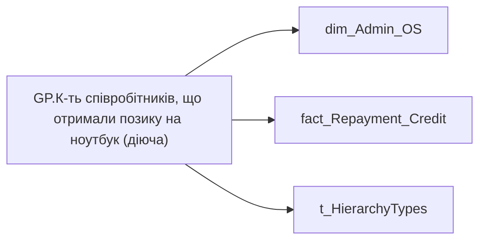

# GP.К-ть співробітників, що отримали позику на ноутбук (діюча)

| Властивість | Значення |
|---|---|
| Тип | міра |
| Home table | _Measures |
| displayFolder | `Group_Profile\TRS` |
| formatString | `0` |
| dataType | — |
| Прихована | ні |

## DAX

```dax
//************* ROLE FILTERS **************
VAR _roleIndex = SELECTEDVALUE ( 't_HierarchyTypes'[Index], 1 )   -- 0 = LT, 1 = Admin
VAR _filter_lt = TREATAS ( VALUES ( 'dim_Admin_LT_OS'[USER_ACCESS_ID] ),dim_Admin_OS[USER_ACCESS_ID] )

/* *********** ADMIN *********** */
VAR _admin =
CALCULATE(
    DISTINCTCOUNT('fact_Repayment_Credit'[USER_ACCESS_ID]),
    FILTER(
        'fact_Repayment_Credit',
        'fact_Repayment_Credit'[IS_INCOMING] = TRUE()
        && 'fact_Repayment_Credit'[BUDGET_ITEM_CODE] = "0000008240"))

/* *********** LT *********** */
VAR _admin_lt =
CALCULATE(
    DISTINCTCOUNT('fact_Repayment_Credit'[USER_ACCESS_ID]),
    FILTER(
        'fact_Repayment_Credit',
        'fact_Repayment_Credit'[IS_INCOMING] = TRUE()
        && 'fact_Repayment_Credit'[BUDGET_ITEM_CODE] = "0000008240"),
    _filter_lt)

VAR _res =
	SWITCH (
		_roleIndex,
		0, _admin_lt,    -- LT
		1, _admin,       -- Admin
		_admin
	)
RETURN 
COALESCE(
	_res, "-")
```

## Джерела

Вихідні таблиці: `DM.vw_R27_dim_Employee_Access_List`, `DM.vw_R27_fact_Repayment_Credit_PDP`

Колонки: `BUDGET_ITEM_CODE`, `IS_INCOMING`, `Index`, `USER_ACCESS_ID`

Power Query: `dim_Admin_OS`

## Бізнес-суть

!!! warning "Без бізнес-визначення"
    Поля міри не знайдено у wiki «Таблицях джерел даних». Заповніть `manualNotes`.

## Залежності

Таблиці: `dim_Admin_OS`, `fact_Repayment_Credit`, `t_HierarchyTypes`

Колонки: `dim_Admin_LT_OS[USER_ACCESS_ID]`, `dim_Admin_OS[USER_ACCESS_ID]`, `fact_Repayment_Credit[BUDGET_ITEM_CODE]`, `fact_Repayment_Credit[IS_INCOMING]`, `fact_Repayment_Credit[USER_ACCESS_ID]`, `t_HierarchyTypes[Index]`

## Схема



## Нотатки

_порожньо_
