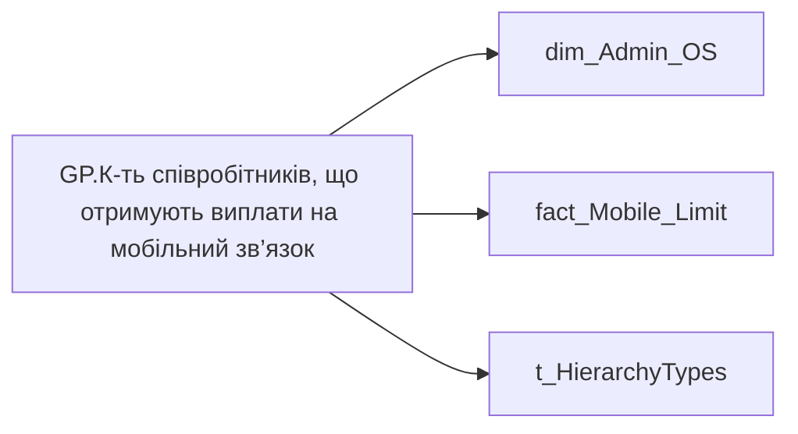

# GP.К-ть співробітників, що отримують виплати на мобільний зв’язок

*тека `Group_Profile\TRS` · формат `0`*

!!! abstract "Джерела даних"
    `DM.vw_R27_dim_Employee_Access_List`, `DM.vw_R27_fact_Mobile_Limit_PDP`

## Бізнес-суть

PHONE_CORP_LIMIT → Мобільний зв'язок - Корпоративний ліміт; PHONE_CORP_LIMIT → Середні витрати на мобільний зв’язок; PHONE_CORP_LIMIT → Мобільний зв'язок

Потрібно відібрати всі записи по працівнику [person_key], періоду [Period], організації [organization_key]  <br>Якщо PHONE_CORP_LIMIT = "99999", виводимо значення "Безлімітний"  <br>Якщо значення в полі відсутнє, то показати текст "Дані відсутні" або знак "-" Розрахункове.  <br>Потрібно зсумувати значення поля PHONE_CORP_LIMIT ( PHONE_CORP_LIMIT <> '99999') по членам команди, які мають компенсацію мобільного зв'язку, та поділити на кількість таких членів команди.  <br>В деталізацію вивести перелік таких працівників та суму на компенсацію зв'язку та назву пакету (PHONE_PACKAGE_NAME) по кожному 

**Вимоги:** `Індивідуальний-профіль-працівника/Сторінка-Винагорода-працівника`, `Командний-профіль/Сторінка-TRS-команди`, `Командний-профіль/Сторінка-TRS-команди/Сторінка-Винагорода-групового-профілю#вимоги-до-звіту`, `Командний-профіль/Сторінка-Моя-команда/ТЗ.-Деталізація-метрик-групового-профілю-звіту`

## На сторінках звіту

[Group Profile](../report/group-profile.md)

## Пов'язані міри

**Використовується в:** ['GP.Мобільний зв''язок, % факт.SVG'](../measures/gp-mobilnyi-zviazok-fakt-svg.md)

---

## Технічний опис

| Властивість | Значення |
|---|---|
| Тип | міра |
| Home table | _Measures |
| displayFolder | `Group_Profile\TRS` |
| formatString | `0` |
| dataType | — |
| Прихована | ні |

### DAX

```dax
//************* ROLE FILTERS **************
VAR _roleIndex = SELECTEDVALUE ( 't_HierarchyTypes'[Index], 1 )   -- 0 = LT, 1 = Admin
VAR _filter_lt = TREATAS ( VALUES ( 'dim_Admin_LT_OS'[USER_ACCESS_ID] ),dim_Admin_OS[USER_ACCESS_ID] )

/* *********** ADMIN *********** */
VAR _admin =
CALCULATE(
    COUNTA('fact_Mobile_Limit'[USER_ACCESS_ID]),
    FILTER(
        'fact_Mobile_Limit',
        NOT ISBLANK('fact_Mobile_Limit'[PHONE_CORP_LIMIT]) && 'fact_Mobile_Limit'[PHONE_CORP_LIMIT] <> 0))
        
/* *********** LT *********** */
VAR _admin_lt =
    CALCULATE(
        COUNTA('fact_Mobile_Limit'[USER_ACCESS_ID]),
        FILTER(
            'fact_Mobile_Limit',
            NOT ISBLANK('fact_Mobile_Limit'[PHONE_CORP_LIMIT]) && 'fact_Mobile_Limit'[PHONE_CORP_LIMIT] <> 0),
            _filter_lt)

VAR _res =
	SWITCH (
		_roleIndex,
		0, _admin_lt,    -- LT
		1, _admin,       -- Admin
		_admin
	)
RETURN _res
```

### Джерела даних

Вихідні таблиці: `DM.vw_R27_dim_Employee_Access_List`, `DM.vw_R27_fact_Mobile_Limit_PDP`

Колонки: `Index`, `PHONE_CORP_LIMIT`, `USER_ACCESS_ID`

Power Query: `dim_Admin_OS`

### Залежності (таблиці й колонки)

Таблиці: `dim_Admin_OS`, `fact_Mobile_Limit`, `t_HierarchyTypes`

Колонки: `dim_Admin_LT_OS[USER_ACCESS_ID]`, `dim_Admin_OS[USER_ACCESS_ID]`, `fact_Mobile_Limit[PHONE_CORP_LIMIT]`, `fact_Mobile_Limit[USER_ACCESS_ID]`, `t_HierarchyTypes[Index]`

### Схема



## Нотатки

_порожньо_
