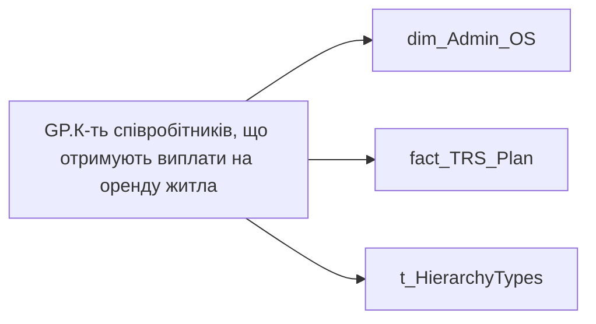

# GP.К-ть співробітників, що отримують виплати на оренду житла

*тека `Group_Profile\TRS` · формат `0`*

## Технічний опис

| Властивість | Значення |
|---|---|
| Тип | міра |
| Home table | _Measures |
| displayFolder | `Group_Profile\TRS` |
| formatString | `0` |
| dataType | — |
| Прихована | ні |

### DAX

```dax
//************* ROLE FILTERS **************
VAR _roleIndex = SELECTEDVALUE ( 't_HierarchyTypes'[Index], 1 )   -- 0 = LT, 1 = Admin
VAR _filter_lt = TREATAS ( VALUES ( 'dim_Admin_LT_OS'[USER_ACCESS_ID] ),dim_Admin_OS[USER_ACCESS_ID] )

/* *********** ADMIN *********** */
VAR _admin =
	CALCULATE(
        DISTINCTCOUNT(fact_TRS_Plan[USER_ACCESS_ID]),
        fact_TRS_Plan[IS_ACTUAL] = TRUE(),
        fact_TRS_Plan[ACCRUAL_ORG_CODE] = "00144")

/* *********** LT *********** */
VAR _admin_lt =
	CALCULATE(
        DISTINCTCOUNT(fact_TRS_Plan[USER_ACCESS_ID]),
        fact_TRS_Plan[IS_ACTUAL] = TRUE(),
        fact_TRS_Plan[ACCRUAL_ORG_CODE] = "00144",
        _filter_lt)

VAR _res =
	SWITCH (
		_roleIndex,
		0, _admin_lt,    -- LT
		1, _admin,       -- Admin
		_admin
	)
RETURN 
COALESCE(
	_res, "-")
```

### Джерела даних

Вихідні таблиці: `DM.vw_R27_dim_Employee_Access_List`, `DM.vw_R27_fact_TRS_Plan_PDP`

Колонки: `ACCRUAL_ORG_CODE`, `IS_ACTUAL`, `Index`, `USER_ACCESS_ID`

Power Query: `dim_Admin_OS`

### Залежності (таблиці й колонки)

Таблиці: `dim_Admin_OS`, `fact_TRS_Plan`, `t_HierarchyTypes`

Колонки: `dim_Admin_LT_OS[USER_ACCESS_ID]`, `dim_Admin_OS[USER_ACCESS_ID]`, `fact_TRS_Plan[ACCRUAL_ORG_CODE]`, `fact_TRS_Plan[IS_ACTUAL]`, `fact_TRS_Plan[USER_ACCESS_ID]`, `t_HierarchyTypes[Index]`

### Схема



---

## Бізнес-суть

!!! note "Бізнес-визначення відсутнє"
    Поля міри не зіставлено з wiki «Таблицями джерел даних». Можна заповнити вручну в `manualNotes`.

## На сторінках звіту

[Group Profile](../report/group-profile.md)

## Пов'язані міри

_Прямих зв'язків з іншими мірами немає._

## Нотатки

_порожньо_
