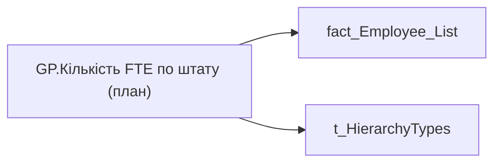

# GP.Кількість FTE по штату (план)

*тека `Group_Profile\Загальна інформація` · формат `#,0.00;-#,0.00;0.00`*

## Технічний опис

| Властивість | Значення |
|---|---|
| Тип | міра |
| Home table | _Measures |
| displayFolder | `Group_Profile\Загальна інформація` |
| formatString | `#,0.00;-#,0.00;0.00` |
| dataType | — |
| Прихована | ні |

### DAX

```dax
VAR _filter_lt= TREATAS(VALUES( dim_Admin_LT_OS[USER_ACCESS_ID] ), 'fact_Employee_List'[USER_ACCESS_ID])
VAR _admin = 
	CALCULATE(
		SUM('fact_Employee_List'[POSITION_AMT]),
		NOT('fact_Employee_List'[STATUS_KEY] IN {"2","3"})
	)
VAR _admin_lt = 
	CALCULATE(
		SUM('fact_Employee_List'[POSITION_AMT]),
		NOT('fact_Employee_List'[STATUS_KEY] IN {"2","3"}),
		_filter_lt
	)
VAR _res = 
	SWITCH(
		SELECTEDVALUE('t_HierarchyTypes'[Index]),
		0, _admin_lt,
		1, _admin
	)
RETURN 
	TRIM(
		FORMAT(	
			COALESCE(_res, "-"), 
			"### ###" 
		) 
	)
		
```

### Джерела даних


Колонки: `Index`, `POSITION_AMT`, `STATUS_KEY`, `USER_ACCESS_ID`

Power Query: `fact_Employee_List`

### Залежності (таблиці й колонки)

Таблиці: `fact_Employee_List`, `t_HierarchyTypes`

Колонки: `fact_Employee_List[POSITION_AMT]`, `fact_Employee_List[STATUS_KEY]`, `fact_Employee_List[USER_ACCESS_ID]`, `t_HierarchyTypes[Index]`

### Схема



---

## Бізнес-суть

POSITION_AMT → Кількість FTE по штату (план)

Розрахункове поле.  <br>Потрібно підрахувати кількість запланованих ставок по штатним посадам по організації (organization_key) та підрозділу (division_key) без врахування задубльованих посад (тобто, коли на одній посаді є людина в статусах мобілізація або декрет (status_key = 2 або 3) та інший працівник в статусі Активний).  <br>Якщо це команда lead team, то штатну чисельність рахувати - так же, плюс посади, виходячи із зв'язку керівник-підлеглий.

**Вимоги:** `Командний-профіль/Сторінка-Загальна-інформація-про-команду`

## На сторінках звіту

[Group Profile](../report/group-profile.md)

## Пов'язані міри

_Прямих зв'язків з іншими мірами немає._

## Нотатки

_порожньо_
