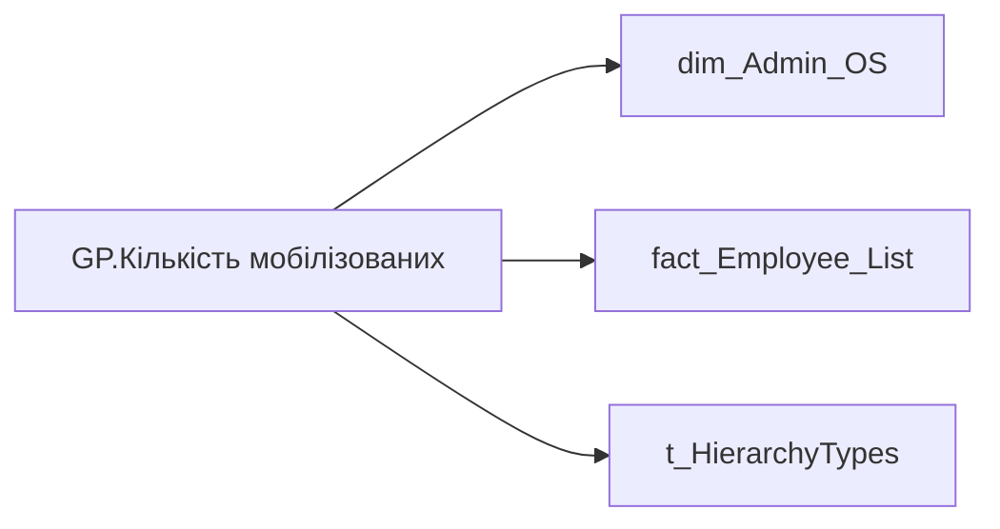

# GP.Кількість мобілізованих

*тека `Group_Profile\Загальна інформація` · формат `0;-0;0`*

## Бізнес-суть

STATUS_NAME → Статус працівника; STATUS_NAME → Статус співробітника; is_mobilized → Кількість мобілізованих

Поле зберігається в довіднику [dm.vw_R27_dim_Employee_Status]  <br>Це поле має бути доступне у візуалізаціях, побудованих на основі фактової таблиці [dm.vw_R27_fact_Employee_List_PDP], через відповідний зв’язок за ключем [status_key].  <br>Поле Статус не може бути пустим, бо у працівника він завжди є. Розрахункове поле. Підрахувати скільки працівників у команді, де is_mobilized = 1  <br>Потрібно рахувати унікальну к-ть, щоб двічі не рахували тих, в кого осн місце і сумісництво. Наприклад, директор хабу дивиться усю свою структуру, то в нього може бути 2 юрки під ним, в кожній один і той самий 

**Вимоги:** `Індивідуальний-профіль-працівника/Сторінка-Загальна-інформація-про-працівника`, `Командний-профіль/Сторінка-Загальна-інформація-про-команду`, `Командний-профіль/Сторінка-Загальна-інформація-про-команду/Редизайн-сторінки-Загальна-інформація`, `Командний-профіль/Сторінка-Моя-команда/ТЗ.-Деталізація-метрик-групового-профілю-звіту`

## На сторінках звіту

[Group Profile](../report/group-profile.md)

## Пов'язані міри

_Прямих зв'язків з іншими мірами немає._

---

## Технічний опис

| Властивість | Значення |
|---|---|
| Тип | міра |
| Home table | _Measures |
| displayFolder | `Group_Profile\Загальна інформація` |
| formatString | `0;-0;0` |
| dataType | — |
| Прихована | ні |

### DAX

```dax
VAR _filter_lt= TREATAS(VALUES( dim_Admin_LT_OS[USER_ACCESS_ID] ), 'fact_Employee_List'[USER_ACCESS_ID])
VAR _admin = 
	CALCULATE(
		COUNTROWS(VALUES('fact_Employee_List'[person_key])),
		ALL('dim_Admin_OS'[STATUS_NAME]),
		KEEPFILTERS('fact_Employee_List'[is_mobilized] = 1)
	)
VAR _admin_lt = 
	CALCULATE(
		COUNTROWS(VALUES('fact_Employee_List'[person_key])),
		KEEPFILTERS('fact_Employee_List'[is_mobilized] = 1),
		ALL('dim_Admin_OS'[STATUS_NAME]),
		_filter_lt
	)
VAR _res = 
	SWITCH(
		SELECTEDVALUE('t_HierarchyTypes'[Index]),
		0, _admin_lt,
		1, _admin
	)
RETURN 
	TRIM(
		FORMAT(	
			COALESCE(_res, "-"), 
			"### ###" 
		) 
	)
		
```

### Джерела даних

Вихідні таблиці: `DM.vw_R27_dim_Employee_Access_List`

Колонки: `Index`, `STATUS_NAME`, `USER_ACCESS_ID`, `is_mobilized`, `person_key`

Power Query: `dim_Admin_OS`

### Залежності (таблиці й колонки)

Таблиці: `dim_Admin_OS`, `fact_Employee_List`, `t_HierarchyTypes`

Колонки: `dim_Admin_OS[STATUS_NAME]`, `fact_Employee_List[USER_ACCESS_ID]`, `fact_Employee_List[is_mobilized]`, `fact_Employee_List[person_key]`, `t_HierarchyTypes[Index]`

### Схема



## Нотатки

_порожньо_
