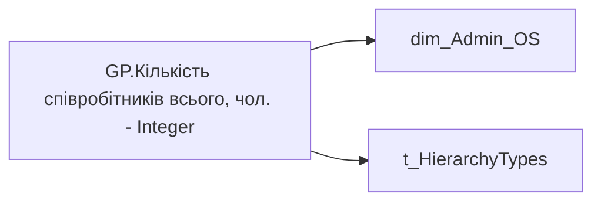

# GP.Кількість співробітників всього, чол. - Integer

*тека `Group_Profile\_Main\Дані про команду` · формат `0`*

!!! abstract "Джерела даних"
    `DM.vw_R27_dim_Employee_Access_List`

## Бізнес-суть

!!! note "Бізнес-визначення відсутнє"
    Поля міри не зіставлено з wiki «Таблицями джерел даних». Можна заповнити вручну в `manualNotes`.

## На сторінках звіту

_Не використовується на основних сторінках звіту._

## Пов'язані міри

**Використовується в:** [GP.Доля команди з доплатою за роз’їзний характер роботи, % факт](../measures/gp-dolia-komandy-z-doplatoiu-za-roziznyi-kharakter-roboty-fakt.md), [GP.Доля команди з доплатою за шкідливі умови праці, % факт](../measures/gp-dolia-komandy-z-doplatoiu-za-shkidlyvi-umovy-pratsi-fakt.md), [GP.Доля команди з квартальною премією, % факт](../measures/gp-dolia-komandy-z-kvartalnoiu-premiieiu-fakt.md), [GP.Доля команди з премією за місяць, % факт](../measures/gp-dolia-komandy-z-premiieiu-za-misiats-fakt.md), [GP.Доля команди з річними бонусами, % факт](../measures/gp-dolia-komandy-z-richnymy-bonusamy-fakt.md), [GP.Доля команди з щомісячною премією, % факт](../measures/gp-dolia-komandy-z-shchomisiachnoiu-premiieiu-fakt.md), [GP.Доля команди із позиками](../measures/gp-dolia-komandy-iz-pozykamy.md), [GP.Доля команди із премією за сумісництво, факт](../measures/gp-dolia-komandy-iz-premiieiu-za-sumisnytstvo-fakt.md), [GP.Кількість співробітників всього, чол. - String](../measures/gp-kilkist-spivrobitnykiv-vsoho-chol-string.md), [GP.Опція по авто, % план.SVG](../measures/gp-optsiia-po-avto-plan-svg.md), [GP.Опція по авто, % факт.SVG](../measures/gp-optsiia-po-avto-fakt-svg.md)

---

## Технічний опис

| Властивість | Значення |
|---|---|
| Тип | міра |
| Home table | _Measures |
| displayFolder | `Group_Profile\_Main\Дані про команду` |
| formatString | `0` |
| dataType | — |
| Прихована | ні |

### DAX

```dax
VAR _Admin_lt = 
    CALCULATETABLE(
        VALUES('dim_Admin_LT_OS'[USER_ACCESS_ID]),
        'dim_Admin_LT_OS'[USER_ROLE]  = "Адміністративний керівник"
    )

VAR _HRBP_lt = 
    CALCULATETABLE(
        VALUES(dim_Admin_LT_OS[USER_ACCESS_ID]),
        'dim_Admin_LT_OS'[USER_ROLE]  = "HRBP"
    )
VAR _Admin = 
	SWITCH(
		SELECTEDVALUE('t_HierarchyTypes'[HierarchyType]),
		"Hierarchy",
		CALCULATE(
			COUNTROWS(VALUES('dim_Admin_OS'[USER_ACCESS_ID])),
            'dim_Admin_OS'[USER_ROLE]  = "Адміністративний керівник"
		),
		"Lead Team",
		CALCULATE(
			COUNTROWS(VALUES('dim_Admin_OS'[USER_ACCESS_ID])),
			TREATAS(_Admin_lt, 'dim_Admin_OS'[USER_ACCESS_ID]),
            'dim_Admin_OS'[USER_ROLE]  = "Адміністративний керівник"
		)
	)

VAR _HRBP = 
	SWITCH(
		SELECTEDVALUE('t_HierarchyTypes'[HierarchyType]),
		"Hierarchy",
		CALCULATE(
			COUNTROWS(VALUES('dim_Admin_OS'[USER_ACCESS_ID])),
            'dim_Admin_OS'[USER_ROLE]  = "HRBP"
		),
		"Lead Team",
		CALCULATE(
			COUNTROWS(VALUES('dim_Admin_OS'[USER_ACCESS_ID])),
			TREATAS(_HRBP_lt, 'dim_Admin_OS'[USER_ACCESS_ID]),
            'dim_Admin_OS'[USER_ROLE]  = "HRBP"
		)
	)

VAR _res = 
    SWITCH(
        SELECTEDVALUE('dim_Admin_OS'[USER_ROLE]),
        "Адміністративний керівник", _Admin,
        "HRBP", _HRBP
    )

RETURN _res
```

### Джерела даних

Вихідні таблиці: `DM.vw_R27_dim_Employee_Access_List`

Колонки: `HierarchyType`, `USER_ACCESS_ID`, `USER_ROLE`

Power Query: `dim_Admin_OS`

### Залежності (таблиці й колонки)

Таблиці: `dim_Admin_OS`, `t_HierarchyTypes`

Колонки: `dim_Admin_LT_OS[USER_ACCESS_ID]`, `dim_Admin_LT_OS[USER_ROLE]`, `dim_Admin_OS[USER_ACCESS_ID]`, `dim_Admin_OS[USER_ROLE]`, `t_HierarchyTypes[HierarchyType]`

### Схема



## Нотатки

_порожньо_
