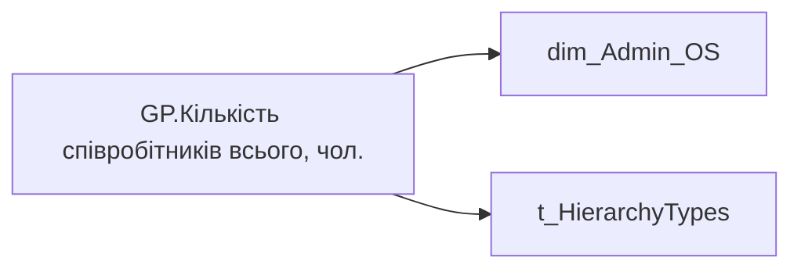

# GP.Кількість співробітників всього, чол.

*тека `Group_Profile\_Main\Дані про команду`*

## Технічний опис

| Властивість | Значення |
|---|---|
| Тип | міра |
| Home table | _Measures |
| displayFolder | `Group_Profile\_Main\Дані про команду` |
| formatString | — |
| dataType | — |
| Прихована | ні |

### DAX

```dax
VAR _Admin_lt = 
    CALCULATETABLE(
        VALUES('dim_Admin_LT_OS'[USER_ACCESS_ID]),
        'dim_Admin_LT_OS'[USER_ROLE]  = "Адміністративний керівник"
    )

VAR _HRBP_lt = 
    CALCULATETABLE(
        VALUES(dim_Admin_LT_OS[USER_ACCESS_ID]),
        'dim_Admin_LT_OS'[USER_ROLE]  = "HRBP"
    )
VAR _Admin = 
	SWITCH(
		SELECTEDVALUE('t_HierarchyTypes'[HierarchyType]),
		"Hierarchy",
		CALCULATE(
			COUNTROWS(VALUES('dim_Admin_OS'[USER_ACCESS_ID])),
            'dim_Admin_OS'[USER_ROLE]  = "Адміністративний керівник"
		),
		"Lead Team",
		CALCULATE(
			COUNTROWS(VALUES('dim_Admin_OS'[USER_ACCESS_ID])),
			TREATAS(_Admin_lt, 'dim_Admin_OS'[USER_ACCESS_ID]),
            'dim_Admin_OS'[USER_ROLE]  = "Адміністративний керівник"
		)
	)

VAR _HRBP = 
	SWITCH(
		SELECTEDVALUE('t_HierarchyTypes'[HierarchyType]),
		"Hierarchy",
		CALCULATE(
			COUNTROWS(VALUES('dim_Admin_OS'[USER_ACCESS_ID])),
            'dim_Admin_OS'[USER_ROLE]  = "HRBP"
		),
		"Lead Team",
		CALCULATE(
			COUNTROWS(VALUES('dim_Admin_OS'[USER_ACCESS_ID])),
			TREATAS(_HRBP_lt, 'dim_Admin_OS'[USER_ACCESS_ID]),
            'dim_Admin_OS'[USER_ROLE]  = "HRBP"
		)
	)

VAR _res = 
    SWITCH(
        SELECTEDVALUE('dim_Admin_OS'[USER_ROLE]),
        "Адміністративний керівник", _Admin,
        "HRBP", _HRBP
    )

RETURN 
	TRIM(
		FORMAT(
			COALESCE(_res, "-"),
			"### ###"
		) 
	)
```

### Джерела даних

Вихідні таблиці: `DM.vw_R27_dim_Employee_Access_List`

Колонки: `HierarchyType`, `USER_ACCESS_ID`, `USER_ROLE`

Power Query: `dim_Admin_OS`

### Залежності (таблиці й колонки)

Таблиці: `dim_Admin_OS`, `t_HierarchyTypes`

Колонки: `dim_Admin_LT_OS[USER_ACCESS_ID]`, `dim_Admin_LT_OS[USER_ROLE]`, `dim_Admin_OS[USER_ACCESS_ID]`, `dim_Admin_OS[USER_ROLE]`, `t_HierarchyTypes[HierarchyType]`

### Схема



---

## Бізнес-суть

**Бізнес-назва:** Кількість співробітників всього, чол.

### Опис із ТЗ

Розрахункове поле.   Вирахувати кількість членів команди для lead team (distinct count)   Для структурної одиниці - це всі її працівники із статусом Активний або Інша відсутність.

Розрахункове поле.   Вирахувати кількість членів команди для lead team (distinct count)   Для структурної одиниці - це всі її працівники (по людині, distinct count) із статусом Активний або Інша відсутність.

**Вимоги (ТЗ):**

- [Командний профіль › Паспортна частина групового профілю › Сторінка Картка команди](https://dev.azure.com/MHPITDepProjects/People%20Digital%20Profile%20%28PDP%29/_wiki/wikis/PDP.wiki?pagePath=/%D0%A4%D1%83%D0%BD%D0%BA%D1%86%D1%96%D0%BE%D0%BD%D0%B0%D0%BB%D1%8C%D0%BD%D1%96%20%D0%B2%D0%B8%D0%BC%D0%BE%D0%B3%D0%B8/%D0%92%D0%B8%D0%BC%D0%BE%D0%B3%D0%B8%20%D0%B4%D0%BE%20%D0%B7%D0%B2%D1%96%D1%82%D1%83%20People%20Digital%20Profile/%D0%9A%D0%BE%D0%BC%D0%B0%D0%BD%D0%B4%D0%BD%D0%B8%D0%B9%20%D0%BF%D1%80%D0%BE%D1%84%D1%96%D0%BB%D1%8C/%D0%9F%D0%B0%D1%81%D0%BF%D0%BE%D1%80%D1%82%D0%BD%D0%B0%20%D1%87%D0%B0%D1%81%D1%82%D0%B8%D0%BD%D0%B0%20%D0%B3%D1%80%D1%83%D0%BF%D0%BE%D0%B2%D0%BE%D0%B3%D0%BE%20%D0%BF%D1%80%D0%BE%D1%84%D1%96%D0%BB%D1%8E/%D0%A1%D1%82%D0%BE%D1%80%D1%96%D0%BD%D0%BA%D0%B0%20%D0%9A%D0%B0%D1%80%D1%82%D0%BA%D0%B0%20%D0%BA%D0%BE%D0%BC%D0%B0%D0%BD%D0%B4%D0%B8)
- [Командний профіль › Сторінка Загальна інформація про команду](https://dev.azure.com/MHPITDepProjects/People%20Digital%20Profile%20%28PDP%29/_wiki/wikis/PDP.wiki?pagePath=/%D0%A4%D1%83%D0%BD%D0%BA%D1%86%D1%96%D0%BE%D0%BD%D0%B0%D0%BB%D1%8C%D0%BD%D1%96%20%D0%B2%D0%B8%D0%BC%D0%BE%D0%B3%D0%B8/%D0%92%D0%B8%D0%BC%D0%BE%D0%B3%D0%B8%20%D0%B4%D0%BE%20%D0%B7%D0%B2%D1%96%D1%82%D1%83%20People%20Digital%20Profile/%D0%9A%D0%BE%D0%BC%D0%B0%D0%BD%D0%B4%D0%BD%D0%B8%D0%B9%20%D0%BF%D1%80%D0%BE%D1%84%D1%96%D0%BB%D1%8C/%D0%A1%D1%82%D0%BE%D1%80%D1%96%D0%BD%D0%BA%D0%B0%20%D0%97%D0%B0%D0%B3%D0%B0%D0%BB%D1%8C%D0%BD%D0%B0%20%D1%96%D0%BD%D1%84%D0%BE%D1%80%D0%BC%D0%B0%D1%86%D1%96%D1%8F%20%D0%BF%D1%80%D0%BE%20%D0%BA%D0%BE%D0%BC%D0%B0%D0%BD%D0%B4%D1%83)

## На сторінках звіту

_Не використовується на основних сторінках звіту._

## Пов'язані міри

_Прямих зв'язків з іншими мірами немає._

## Нотатки

_порожньо_
