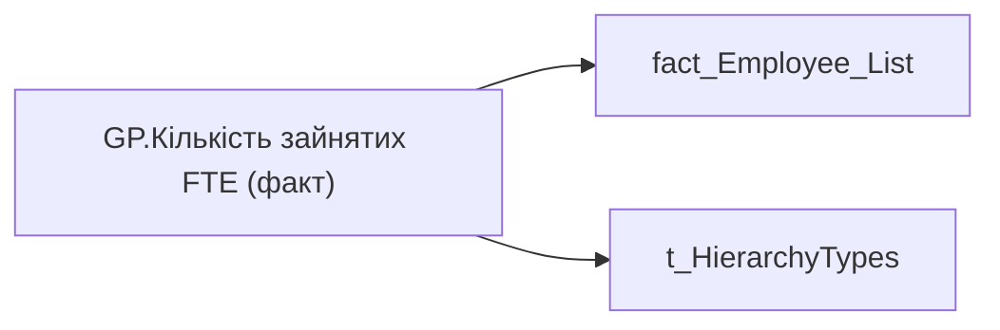

# GP.Кількість зайнятих FTE (факт)

*тека `Group_Profile\Загальна інформація` · формат `#,0.00;-#,0.00;0.00`*

## Бізнес-суть

FTE_employee → Зайнятих ставок з відсутностями; FTE_employee → Зайняті ставки; FTE_employee → Кількість зайнятих FTE (факт)

Поле завжди має значення, пусте поле не допускається Розрахункове поле.  <br>Потрібно підрахувати кількість фактично зайнятих ставок по штатним посадам по організації (organization_key) та підрозділу (division_key) по працівникам у статусах Активні та Інша відсутність (status_key = 1 або 4)  <br>(Аутсорс поки не входить в розрахунок)

**Вимоги:** `Індивідуальний-профіль-працівника/Сторінка-Загальна-інформація-про-працівника`, `Допоміжні-вітрини-для-звіту/Таблиця-періодична-(попередні-12-міс)-для-розрахунку-метрики-Середній-дохід`, `Командний-профіль/Сторінка-Загальна-інформація-про-команду`

## На сторінках звіту

[Group Profile](../report/group-profile.md)

## Пов'язані міри

_Прямих зв'язків з іншими мірами немає._

---

## Технічний опис

| Властивість | Значення |
|---|---|
| Тип | міра |
| Home table | _Measures |
| displayFolder | `Group_Profile\Загальна інформація` |
| formatString | `#,0.00;-#,0.00;0.00` |
| dataType | — |
| Прихована | ні |

### DAX

```dax
VAR _filter_lt= TREATAS(VALUES( dim_Admin_LT_OS[USER_ACCESS_ID] ), 'fact_Employee_List'[USER_ACCESS_ID])
VAR _admin = 
	CALCULATE(
		SUM('fact_Employee_List'[FTE_employee]),
		'fact_Employee_List'[status_key] IN { "1", "4" },
		'fact_Employee_List'[FTE_employee] > 0
	)
VAR _admin_lt = 
	CALCULATE(
		SUM('fact_Employee_List'[FTE_employee]),
		'fact_Employee_List'[status_key] IN { "1", "4" },
		'fact_Employee_List'[FTE_employee] > 0,
		_filter_lt
	)
VAR _res = 
	SWITCH(
		SELECTEDVALUE('t_HierarchyTypes'[Index]),
		0, _admin_lt,
		1, _admin
	)
RETURN 
	TRIM(
		FORMAT(
				COALESCE(_res, "-"), 
				"### ###" 
		) 
	)
```

### Джерела даних


Колонки: `FTE_employee`, `Index`, `USER_ACCESS_ID`, `status_key`

Power Query: `fact_Employee_List`

### Залежності (таблиці й колонки)

Таблиці: `fact_Employee_List`, `t_HierarchyTypes`

Колонки: `fact_Employee_List[FTE_employee]`, `fact_Employee_List[USER_ACCESS_ID]`, `fact_Employee_List[status_key]`, `t_HierarchyTypes[Index]`

### Схема



## Нотатки

_порожньо_
