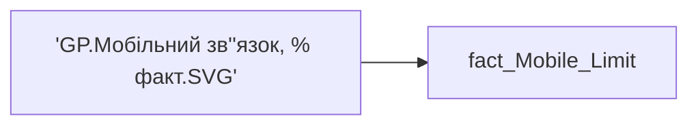

# 'GP.Мобільний зв''язок, % факт.SVG'

*тека `Group_Profile\TRS`*

## Технічний опис

| Властивість | Значення |
|---|---|
| Тип | міра |
| Home table | _Measures |
| displayFolder | `Group_Profile\TRS` |
| formatString | — |
| dataType | — |
| Прихована | ні |

### DAX

```dax
/* *********** 1. ОТРИМАННЯ ТА ПІДГОТОВКА ДАНИХ *********** */
VAR _MaxVal = MAXX( ALLSELECTED('fact_Mobile_Limit'[PHONE_PACKAGE_NAME]), [GP.К-ть співробітників, що отримують виплати на мобільний зв’язок] )

VAR _Data = 
    ADDCOLUMNS(
        VALUES('fact_Mobile_Limit'[PHONE_PACKAGE_NAME]),
        "@Val", [GP.К-ть співробітників, що отримують виплати на мобільний зв’язок]
    )

VAR _FilteredData = FILTER(_Data, NOT(ISBLANK('fact_Mobile_Limit'[PHONE_PACKAGE_NAME])) && [@Val] > 0)
VAR _CountItems = COUNTROWS(_FilteredData)

VAR _DataWithRank = 
    GENERATE(
        _FilteredData,
        VAR _CurrVal = [@Val]
        VAR _CurrCat = 'fact_Mobile_Limit'[PHONE_PACKAGE_NAME]
        VAR _Rank = 
            COUNTROWS(
                FILTER(
                    _FilteredData,
                    [@Val] > _CurrVal || ([@Val] = _CurrVal && 'fact_Mobile_Limit'[PHONE_PACKAGE_NAME] <= _CurrCat)
                )
            )
        RETURN ROW("@Rank", _Rank)
    )

/* *********** 2. НАЛАШТУВАННЯ *********** */
VAR _CanvasWidth = 865
VAR _CanvasHeight = COUNTROWS(_Data) * 30

VAR _BarHeight = 20         -- Робимо бари тоншими у формі пігулки
VAR _Gap = 8                -- Зменшуємо відступ між барами
VAR _TopMargin = 15         -- Відступ зверху
VAR _LeftMargin = 150       -- Збільшено! Тепер є багато місця для довгих назв зліва
VAR _RightMargin = 40
VAR _MaxBarWidth = _CanvasWidth - _LeftMargin - _RightMargin

VAR _ColorBar = "#D9C87C"   -- Приглушений жовтий
VAR _ColorTrack = "#F5F5F5" -- Світло-сірий фон
VAR _ColorText = "#003A5D"  -- Колір назв
VAR _ColorValue = "#1F4E79" -- Колір цифр
VAR _Radius = _BarHeight / 2 -- Ідеальне скруглення (8px)

/* *********** 3. ГЕНЕРАЦІЯ ЕЛЕМЕНТІВ *********** */
VAR _SVG_Bars = 
    CONCATENATEX(
        _DataWithRank,
        VAR _YPos = _TopMargin + ([@Rank] - 1) * (_BarHeight + _Gap)
        VAR _BarW = DIVIDE([@Val], _MaxVal, 0) * _MaxBarWidth
        VAR _Label = 'fact_Mobile_Limit'[PHONE_PACKAGE_NAME]
        VAR _ValueFormat = FORMAT([@Val], "#,0")
        
        RETURN
        "<g>" &
            -- Назва категорії (вирівнювання праворуч)
            "<text x='" & (_LeftMargin - 10) & "' y='" & (_YPos + _BarHeight/2 + 4) & "' 
                text-anchor='end' font-family='Segoe UI' font-size='12' fill='" & _ColorText & "'>" & _Label & "</text>" &
            
            -- Фон (сірий трек)
            "<rect x='" & _LeftMargin & "' y='" & _YPos & "' width='" & _MaxBarWidth & "' height='" & _BarHeight & "' fill='" & _ColorTrack & "' rx='" & _Radius & "' />" &
            
            -- Бар (факт)
            IF([@Val] > 0, 
                "<rect x='" & _LeftMargin & "' y='" & _YPos & "' width='" & _BarW & "' height='" & _BarHeight & "' fill='" & _ColorBar & "' rx='" & _Radius & "' />", 
                ""
            ) &
            
            -- Значення цифра
            "<text x='" & (_LeftMargin + _BarW + 5) & "' y='" & (_YPos + _BarHeight/2 + 4) & "' 
                text-anchor='start' font-family='Segoe UI' font-weight='bold' font-size='11' fill='" & _ColorValue & "'>" & _ValueFormat & "</text>" &
        "</g>",
        "",
        [@Rank], ASC
    )

/* *********** 4. ФІНАЛЬНИЙ РЕНДЕР *********** */
VAR _SVG = 
    "<svg xmlns='http://www.w3.org/2000/svg' viewBox='0 0 " & _CanvasWidth & " " & _CanvasHeight & "'>" & 
    _SVG_Bars & 
    "</svg>"

RETURN 
    IF(_CountItems > 0, _SVG, BLANK())
```

### Джерела даних

Вихідні таблиці: `DM.vw_R27_fact_Mobile_Limit_PDP`

Колонки: `PHONE_PACKAGE_NAME`

Power Query: `fact_Mobile_Limit`

### Залежності (таблиці й колонки)

Таблиці: `fact_Mobile_Limit`

Колонки: `fact_Mobile_Limit[PHONE_PACKAGE_NAME]`

### Схема



---

## Бізнес-суть

### Опис із ТЗ

Потрібно відібрати всі записи по працівнику `person_key`, періоду `Period`, організації `organization_key`   Якщо значення в полі відсутнє, то показати текст "Дані відсутні" або знак "-"

??? note "Поля-джерела та пов'язані бізнес-метрики (1)"
    | Поле | Бізнес-метрики |
    |---|---|
    | `PHONE_PACKAGE_NAME` | Мобільний зв'язок - Назва пакету |

**Вимоги (ТЗ):**

- [Індивідуальний профіль працівника › Сторінка Винагорода працівника](https://dev.azure.com/MHPITDepProjects/People%20Digital%20Profile%20%28PDP%29/_wiki/wikis/PDP.wiki?pagePath=/%D0%A4%D1%83%D0%BD%D0%BA%D1%86%D1%96%D0%BE%D0%BD%D0%B0%D0%BB%D1%8C%D0%BD%D1%96%20%D0%B2%D0%B8%D0%BC%D0%BE%D0%B3%D0%B8/%D0%92%D0%B8%D0%BC%D0%BE%D0%B3%D0%B8%20%D0%B4%D0%BE%20%D0%B7%D0%B2%D1%96%D1%82%D1%83%20People%20Digital%20Profile/%D0%86%D0%BD%D0%B4%D0%B8%D0%B2%D1%96%D0%B4%D1%83%D0%B0%D0%BB%D1%8C%D0%BD%D0%B8%D0%B9%20%D0%BF%D1%80%D0%BE%D1%84%D1%96%D0%BB%D1%8C%20%D0%BF%D1%80%D0%B0%D1%86%D1%96%D0%B2%D0%BD%D0%B8%D0%BA%D0%B0/%D0%A1%D1%82%D0%BE%D1%80%D1%96%D0%BD%D0%BA%D0%B0%20%D0%92%D0%B8%D0%BD%D0%B0%D0%B3%D0%BE%D1%80%D0%BE%D0%B4%D0%B0%20%D0%BF%D1%80%D0%B0%D1%86%D1%96%D0%B2%D0%BD%D0%B8%D0%BA%D0%B0)

## На сторінках звіту

_Не використовується на основних сторінках звіту._

## Пов'язані міри

**Використовує:** [GP.К-ть співробітників, що отримують виплати на мобільний зв’язок](../measures/gp-k-t-spivrobitnykiv-shcho-otrymuiut-vyplaty-na-mobilnyi-zviazok.md)

## Нотатки

_порожньо_
