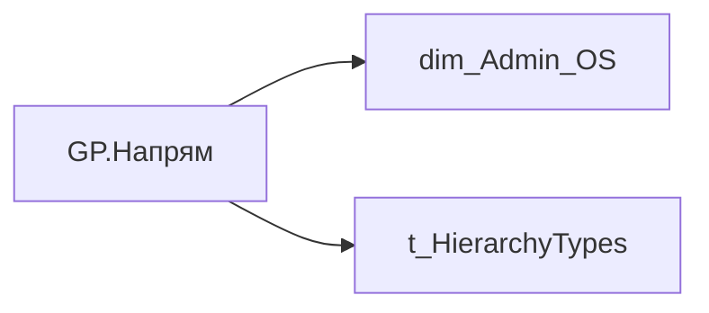

# GP.Напрям

| Властивість | Значення |
|---|---|
| Тип | міра |
| Home table | _Measures |
| displayFolder | `Group_Profile\Загальна інформація` |
| formatString | — |
| dataType | — |
| Прихована | ні |

## DAX

```dax
VAR _filter_lt= TREATAS(VALUES( dim_Admin_LT_OS[USER_ACCESS_ID] ), 'dim_Admin_OS'[USER_ACCESS_ID])

--1. Якщо у вибірку для HR BP потрапляють керівники рівня N-1, то конкатинацію робити лише по категоріях посади Старший менеджмент А, Старший менеджмент А+ і Топ-менеджмент

VAR _sample_of_users = 
    CALCULATETABLE(
        VALUES('dim_Admin_OS'[USER_ACCESS_ID]),
        OR(
            'dim_Admin_OS'[POSITION_CATEGORY_DETAIL] IN {"Старший менеджмент А", "Старший менеджмент А+", "Топ-менеджмент"} && 'dim_Admin_OS'[path_length] = 2,
            dim_Admin_OS[path_length] > 2
        )
    )
VAR _sample_of_users_lt = 
    CALCULATETABLE(
        VALUES('dim_Admin_OS'[USER_ACCESS_ID]),
        OR(
            'dim_Admin_OS'[POSITION_CATEGORY_DETAIL] IN {"Старший менеджмент А", "Старший менеджмент А+", "Топ-менеджмент"} && 'dim_Admin_OS'[path_length] = 2,
            dim_Admin_OS[path_length] > 2
        ),
        _filter_lt
    )

--2. Визначення найвищого рівня ієрархії, за яким конкатенується атрибут

VAR _highest_ADMIN_hierarchy_level = CALCULATE(MINX('dim_Admin_OS', 'dim_Admin_OS'[path_length]))
VAR _highest_ADMIN_hierarchy_level_lt = CALCULATE(MINX('dim_Admin_OS', 'dim_Admin_OS'[path_length]))
VAR _highest_HRBP_hierarchy_level = CALCULATE(MINX('dim_Admin_OS', 'dim_Admin_OS'[path_length]),_sample_of_users)
VAR _highest_HRBP_hierarchy_level_lt = CALCULATE(MINX('dim_Admin_OS', 'dim_Admin_OS'[path_length]),_sample_of_users_lt)

--3. Розрахунок метрики для ADMIN ролі

VAR _admin =
    CALCULATE(
        CONCATENATEX(
            VALUES('dim_Admin_OS'[DIRECTION]),
            'dim_Admin_OS'[DIRECTION],
            ", "
        ),
        'dim_Admin_OS'[path_length] = _highest_ADMIN_hierarchy_level
    )
VAR _admin_lt = 
    CALCULATE(
        CONCATENATEX(
            VALUES('dim_Admin_OS'[DIRECTION]),
            'dim_Admin_OS'[DIRECTION],
            ", "
        ),
        'dim_Admin_OS'[path_length] = _highest_ADMIN_hierarchy_level_lt
    )

--4. Розрахунок метрики для HRBP ролі

VAR _HRBP =
    CALCULATE(
        CONCATENATEX(
            VALUES('dim_Admin_OS'[DIRECTION]),
            'dim_Admin_OS'[DIRECTION],
            ", "
        ),
        'dim_Admin_OS'[path_length] = _highest_HRBP_hierarchy_level,
        _sample_of_users
    )
VAR _HRBP_lt = 
    CALCULATE(
        CONCATENATEX(
            VALUES('dim_Admin_OS'[DIRECTION]),
            'dim_Admin_OS'[DIRECTION],
            ", "
        ),
        'dim_Admin_OS'[path_length] = _highest_HRBP_hierarchy_level_lt,
        _sample_of_users_lt
    )

--5. Визначення результату
VAR _res = 
    SWITCH(
        SELECTEDVALUE('t_HierarchyTypes'[Index]),
        0, 
        SWITCH(
            SELECTEDVALUE('dim_Admin_OS'[USER_ROLE]),
            "Адміністративний керівник", _admin_lt,
            "HRBP", _HRBP_lt
        ),
        1,
        SWITCH(
            SELECTEDVALUE('dim_Admin_OS'[USER_ROLE]),
            "Адміністративний керівник", _admin,
            "HRBP", _HRBP
        )
    )
RETURN COALESCE(_res, "-")
```

## Джерела

Вихідні таблиці: `DM.vw_R27_dim_Employee_Access_List`

Колонки: `DIRECTION`, `Index`, `POSITION_CATEGORY_DETAIL`, `USER_ACCESS_ID`, `USER_ROLE`, `path_length`

Power Query: `dim_Admin_OS`

## Бізнес-суть

DIRECTION → Напрям; DIRECTION → direction_name; DIRECTION → direction; POSITION_CATEGORY_DETAIL → Деталізація категорії посади (внутрішня); POSITION_CATEGORY_DETAIL → Категорія посади; POSITION_CATEGORY_DETAIL → Категорія посади (внутрішня); POSITION_CATEGORY_DETAIL → Доля менеджерів серед всіх співробітників (%)

division_person_id = unit_key Поле зберігається в довіднику [dm.vw_R27_dim_unit]  <br>Це поле має бути доступне у візуалізаціях, побудованих на основі фактової таблиці [dm.vw_R27_fact_Employee_List], через відповідний зв’язок за ключем [division_key] = [unit_key].  <br>Поле завжди має значення, пусте поле не допускається  <br>Якщо не вміщається в одну строку, перенести на іншу Поле зберігається в довіднику [dm.vw_R27_dim_unit]  <br>Це поле має бути доступне у візуалізаціях, побудованих на основі фактової таблиці [dm.vw_R27_fact_Employee_List_PDP], через відповідний зв’язок за ключем [division_

**Вимоги:** `Індивідуальний-профіль-працівника/Історія-по-посадам`, `Індивідуальний-профіль-працівника/Історія-по-посадам/Реліз-1.-Історія-по-посадам`, `Індивідуальний-профіль-працівника/Паспортна-частина-індивідуального-профілю-співробітника`, `Індивідуальний-профіль-працівника/Паспортна-частина-індивідуального-профілю-співробітника/Сторінка-Картка-(паспорт)-працівника`, `Індивідуальний-профіль-працівника/Сторінка-Індивідуальний-профіль-працівника`, `Індивідуальний-профіль-працівника/Сторінка-Взаємодія-Viva-та-залученість-працівника/Таблиця-vw_R27_calc_Viva_Direction_PDP`, `Індивідуальний-профіль-працівника/Сторінка-Загальна-інформація-про-працівника`, `Допоміжні-вітрини-для-звіту/Таблиця-для-розрахунку-агрегованих-метрик-по-звіту`, `Командний-профіль/Паспортна-частина-групового-профілю/Метрики-рекрутингу`, `Командний-профіль/Паспортна-частина-групового-профілю/Метрики-рекрутингу/ТЗ-на-розробку-вітрин-по-метрикам-рекрутингу`, `Командний-профіль/Паспортна-частина-групового-профілю/Редизайн-паспортної-частини-групового-профілю`, `Командний-профіль/Сторінка-Ефективність`, `Командний-профіль/Сторінка-Загальна-інформація-про-команду`, `Командний-профіль/Сторінка-Моя-команда/ТЗ.-Деталізація-метрик-групового-профілю-звіту`, `Командний-профіль/Сторінка-Навчання-і-розвиток/Блок-Розвиток-сторінки-Навчання-і-розвиток`, `Командний-профіль/Сторінка-Плинність-та-Exits/Плинність-(вітрина)`, `Командний-профіль/Сторінка-Плинність-та-Exits/Плинність-(вітрина)/Додаткові-вимоги-до-вітрини-Плинність`, `Командний-профіль/Сторінка-Плинність-та-Exits/ТЗ-на-вітрину-Exits`, `Командний-профіль/Сторінка-Результативність-та-оцінка-команди`, `Командний-профіль/Сторінка-Результативність-та-оцінка-команди/Блок-Додаткові-інструменти`

## Залежності

Таблиці: `dim_Admin_OS`, `t_HierarchyTypes`

Колонки: `dim_Admin_OS[DIRECTION]`, `dim_Admin_OS[POSITION_CATEGORY_DETAIL]`, `dim_Admin_OS[USER_ACCESS_ID]`, `dim_Admin_OS[USER_ROLE]`, `dim_Admin_OS[path_length]`, `t_HierarchyTypes[Index]`

## Схема



## Нотатки

_порожньо_
