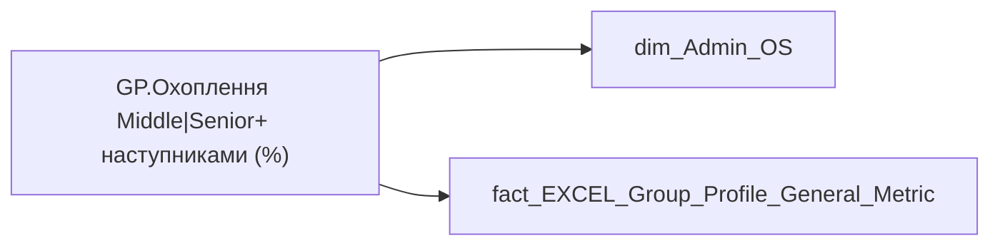

# GP.Охоплення Middle|Senior+ наступниками (%)

*тека `Group_Profile\_Main\Індикатори здоров'я команди`*

## Технічний опис

| Властивість | Значення |
|---|---|
| Тип | міра |
| Home table | _Measures |
| displayFolder | `Group_Profile\_Main\Індикатори здоров'я команди` |
| formatString | — |
| dataType | — |
| Прихована | ні |

### DAX

```dax
VAR _current_direction = 
	FIRSTNONBLANKVALUE(
		'dim_Admin_OS'[ORDER_NUM_2],
		MIN('dim_Admin_OS'[DIRECTION])
	)

VAR _current_sub_direction = 
	FIRSTNONBLANKVALUE(
		'dim_Admin_OS'[ORDER_NUM_2],
		MIN('dim_Admin_OS'[SUB_DIRECTION])
	)

VAR _current_email = 
	FIRSTNONBLANKVALUE(
		'dim_Admin_OS'[ORDER_NUM_2],
		MIN('dim_Admin_OS'[EMPLOYEE_EMAIL])
	)

VAR _direction_res = 
CALCULATE(
	SUM('fact_EXCEL_Group_Profile_General_Metric'[Talent_Pool]),
	FILTER(
		'fact_EXCEL_Group_Profile_General_Metric',
		'fact_EXCEL_Group_Profile_General_Metric'[Record_Type] = "DIRECTION"
		&&'fact_EXCEL_Group_Profile_General_Metric'[Direction_Name] = _current_direction))

VAR _sub_direction_res = 
CALCULATE(
	SUM('fact_EXCEL_Group_Profile_General_Metric'[Talent_Pool]),
	FILTER(
		'fact_EXCEL_Group_Profile_General_Metric',
		fact_EXCEL_Group_Profile_General_Metric[Record_Type] = "SUBDIRECTION"
		&& 'fact_EXCEL_Group_Profile_General_Metric'[Direction_Name] = _current_sub_direction))

VAR top_employee_list = 
SELECTCOLUMNS(
	FILTER(
	'dim_Admin_OS', 
	'dim_Admin_OS'[POSITION_CATEGORY_DETAIL] = "Топ-менеджмент" 
	|| 'dim_Admin_OS'[EMPLOYEE_EMAIL] in 
		{"d.konogray@mhp.com.ua",
		"r.zvonenko@mhp.com.ua",
		"s.p.nikolaiev@mhp.com.ua",
		"a.evshel@mhp.com.ua",
		"t.sakhno@mhp.com.ua",
		"i.zakharchuk@mhp.com.ua",
		"yu.polovyna@mhp.com.ua",
		"a.gromova@mhp.com.ua"}),
	"EmailColumn", 'dim_Admin_OS'[EMPLOYEE_EMAIL])

VAR _res =
IF(_current_email in top_employee_list, _direction_res, _sub_direction_res)

RETURN 
IF(
    ISBLANK(_res),
    "-", 
    COALESCE(TRIM(_res), 0) & "%" & ", (>=90%)"
) 
```

### Джерела даних

Вихідні таблиці: `DM.vw_R27_dim_Employee_Access_List`, `DWH.t_SPO_HR_Group_Profile_General_Metric`

Колонки: `DIRECTION`, `Direction_Name`, `EMPLOYEE_EMAIL`, `ORDER_NUM_2`, `POSITION_CATEGORY_DETAIL`, `Record_Type`, `SUB_DIRECTION`, `Talent_Pool`

Power Query: `dim_Admin_OS`

### Залежності (таблиці й колонки)

Таблиці: `dim_Admin_OS`, `fact_EXCEL_Group_Profile_General_Metric`

Колонки: `dim_Admin_OS[DIRECTION]`, `dim_Admin_OS[EMPLOYEE_EMAIL]`, `dim_Admin_OS[ORDER_NUM_2]`, `dim_Admin_OS[POSITION_CATEGORY_DETAIL]`, `dim_Admin_OS[SUB_DIRECTION]`, `fact_EXCEL_Group_Profile_General_Metric[Direction_Name]`, `fact_EXCEL_Group_Profile_General_Metric[Record_Type]`, `fact_EXCEL_Group_Profile_General_Metric[Talent_Pool]`

### Схема



---

## Бізнес-суть

!!! note "Бізнес-визначення відсутнє"
    Поля міри не зіставлено з wiki «Таблицями джерел даних». Можна заповнити вручну в `manualNotes`.

## На сторінках звіту

- [Group Profile](../report/group-profile.md) — Версія 2 › Індикатори здоров'я команди

## Пов'язані міри

_Прямих зв'язків з іншими мірами немає._

## Нотатки

_порожньо_
