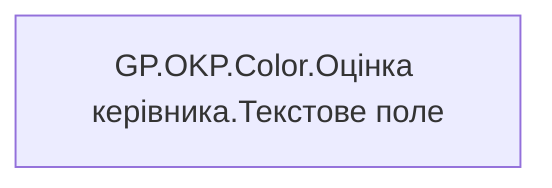

# GP.OKP.Color.Оцінка керівника.Текстове поле

*тека `Group_Profile\_Main\ОКР`*

## Бізнес-суть

!!! note "Бізнес-визначення відсутнє"
    Поля міри не зіставлено з wiki «Таблицями джерел даних». Можна заповнити вручну в `manualNotes`.

## На сторінках звіту

[Group Profile](../report/group-profile.md)

## Пов'язані міри

**Використовує:** [GP.ОКР.Оцінка керівника.Колір](../measures/gp-okr-otsinka-kerivnyka-kolir.md)

---

## Технічний опис

| Властивість | Значення |
|---|---|
| Тип | міра |
| Home table | _Measures |
| displayFolder | `Group_Profile\_Main\ОКР` |
| formatString | — |
| dataType | — |
| Прихована | ні |

### DAX

```dax
SWITCH(
    [GP.ОКР.Оцінка керівника.Колір],
    "Супер зелений", "#006B3D",
    "Зелений", "#028A2E",
    "Жовто-зелений", "#8BA620",
    "Жовтий", "#C4A800",
    "Жовто-червоний", "#CC6500",
    "Червоний", "#C42A0D",
    "#252423"
)
```

### Джерела даних

—

### Залежності (таблиці й колонки)

—

### Схема



## Нотатки

_порожньо_
