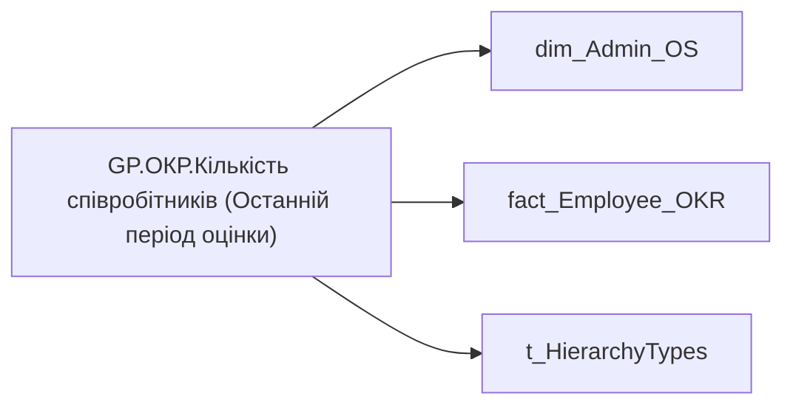

# GP.ОКР.Кількість співробітників (Останній період оцінки)

*тека `Group_Profile\_Main\ОКР` · формат `0`*

## Технічний опис

| Властивість | Значення |
|---|---|
| Тип | міра |
| Home table | _Measures |
| displayFolder | `Group_Profile\_Main\ОКР` |
| formatString | `0` |
| dataType | — |
| Прихована | ні |

### DAX

```dax
//************* ROLE FILTERS **************
VAR _filter_lt = TREATAS(VALUES(dim_Admin_LT_OS[USER_ACCESS_ID]), 'dim_Admin_OS'[USER_ACCESS_ID])

VAR lastYear = [GP.ОКР.Останній рік]
/* *********** ADMIN *********** */
VAR _admin =
CALCULATE(
        DISTINCTCOUNT('fact_Employee_OKR'[USER_ACCESS_ID]),
        'fact_Employee_OKR'[PLAN_YEAR] = lastYear)
        // FILTER(
        //     'fact_Employee_OKR',
        //     'fact_Employee_OKR'[order] = 1))

/* *********** ADMIN LT *********** */
VAR _admin_lt =
CALCULATE(
        DISTINCTCOUNT('fact_Employee_OKR'[USER_ACCESS_ID]),
        'fact_Employee_OKR'[PLAN_YEAR] = lastYear,
        // FILTER(
        //     'fact_Employee_OKR',
        //     'fact_Employee_OKR'[order] = 1),
        _filter_lt)

VAR _res = 
	SWITCH(
		SELECTEDVALUE( t_HierarchyTypes[Index] ),
		0, _admin_lt,
		1, _admin
	)

/* *********** RESULT *********** */
RETURN COALESCE(_res, 0)
```

### Джерела даних

Вихідні таблиці: `DM.R27_fact_OKR_Goals`, `DM.vw_R27_dim_Employee_Access_List`

Колонки: `Index`, `PLAN_YEAR`, `USER_ACCESS_ID`, `order`

Power Query: `dim_Admin_OS`

### Залежності (таблиці й колонки)

Таблиці: `dim_Admin_OS`, `fact_Employee_OKR`, `t_HierarchyTypes`

Колонки: `dim_Admin_OS[USER_ACCESS_ID]`, `fact_Employee_OKR[PLAN_YEAR]`, `fact_Employee_OKR[USER_ACCESS_ID]`, `fact_Employee_OKR[order]`, `t_HierarchyTypes[Index]`

### Схема



---

## Бізнес-суть

!!! note "Бізнес-визначення відсутнє"
    Поля міри не зіставлено з wiki «Таблицями джерел даних». Можна заповнити вручну в `manualNotes`.

## На сторінках звіту

_Не використовується на основних сторінках звіту._

## Пов'язані міри

**Використовує:** [GP.ОКР.Останній рік](../measures/gp-okr-ostannii-rik.md)

**Використовується в:** [GP.OKR.SVG.Bar chart](../measures/gp-okr-svg-bar-chart.md), [GP.ОКР.К-ть співробітників, що оцінюються.Текстове поле](../measures/gp-okr-k-t-spivrobitnykiv-shcho-otsiniuiutsia-tekstove-pole.md)

## Нотатки

_порожньо_
