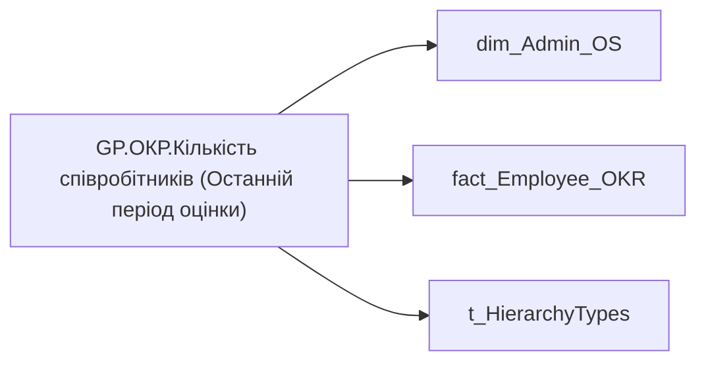

# GP.ОКР.Кількість співробітників (Останній період оцінки)

*тека `Group_Profile\_Main\ОКР` · формат `0`*

## Технічний опис

| Властивість | Значення |
|---|---|
| Тип | міра |
| Home table | _Measures |
| displayFolder | `Group_Profile\_Main\ОКР` |
| formatString | `0` |
| dataType | — |
| Прихована | ні |

### DAX

```dax
//************* ROLE FILTERS **************
VAR _filter_lt = TREATAS(VALUES(dim_Admin_LT_OS[USER_ACCESS_ID]), 'dim_Admin_OS'[USER_ACCESS_ID])

VAR lastYear = [GP.ОКР.Останній рік]
/* *********** ADMIN *********** */
VAR _admin =
CALCULATE(
        DISTINCTCOUNT('fact_Employee_OKR'[USER_ACCESS_ID]),
        'fact_Employee_OKR'[PLAN_YEAR] = lastYear)
        // FILTER(
        //     'fact_Employee_OKR',
        //     'fact_Employee_OKR'[order] = 1))

/* *********** ADMIN LT *********** */
VAR _admin_lt =
CALCULATE(
        DISTINCTCOUNT('fact_Employee_OKR'[USER_ACCESS_ID]),
        'fact_Employee_OKR'[PLAN_YEAR] = lastYear,
        // FILTER(
        //     'fact_Employee_OKR',
        //     'fact_Employee_OKR'[order] = 1),
        _filter_lt)

VAR _res = 
	SWITCH(
		SELECTEDVALUE( t_HierarchyTypes[Index] ),
		0, _admin_lt,
		1, _admin
	)

/* *********** RESULT *********** */
RETURN COALESCE(_res, 0)
```

### Джерела даних

Вихідні таблиці: `DM.R27_fact_OKR_Goals`, `DM.vw_R27_dim_Employee_Access_List`

Колонки: `Index`, `PLAN_YEAR`, `USER_ACCESS_ID`, `order`

Power Query: `dim_Admin_OS`

### Залежності (таблиці й колонки)

Таблиці: `dim_Admin_OS`, `fact_Employee_OKR`, `t_HierarchyTypes`

Колонки: `dim_Admin_OS[USER_ACCESS_ID]`, `fact_Employee_OKR[PLAN_YEAR]`, `fact_Employee_OKR[USER_ACCESS_ID]`, `fact_Employee_OKR[order]`, `t_HierarchyTypes[Index]`

### Схема



---

## Бізнес-суть

### Опис із ТЗ

Останнє доступне значення станом на дату поточного запису, релевантне відповідній оцінці результативності.

Значення останнього року оцінки ОКР визначати в залежності від того, які дані доступні на поточний момент. Наприклад, протягом 2025 року в оцінку брати коефіцієнт індивідуального бонусу працівника за 2023-2024 роки, бо за 2025 рік оцінки ще немає. Тому останній рік буде 2024. На початку 2026 року, коли з'являться результати оцінки ОКР за 2025 рік, потрібно буде змістити період і брати 2025 рік.      Для того, що визначити період (рік), за який виставлено індивідуальний бонус, потрібно:   1. Із таблиці dwh.`t_sf_okr_objective_monitor` потрібно визначити `Form_template_ID` по ключу `Form_Employee_ID`.   2. Піти в таблицю dwh.`dim_SF_Form_Template` та використати `Form_template_ID`, щоб знайти значення `Parent_ID`.   3. На основі `Parent_ID` визначити значення ID і взяти поле `Plan_Year`.  Запит для визначення року ОКР select fe.* from `DWH`.`dim_sf_form_template` ft join dwh.`t_SF_Form_Employee` fe on fe.`form_template_id` = ft.id left join `DWH`.`dim_sf_form_template` fow on fow.id = fe.`form_template_owner_id` where ft.`Form_Type_Code` in ('`OKR_MONITORING`')  and fow.Code = 'OKR_ЗА_2024_РІК'

Значення передостаннього року оцінки ОКР визначати в залежності від того, які дані доступні на поточний момент. Наприклад, протягом 2025 року в оцінку брати коефіцієнт індивідуального бонусу працівника за 2023-2024 роки. Тому передостанній рік буде 2023. На початку 2026 року, коли з'являться результати оцінки ОКР за 2025 рік, потрібно буде змістити період і брати 2024 рік.      Для того, що визначити період (рік), за який виставлено індивідуальний бонус, потрібно:   1. Із таблиці dwh.`t_sf_okr_objective_monitor` потрібно визначити `Form_template_ID` по ключу `Form_Employee_ID`.   2. Піти в таблицю dwh.`dim_SF_Form_Template` та використати `Form_template_ID`, щоб знайти значення `Parent_ID`.   3. На основі `Parent_ID` визначити значення ID і взяти поле `Plan_Year`.  Запит для визначення року ОКР select fe.* from `DWH`.`dim_sf_form_template` ft join dwh.`t_SF_Form_Employee` fe on fe.`form_template_id` = ft.id left join `DWH`.`dim_sf_form_template` fow on fow.id = fe.`form_template_owner_id` where ft.`Form_Type_Code` in ('`OKR_MONITORING`')  and fow.Code = 'OKR_ЗА_2023_РІК'

??? note "Поля-джерела та пов'язані бізнес-метрики (3)"
    | Поле | Бізнес-метрики |
    |---|---|
    | `PLAN_YEAR` | Рік ОКР · Значення останнього року оцінки ОКР · Значення передостаннього  року оцінки ОКР |

**Вимоги (ТЗ):**

- [Індивідуальний профіль працівника › Історія по посадам](https://dev.azure.com/MHPITDepProjects/People%20Digital%20Profile%20%28PDP%29/_wiki/wikis/PDP.wiki?pagePath=/%D0%A4%D1%83%D0%BD%D0%BA%D1%86%D1%96%D0%BE%D0%BD%D0%B0%D0%BB%D1%8C%D0%BD%D1%96%20%D0%B2%D0%B8%D0%BC%D0%BE%D0%B3%D0%B8/%D0%92%D0%B8%D0%BC%D0%BE%D0%B3%D0%B8%20%D0%B4%D0%BE%20%D0%B7%D0%B2%D1%96%D1%82%D1%83%20People%20Digital%20Profile/%D0%86%D0%BD%D0%B4%D0%B8%D0%B2%D1%96%D0%B4%D1%83%D0%B0%D0%BB%D1%8C%D0%BD%D0%B8%D0%B9%20%D0%BF%D1%80%D0%BE%D1%84%D1%96%D0%BB%D1%8C%20%D0%BF%D1%80%D0%B0%D1%86%D1%96%D0%B2%D0%BD%D0%B8%D0%BA%D0%B0/%D0%86%D1%81%D1%82%D0%BE%D1%80%D1%96%D1%8F%20%D0%BF%D0%BE%20%D0%BF%D0%BE%D1%81%D0%B0%D0%B4%D0%B0%D0%BC)
- [Індивідуальний профіль працівника › Історія по посадам › Реліз 1. Історія по посадам](https://dev.azure.com/MHPITDepProjects/People%20Digital%20Profile%20%28PDP%29/_wiki/wikis/PDP.wiki?pagePath=/%D0%A4%D1%83%D0%BD%D0%BA%D1%86%D1%96%D0%BE%D0%BD%D0%B0%D0%BB%D1%8C%D0%BD%D1%96%20%D0%B2%D0%B8%D0%BC%D0%BE%D0%B3%D0%B8/%D0%92%D0%B8%D0%BC%D0%BE%D0%B3%D0%B8%20%D0%B4%D0%BE%20%D0%B7%D0%B2%D1%96%D1%82%D1%83%20People%20Digital%20Profile/%D0%86%D0%BD%D0%B4%D0%B8%D0%B2%D1%96%D0%B4%D1%83%D0%B0%D0%BB%D1%8C%D0%BD%D0%B8%D0%B9%20%D0%BF%D1%80%D0%BE%D1%84%D1%96%D0%BB%D1%8C%20%D0%BF%D1%80%D0%B0%D1%86%D1%96%D0%B2%D0%BD%D0%B8%D0%BA%D0%B0/%D0%86%D1%81%D1%82%D0%BE%D1%80%D1%96%D1%8F%20%D0%BF%D0%BE%20%D0%BF%D0%BE%D1%81%D0%B0%D0%B4%D0%B0%D0%BC/%D0%A0%D0%B5%D0%BB%D1%96%D0%B7%201.%20%D0%86%D1%81%D1%82%D0%BE%D1%80%D1%96%D1%8F%20%D0%BF%D0%BE%20%D0%BF%D0%BE%D1%81%D0%B0%D0%B4%D0%B0%D0%BC)
- [Індивідуальний профіль працівника › Паспортна частина індивідуального профілю співробітника](https://dev.azure.com/MHPITDepProjects/People%20Digital%20Profile%20%28PDP%29/_wiki/wikis/PDP.wiki?pagePath=/%D0%A4%D1%83%D0%BD%D0%BA%D1%86%D1%96%D0%BE%D0%BD%D0%B0%D0%BB%D1%8C%D0%BD%D1%96%20%D0%B2%D0%B8%D0%BC%D0%BE%D0%B3%D0%B8/%D0%92%D0%B8%D0%BC%D0%BE%D0%B3%D0%B8%20%D0%B4%D0%BE%20%D0%B7%D0%B2%D1%96%D1%82%D1%83%20People%20Digital%20Profile/%D0%86%D0%BD%D0%B4%D0%B8%D0%B2%D1%96%D0%B4%D1%83%D0%B0%D0%BB%D1%8C%D0%BD%D0%B8%D0%B9%20%D0%BF%D1%80%D0%BE%D1%84%D1%96%D0%BB%D1%8C%20%D0%BF%D1%80%D0%B0%D1%86%D1%96%D0%B2%D0%BD%D0%B8%D0%BA%D0%B0/%D0%9F%D0%B0%D1%81%D0%BF%D0%BE%D1%80%D1%82%D0%BD%D0%B0%20%D1%87%D0%B0%D1%81%D1%82%D0%B8%D0%BD%D0%B0%20%D1%96%D0%BD%D0%B4%D0%B8%D0%B2%D1%96%D0%B4%D1%83%D0%B0%D0%BB%D1%8C%D0%BD%D0%BE%D0%B3%D0%BE%20%D0%BF%D1%80%D0%BE%D1%84%D1%96%D0%BB%D1%8E%20%D1%81%D0%BF%D1%96%D0%B2%D1%80%D0%BE%D0%B1%D1%96%D1%82%D0%BD%D0%B8%D0%BA%D0%B0)
- [Індивідуальний профіль працівника › Паспортна частина індивідуального профілю співробітника › Сторінка Картка (паспорт) працівника › Редизайн паспортної частини](https://dev.azure.com/MHPITDepProjects/People%20Digital%20Profile%20%28PDP%29/_wiki/wikis/PDP.wiki?pagePath=/%D0%A4%D1%83%D0%BD%D0%BA%D1%86%D1%96%D0%BE%D0%BD%D0%B0%D0%BB%D1%8C%D0%BD%D1%96%20%D0%B2%D0%B8%D0%BC%D0%BE%D0%B3%D0%B8/%D0%92%D0%B8%D0%BC%D0%BE%D0%B3%D0%B8%20%D0%B4%D0%BE%20%D0%B7%D0%B2%D1%96%D1%82%D1%83%20People%20Digital%20Profile/%D0%86%D0%BD%D0%B4%D0%B8%D0%B2%D1%96%D0%B4%D1%83%D0%B0%D0%BB%D1%8C%D0%BD%D0%B8%D0%B9%20%D0%BF%D1%80%D0%BE%D1%84%D1%96%D0%BB%D1%8C%20%D0%BF%D1%80%D0%B0%D1%86%D1%96%D0%B2%D0%BD%D0%B8%D0%BA%D0%B0/%D0%9F%D0%B0%D1%81%D0%BF%D0%BE%D1%80%D1%82%D0%BD%D0%B0%20%D1%87%D0%B0%D1%81%D1%82%D0%B8%D0%BD%D0%B0%20%D1%96%D0%BD%D0%B4%D0%B8%D0%B2%D1%96%D0%B4%D1%83%D0%B0%D0%BB%D1%8C%D0%BD%D0%BE%D0%B3%D0%BE%20%D0%BF%D1%80%D0%BE%D1%84%D1%96%D0%BB%D1%8E%20%D1%81%D0%BF%D1%96%D0%B2%D1%80%D0%BE%D0%B1%D1%96%D1%82%D0%BD%D0%B8%D0%BA%D0%B0/%D0%A1%D1%82%D0%BE%D1%80%D1%96%D0%BD%D0%BA%D0%B0%20%D0%9A%D0%B0%D1%80%D1%82%D0%BA%D0%B0%20%28%D0%BF%D0%B0%D1%81%D0%BF%D0%BE%D1%80%D1%82%29%20%D0%BF%D1%80%D0%B0%D1%86%D1%96%D0%B2%D0%BD%D0%B8%D0%BA%D0%B0/%D0%A0%D0%B5%D0%B4%D0%B8%D0%B7%D0%B0%D0%B9%D0%BD%20%D0%BF%D0%B0%D1%81%D0%BF%D0%BE%D1%80%D1%82%D0%BD%D0%BE%D1%97%20%D1%87%D0%B0%D1%81%D1%82%D0%B8%D0%BD%D0%B8)
- [Індивідуальний профіль працівника › Сторінка Результативність та оцінка](https://dev.azure.com/MHPITDepProjects/People%20Digital%20Profile%20%28PDP%29/_wiki/wikis/PDP.wiki?pagePath=/%D0%A4%D1%83%D0%BD%D0%BA%D1%86%D1%96%D0%BE%D0%BD%D0%B0%D0%BB%D1%8C%D0%BD%D1%96%20%D0%B2%D0%B8%D0%BC%D0%BE%D0%B3%D0%B8/%D0%92%D0%B8%D0%BC%D0%BE%D0%B3%D0%B8%20%D0%B4%D0%BE%20%D0%B7%D0%B2%D1%96%D1%82%D1%83%20People%20Digital%20Profile/%D0%86%D0%BD%D0%B4%D0%B8%D0%B2%D1%96%D0%B4%D1%83%D0%B0%D0%BB%D1%8C%D0%BD%D0%B8%D0%B9%20%D0%BF%D1%80%D0%BE%D1%84%D1%96%D0%BB%D1%8C%20%D0%BF%D1%80%D0%B0%D1%86%D1%96%D0%B2%D0%BD%D0%B8%D0%BA%D0%B0/%D0%A1%D1%82%D0%BE%D1%80%D1%96%D0%BD%D0%BA%D0%B0%20%D0%A0%D0%B5%D0%B7%D1%83%D0%BB%D1%8C%D1%82%D0%B0%D1%82%D0%B8%D0%B2%D0%BD%D1%96%D1%81%D1%82%D1%8C%20%D1%82%D0%B0%20%D0%BE%D1%86%D1%96%D0%BD%D0%BA%D0%B0)
- [Допоміжні вітрини для звіту › Таблиця для розрахунку агрегованих метрик по звіту](https://dev.azure.com/MHPITDepProjects/People%20Digital%20Profile%20%28PDP%29/_wiki/wikis/PDP.wiki?pagePath=/%D0%A4%D1%83%D0%BD%D0%BA%D1%86%D1%96%D0%BE%D0%BD%D0%B0%D0%BB%D1%8C%D0%BD%D1%96%20%D0%B2%D0%B8%D0%BC%D0%BE%D0%B3%D0%B8/%D0%92%D0%B8%D0%BC%D0%BE%D0%B3%D0%B8%20%D0%B4%D0%BE%20%D0%B7%D0%B2%D1%96%D1%82%D1%83%20People%20Digital%20Profile/%D0%94%D0%BE%D0%BF%D0%BE%D0%BC%D1%96%D0%B6%D0%BD%D1%96%20%D0%B2%D1%96%D1%82%D1%80%D0%B8%D0%BD%D0%B8%20%D0%B4%D0%BB%D1%8F%20%D0%B7%D0%B2%D1%96%D1%82%D1%83/%D0%A2%D0%B0%D0%B1%D0%BB%D0%B8%D1%86%D1%8F%20%D0%B4%D0%BB%D1%8F%20%D1%80%D0%BE%D0%B7%D1%80%D0%B0%D1%85%D1%83%D0%BD%D0%BA%D1%83%20%D0%B0%D0%B3%D1%80%D0%B5%D0%B3%D0%BE%D0%B2%D0%B0%D0%BD%D0%B8%D1%85%20%D0%BC%D0%B5%D1%82%D1%80%D0%B8%D0%BA%20%D0%BF%D0%BE%20%D0%B7%D0%B2%D1%96%D1%82%D1%83)
- [Командний профіль › Паспортна частина групового профілю › Редизайн паспортної частини групового профілю](https://dev.azure.com/MHPITDepProjects/People%20Digital%20Profile%20%28PDP%29/_wiki/wikis/PDP.wiki?pagePath=/%D0%A4%D1%83%D0%BD%D0%BA%D1%86%D1%96%D0%BE%D0%BD%D0%B0%D0%BB%D1%8C%D0%BD%D1%96%20%D0%B2%D0%B8%D0%BC%D0%BE%D0%B3%D0%B8/%D0%92%D0%B8%D0%BC%D0%BE%D0%B3%D0%B8%20%D0%B4%D0%BE%20%D0%B7%D0%B2%D1%96%D1%82%D1%83%20People%20Digital%20Profile/%D0%9A%D0%BE%D0%BC%D0%B0%D0%BD%D0%B4%D0%BD%D0%B8%D0%B9%20%D0%BF%D1%80%D0%BE%D1%84%D1%96%D0%BB%D1%8C/%D0%9F%D0%B0%D1%81%D0%BF%D0%BE%D1%80%D1%82%D0%BD%D0%B0%20%D1%87%D0%B0%D1%81%D1%82%D0%B8%D0%BD%D0%B0%20%D0%B3%D1%80%D1%83%D0%BF%D0%BE%D0%B2%D0%BE%D0%B3%D0%BE%20%D0%BF%D1%80%D0%BE%D1%84%D1%96%D0%BB%D1%8E/%D0%A0%D0%B5%D0%B4%D0%B8%D0%B7%D0%B0%D0%B9%D0%BD%20%D0%BF%D0%B0%D1%81%D0%BF%D0%BE%D1%80%D1%82%D0%BD%D0%BE%D1%97%20%D1%87%D0%B0%D1%81%D1%82%D0%B8%D0%BD%D0%B8%20%D0%B3%D1%80%D1%83%D0%BF%D0%BE%D0%B2%D0%BE%D0%B3%D0%BE%20%D0%BF%D1%80%D0%BE%D1%84%D1%96%D0%BB%D1%8E)
- [Командний профіль › Сторінка Результативність та оцінка команди › Створити блок Виконання OKR](https://dev.azure.com/MHPITDepProjects/People%20Digital%20Profile%20%28PDP%29/_wiki/wikis/PDP.wiki?pagePath=/%D0%A4%D1%83%D0%BD%D0%BA%D1%86%D1%96%D0%BE%D0%BD%D0%B0%D0%BB%D1%8C%D0%BD%D1%96%20%D0%B2%D0%B8%D0%BC%D0%BE%D0%B3%D0%B8/%D0%92%D0%B8%D0%BC%D0%BE%D0%B3%D0%B8%20%D0%B4%D0%BE%20%D0%B7%D0%B2%D1%96%D1%82%D1%83%20People%20Digital%20Profile/%D0%9A%D0%BE%D0%BC%D0%B0%D0%BD%D0%B4%D0%BD%D0%B8%D0%B9%20%D0%BF%D1%80%D0%BE%D1%84%D1%96%D0%BB%D1%8C/%D0%A1%D1%82%D0%BE%D1%80%D1%96%D0%BD%D0%BA%D0%B0%20%D0%A0%D0%B5%D0%B7%D1%83%D0%BB%D1%8C%D1%82%D0%B0%D1%82%D0%B8%D0%B2%D0%BD%D1%96%D1%81%D1%82%D1%8C%20%D1%82%D0%B0%20%D0%BE%D1%86%D1%96%D0%BD%D0%BA%D0%B0%20%D0%BA%D0%BE%D0%BC%D0%B0%D0%BD%D0%B4%D0%B8/%D0%A1%D1%82%D0%B2%D0%BE%D1%80%D0%B8%D1%82%D0%B8%20%D0%B1%D0%BB%D0%BE%D0%BA%20%D0%92%D0%B8%D0%BA%D0%BE%D0%BD%D0%B0%D0%BD%D0%BD%D1%8F%20OKR)

## На сторінках звіту

_Не використовується на основних сторінках звіту._

## Пов'язані міри

**Використовує:** [GP.ОКР.Останній рік](../measures/gp-okr-ostannii-rik.md)

**Використовується в:** [GP.OKR.SVG.Bar chart](../measures/gp-okr-svg-bar-chart.md), [GP.ОКР.К-ть співробітників, що оцінюються.Текстове поле](../measures/gp-okr-k-t-spivrobitnykiv-shcho-otsiniuiutsia-tekstove-pole.md)

## Нотатки

_порожньо_
