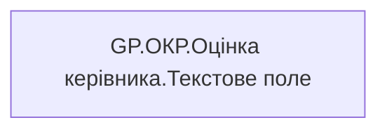

# GP.ОКР.Оцінка керівника.Текстове поле

*тека `Group_Profile\_Main\ОКР`*

## Технічний опис

| Властивість | Значення |
|---|---|
| Тип | міра |
| Home table | _Measures |
| displayFolder | `Group_Profile\_Main\ОКР` |
| formatString | — |
| dataType | — |
| Прихована | ні |

### DAX

```dax
VAR _rate_value = [GP.ОКР.Оцінка керівника.Значення]
VAR _color = [GP.ОКР.Оцінка керівника.Колір]
RETURN 
    --"Оцінка керівника - " &
    IF(
        ISBLANK(_rate_value),
        "Дані відсутні",
         _color & ", " & ROUND(_rate_value,2)
    )
```

### Джерела даних

—

### Залежності (таблиці й колонки)

—

### Схема



---

## Бізнес-суть

**Бізнес-назва:** Оцінка керівника

**Вимоги (ТЗ):**

- [Індивідуальний профіль працівника › Сторінка Результативність та оцінка › Блок Оцінка компетенцій](https://dev.azure.com/MHPITDepProjects/People%20Digital%20Profile%20%28PDP%29/_wiki/wikis/PDP.wiki?pagePath=/%D0%A4%D1%83%D0%BD%D0%BA%D1%86%D1%96%D0%BE%D0%BD%D0%B0%D0%BB%D1%8C%D0%BD%D1%96%20%D0%B2%D0%B8%D0%BC%D0%BE%D0%B3%D0%B8/%D0%92%D0%B8%D0%BC%D0%BE%D0%B3%D0%B8%20%D0%B4%D0%BE%20%D0%B7%D0%B2%D1%96%D1%82%D1%83%20People%20Digital%20Profile/%D0%86%D0%BD%D0%B4%D0%B8%D0%B2%D1%96%D0%B4%D1%83%D0%B0%D0%BB%D1%8C%D0%BD%D0%B8%D0%B9%20%D0%BF%D1%80%D0%BE%D1%84%D1%96%D0%BB%D1%8C%20%D0%BF%D1%80%D0%B0%D1%86%D1%96%D0%B2%D0%BD%D0%B8%D0%BA%D0%B0/%D0%A1%D1%82%D0%BE%D1%80%D1%96%D0%BD%D0%BA%D0%B0%20%D0%A0%D0%B5%D0%B7%D1%83%D0%BB%D1%8C%D1%82%D0%B0%D1%82%D0%B8%D0%B2%D0%BD%D1%96%D1%81%D1%82%D1%8C%20%D1%82%D0%B0%20%D0%BE%D1%86%D1%96%D0%BD%D0%BA%D0%B0/%D0%91%D0%BB%D0%BE%D0%BA%20%D0%9E%D1%86%D1%96%D0%BD%D0%BA%D0%B0%20%D0%BA%D0%BE%D0%BC%D0%BF%D0%B5%D1%82%D0%B5%D0%BD%D1%86%D1%96%D0%B9)
- [Командний профіль › Сторінка Результативність та оцінка команди › Блок Оцінка компетенцій (груповий профіль)](https://dev.azure.com/MHPITDepProjects/People%20Digital%20Profile%20%28PDP%29/_wiki/wikis/PDP.wiki?pagePath=/%D0%A4%D1%83%D0%BD%D0%BA%D1%86%D1%96%D0%BE%D0%BD%D0%B0%D0%BB%D1%8C%D0%BD%D1%96%20%D0%B2%D0%B8%D0%BC%D0%BE%D0%B3%D0%B8/%D0%92%D0%B8%D0%BC%D0%BE%D0%B3%D0%B8%20%D0%B4%D0%BE%20%D0%B7%D0%B2%D1%96%D1%82%D1%83%20People%20Digital%20Profile/%D0%9A%D0%BE%D0%BC%D0%B0%D0%BD%D0%B4%D0%BD%D0%B8%D0%B9%20%D0%BF%D1%80%D0%BE%D1%84%D1%96%D0%BB%D1%8C/%D0%A1%D1%82%D0%BE%D1%80%D1%96%D0%BD%D0%BA%D0%B0%20%D0%A0%D0%B5%D0%B7%D1%83%D0%BB%D1%8C%D1%82%D0%B0%D1%82%D0%B8%D0%B2%D0%BD%D1%96%D1%81%D1%82%D1%8C%20%D1%82%D0%B0%20%D0%BE%D1%86%D1%96%D0%BD%D0%BA%D0%B0%20%D0%BA%D0%BE%D0%BC%D0%B0%D0%BD%D0%B4%D0%B8/%D0%91%D0%BB%D0%BE%D0%BA%20%D0%9E%D1%86%D1%96%D0%BD%D0%BA%D0%B0%20%D0%BA%D0%BE%D0%BC%D0%BF%D0%B5%D1%82%D0%B5%D0%BD%D1%86%D1%96%D0%B9%20%28%D0%B3%D1%80%D1%83%D0%BF%D0%BE%D0%B2%D0%B8%D0%B9%20%D0%BF%D1%80%D0%BE%D1%84%D1%96%D0%BB%D1%8C%29)

## На сторінках звіту

- [Group Profile](../report/group-profile.md)

## Пов'язані міри

**Використовує:** [GP.ОКР.Оцінка керівника.Значення](../measures/gp-okr-otsinka-kerivnyka-znachennia.md), [GP.ОКР.Оцінка керівника.Колір](../measures/gp-okr-otsinka-kerivnyka-kolir.md)

## Нотатки

_порожньо_
