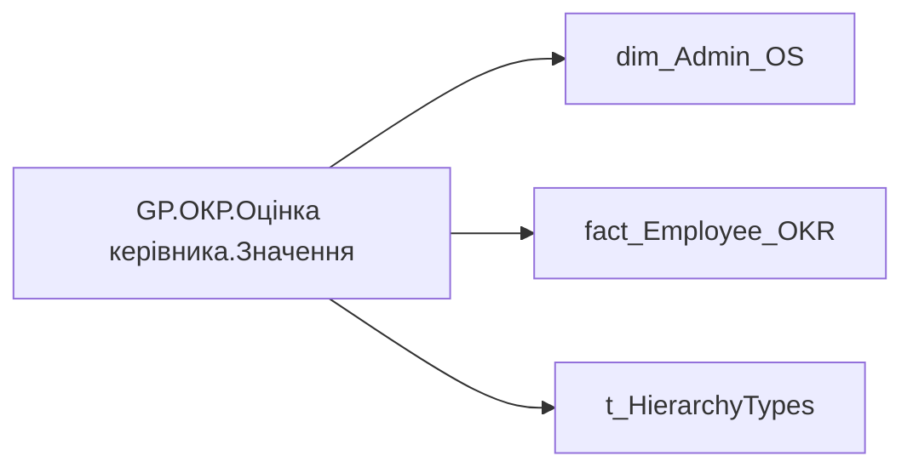

# GP.ОКР.Оцінка керівника.Значення

*тека `Group_Profile\_Main\ОКР`*

!!! abstract "Джерела даних"
    `DM.R27_fact_OKR_Goals`, `DM.vw_R27_dim_Employee_Access_List`

## Бізнес-суть

POSITION_CATEGORY_DETAIL → Деталізація категорії посади (внутрішня); POSITION_CATEGORY_DETAIL → Категорія посади; POSITION_CATEGORY_DETAIL → Категорія посади (внутрішня); POSITION_CATEGORY_DETAIL → Доля менеджерів серед всіх співробітників (%); CALC_PERFORMANCE_STR_RATE → Загальна оцінка ОКР; CALC_PERFORMANCE_STR_RATE → Загальна оцінка OKR; CALC_PERFORMANCE_STR_RATE → Оцінка OKR; PLAN_YEAR → Рік ОКР; PLAN_YEAR → Значення останнього року оцінки ОКР; PLAN_YEAR → Значення передостаннього  року оцінки ОКР

Поле завжди має значення, пусте поле не допускається Назва категорії посади Менеджери - це управлінські категорії.  <br>POSITION_CATEGORY_DETAIL in (Топ-менеджмент, Середній менеджмент, Старший менеджмент А+, Старший менеджмент А, Старший менеджмент В, Старший менеджмент С, Лінійні керівники) Останнє НЕ пусте актуальне значення на дату (date) поточного запису Останнє доступне значення станом на дату поточного запису, релевантне відповідній оцінці результативності. Значення останнього року оцінки ОКР визначати в залежності від того, які дані доступні на поточний момент. Наприклад, протягом 2025

**Вимоги:** `Індивідуальний-профіль-працівника/Історія-по-посадам`, `Індивідуальний-профіль-працівника/Історія-по-посадам/Реліз-1.-Історія-по-посадам`, `Індивідуальний-профіль-працівника/Паспортна-частина-індивідуального-профілю-співробітника`, `Індивідуальний-профіль-працівника/Паспортна-частина-індивідуального-профілю-співробітника/Сторінка-Картка-(паспорт)-працівника`, `Індивідуальний-профіль-працівника/Паспортна-частина-індивідуального-профілю-співробітника/Сторінка-Картка-(паспорт)-працівника/Редизайн-паспортної-частини`, `Індивідуальний-профіль-працівника/Сторінка-Загальна-інформація-про-працівника`, `Індивідуальний-профіль-працівника/Сторінка-Результативність-та-оцінка`, `Допоміжні-вітрини-для-звіту/Таблиця-для-розрахунку-агрегованих-метрик-по-звіту`, `Командний-профіль/Паспортна-частина-групового-профілю/Редизайн-паспортної-частини-групового-профілю`, `Командний-профіль/Сторінка-Ефективність`, `Командний-профіль/Сторінка-Моя-команда/ТЗ.-Деталізація-метрик-групового-профілю-звіту`, `Командний-профіль/Сторінка-Навчання-і-розвиток/Блок-Розвиток-сторінки-Навчання-і-розвиток`, `Командний-профіль/Сторінка-Плинність-та-Exits/ТЗ-на-вітрину-Exits`, `Командний-профіль/Сторінка-Результативність-та-оцінка-команди/Блок-Додаткові-інструменти`, `Командний-профіль/Сторінка-Результативність-та-оцінка-команди/Створити-блок-Виконання-OKR`

## На сторінках звіту

_Не використовується на основних сторінках звіту._

## Пов'язані міри

**Використовує:** [GP.ОКР.Останній рік](../measures/gp-okr-ostannii-rik.md)

**Використовується в:** [GP.ОКР.Оцінка керівника.Колір](../measures/gp-okr-otsinka-kerivnyka-kolir.md), [GP.ОКР.Оцінка керівника.Текстове поле](../measures/gp-okr-otsinka-kerivnyka-tekstove-pole.md)

---

## Технічний опис

| Властивість | Значення |
|---|---|
| Тип | міра |
| Home table | _Measures |
| displayFolder | `Group_Profile\_Main\ОКР` |
| formatString | — |
| dataType | — |
| Прихована | ні |

### DAX

```dax
//************* ROLE FILTERS **************
VAR _filter_lt = TREATAS(VALUES(dim_Admin_LT_OS[USER_ACCESS_ID]), 'dim_Admin_OS'[USER_ACCESS_ID])
VAR LastYear = [GP.ОКР.Останній рік]

--1. Якщо у вибірку для HR BP потрапляють керівники рівня N-1, то конкатинацію робити лише по категоріях посади Старший менеджмент А, Старший менеджмент А+ і Топ-менеджмент

VAR _sample_of_users = 
    CALCULATETABLE(
        VALUES('dim_Admin_OS'[USER_ACCESS_ID]),
        OR(
            'dim_Admin_OS'[POSITION_CATEGORY_DETAIL] IN {"Старший менеджмент А", "Старший менеджмент А+", "Топ-менеджмент"} && 'dim_Admin_OS'[path_length] = 2,
            dim_Admin_OS[path_length] > 2
        )
    )
VAR _sample_of_users_lt = 
    CALCULATETABLE(
        VALUES('dim_Admin_OS'[USER_ACCESS_ID]),
        OR(
            'dim_Admin_OS'[POSITION_CATEGORY_DETAIL] IN {"Старший менеджмент А", "Старший менеджмент А+", "Топ-менеджмент"} && 'dim_Admin_OS'[path_length] = 2,
            dim_Admin_OS[path_length] > 2
        ),
        _filter_lt
    )

--2. Визначення найвищого рівня ієрархії, за яким конкатенується атрибут

VAR _highest_ADMIN_hierarchy_level = CALCULATE(MINX('dim_Admin_OS', 'dim_Admin_OS'[path_length]))
VAR _highest_ADMIN_hierarchy_level_lt = CALCULATE(MINX('dim_Admin_OS', 'dim_Admin_OS'[path_length]))
VAR _highest_HRBP_hierarchy_level = CALCULATE(MINX('dim_Admin_OS', 'dim_Admin_OS'[path_length]),_sample_of_users)
VAR _highest_HRBP_hierarchy_level_lt = CALCULATE(MINX('dim_Admin_OS', 'dim_Admin_OS'[path_length]),_sample_of_users_lt)

--3. * *********** ADMIN *********** */

VAR _admin =
    CALCULATE(
        AVERAGE('fact_Employee_OKR'[CALC_PERFORMANCE_STR_RATE]),
        'fact_Employee_OKR'[PLAN_YEAR] = LastYear,
        'dim_Admin_OS'[path_length] = _highest_ADMIN_hierarchy_level
    )
VAR _admin_lt = 
    CALCULATE(
        AVERAGE('fact_Employee_OKR'[CALC_PERFORMANCE_STR_RATE]),
        'fact_Employee_OKR'[PLAN_YEAR] = LastYear,
        'dim_Admin_OS'[path_length] = _highest_ADMIN_hierarchy_level_lt,
        _filter_lt
    )

--4. /* *********** HRBP *********** */

VAR _HRBP =
    CALCULATE(
        AVERAGE('fact_Employee_OKR'[CALC_PERFORMANCE_STR_RATE]),
        'fact_Employee_OKR'[PLAN_YEAR] = LastYear,
        'dim_Admin_OS'[path_length] = _highest_HRBP_hierarchy_level,
        _sample_of_users
    )
VAR _HRBP_lt = 
    CALCULATE(
        AVERAGE('fact_Employee_OKR'[CALC_PERFORMANCE_STR_RATE]),
        'fact_Employee_OKR'[PLAN_YEAR] = LastYear,
        'dim_Admin_OS'[path_length] = _highest_HRBP_hierarchy_level_lt,
        _sample_of_users_lt
    )

--5. Визначення результату
VAR _res = 
    SWITCH(
        SELECTEDVALUE('t_HierarchyTypes'[Index]),
        0, 
        SWITCH(
            SELECTEDVALUE('dim_Admin_OS'[USER_ROLE]),
            "Адміністративний керівник", _admin_lt,
            "HRBP", _HRBP_lt
        ),
        1,
        SWITCH(
            SELECTEDVALUE('dim_Admin_OS'[USER_ROLE]),
            "Адміністративний керівник", _admin,
            "HRBP", _HRBP
        )
    )
RETURN ROUND(_res,2)
```

### Джерела даних

Вихідні таблиці: `DM.R27_fact_OKR_Goals`, `DM.vw_R27_dim_Employee_Access_List`

Колонки: `CALC_PERFORMANCE_STR_RATE`, `Index`, `PLAN_YEAR`, `POSITION_CATEGORY_DETAIL`, `USER_ACCESS_ID`, `USER_ROLE`, `path_length`

Power Query: `dim_Admin_OS`

### Залежності (таблиці й колонки)

Таблиці: `dim_Admin_OS`, `fact_Employee_OKR`, `t_HierarchyTypes`

Колонки: `dim_Admin_OS[POSITION_CATEGORY_DETAIL]`, `dim_Admin_OS[USER_ACCESS_ID]`, `dim_Admin_OS[USER_ROLE]`, `dim_Admin_OS[path_length]`, `fact_Employee_OKR[CALC_PERFORMANCE_STR_RATE]`, `fact_Employee_OKR[PLAN_YEAR]`, `t_HierarchyTypes[Index]`

### Схема



## Нотатки

_порожньо_
