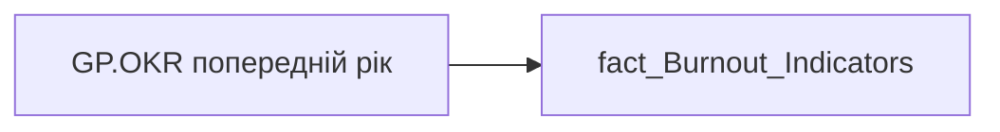

# GP.OKR  попередній рік

*тека `Group_Profile\_Main\SVG`*

## Технічний опис

| Властивість | Значення |
|---|---|
| Тип | міра |
| Home table | _Measures |
| displayFolder | `Group_Profile\_Main\SVG` |
| formatString | — |
| dataType | — |
| Прихована | ні |

### DAX

```dax
CALCULATE(
	SUM('fact_Burnout_Indicators'[OKR_PREV_YEAR_RATE]),
	TREATAS({[GP._Manager_ID]}, 'fact_Burnout_Indicators'[USER_ACCESS_ID])
)
```

### Джерела даних


Колонки: `OKR_PREV_YEAR_RATE`, `USER_ACCESS_ID`

Power Query: `fact_Burnout_Indicators`

### Залежності (таблиці й колонки)

Таблиці: `fact_Burnout_Indicators`

Колонки: `fact_Burnout_Indicators[OKR_PREV_YEAR_RATE]`, `fact_Burnout_Indicators[USER_ACCESS_ID]`

### Схема



---

## Бізнес-суть

### Опис із ТЗ

Для розрахунку метрики "Тренд OKR"

Ці дані виводяться в деталізацію по тренду оцінки ОКР

Тимчасово це буде коефіцієнт індивідуального бонусу, а не оцінка ОКР.   Визначається по показнику керівника цієї команди.   Якщо у керівника є ОКР, який було складено/оцінено по іншому кадровому підрозділу/організації, то такий ОКР  не відображається. Наприклад, керівник в 2023 році працював на іншому підприємстві чи підрозділі.

??? note "Поля-джерела та пов'язані бізнес-метрики (3)"
    | Поле | Бізнес-метрики |
    |---|---|
    | `OKR_PREV_YEAR_RATE` | OKR попередній рік · Значення коефіцієнта індивідуального бонусу за передостанній період · OKR команди за передостанній рік |

**Вимоги (ТЗ):**

- [Кейс Втрати Продуктивності Працівників › Деталізація метрик в кейсі Продуктивність](https://dev.azure.com/MHPITDepProjects/People%20Digital%20Profile%20%28PDP%29/_wiki/wikis/PDP.wiki?pagePath=/%D0%A4%D1%83%D0%BD%D0%BA%D1%86%D1%96%D0%BE%D0%BD%D0%B0%D0%BB%D1%8C%D0%BD%D1%96%20%D0%B2%D0%B8%D0%BC%D0%BE%D0%B3%D0%B8/%D0%92%D0%B8%D0%BC%D0%BE%D0%B3%D0%B8%20%D0%B4%D0%BE%20%D0%B7%D0%B2%D1%96%D1%82%D1%83%20People%20Digital%20Profile/%D0%9A%D0%B5%D0%B9%D1%81%20%D0%92%D1%82%D1%80%D0%B0%D1%82%D0%B8%20%D0%9F%D1%80%D0%BE%D0%B4%D1%83%D0%BA%D1%82%D0%B8%D0%B2%D0%BD%D0%BE%D1%81%D1%82%D1%96%20%D0%9F%D1%80%D0%B0%D1%86%D1%96%D0%B2%D0%BD%D0%B8%D0%BA%D1%96%D0%B2/%D0%94%D0%B5%D1%82%D0%B0%D0%BB%D1%96%D0%B7%D0%B0%D1%86%D1%96%D1%8F%20%D0%BC%D0%B5%D1%82%D1%80%D0%B8%D0%BA%20%D0%B2%20%D0%BA%D0%B5%D0%B9%D1%81%D1%96%20%D0%9F%D1%80%D0%BE%D0%B4%D1%83%D0%BA%D1%82%D0%B8%D0%B2%D0%BD%D1%96%D1%81%D1%82%D1%8C)
- [Кейс Утримання працівників › Опис джерел для сторінки %22Кейс звільнення (вигорання)%22](https://dev.azure.com/MHPITDepProjects/People%20Digital%20Profile%20%28PDP%29/_wiki/wikis/PDP.wiki?pagePath=/%D0%A4%D1%83%D0%BD%D0%BA%D1%86%D1%96%D0%BE%D0%BD%D0%B0%D0%BB%D1%8C%D0%BD%D1%96%20%D0%B2%D0%B8%D0%BC%D0%BE%D0%B3%D0%B8/%D0%92%D0%B8%D0%BC%D0%BE%D0%B3%D0%B8%20%D0%B4%D0%BE%20%D0%B7%D0%B2%D1%96%D1%82%D1%83%20People%20Digital%20Profile/%D0%9A%D0%B5%D0%B9%D1%81%20%D0%A3%D1%82%D1%80%D0%B8%D0%BC%D0%B0%D0%BD%D0%BD%D1%8F%20%D0%BF%D1%80%D0%B0%D1%86%D1%96%D0%B2%D0%BD%D0%B8%D0%BA%D1%96%D0%B2/%D0%9E%D0%BF%D0%B8%D1%81%20%D0%B4%D0%B6%D0%B5%D1%80%D0%B5%D0%BB%20%D0%B4%D0%BB%D1%8F%20%D1%81%D1%82%D0%BE%D1%80%D1%96%D0%BD%D0%BA%D0%B8%20%2522%D0%9A%D0%B5%D0%B9%D1%81%20%D0%B7%D0%B2%D1%96%D0%BB%D1%8C%D0%BD%D0%B5%D0%BD%D0%BD%D1%8F%20%28%D0%B2%D0%B8%D0%B3%D0%BE%D1%80%D0%B0%D0%BD%D0%BD%D1%8F%29%2522)
- [Командний профіль › Паспортна частина групового профілю › Додати інформацію про ОКР команди та середню оцінку результативності по команді](https://dev.azure.com/MHPITDepProjects/People%20Digital%20Profile%20%28PDP%29/_wiki/wikis/PDP.wiki?pagePath=/%D0%A4%D1%83%D0%BD%D0%BA%D1%86%D1%96%D0%BE%D0%BD%D0%B0%D0%BB%D1%8C%D0%BD%D1%96%20%D0%B2%D0%B8%D0%BC%D0%BE%D0%B3%D0%B8/%D0%92%D0%B8%D0%BC%D0%BE%D0%B3%D0%B8%20%D0%B4%D0%BE%20%D0%B7%D0%B2%D1%96%D1%82%D1%83%20People%20Digital%20Profile/%D0%9A%D0%BE%D0%BC%D0%B0%D0%BD%D0%B4%D0%BD%D0%B8%D0%B9%20%D0%BF%D1%80%D0%BE%D1%84%D1%96%D0%BB%D1%8C/%D0%9F%D0%B0%D1%81%D0%BF%D0%BE%D1%80%D1%82%D0%BD%D0%B0%20%D1%87%D0%B0%D1%81%D1%82%D0%B8%D0%BD%D0%B0%20%D0%B3%D1%80%D1%83%D0%BF%D0%BE%D0%B2%D0%BE%D0%B3%D0%BE%20%D0%BF%D1%80%D0%BE%D1%84%D1%96%D0%BB%D1%8E/%D0%94%D0%BE%D0%B4%D0%B0%D1%82%D0%B8%20%D1%96%D0%BD%D1%84%D0%BE%D1%80%D0%BC%D0%B0%D1%86%D1%96%D1%8E%20%D0%BF%D1%80%D0%BE%20%D0%9E%D0%9A%D0%A0%20%D0%BA%D0%BE%D0%BC%D0%B0%D0%BD%D0%B4%D0%B8%20%D1%82%D0%B0%20%D1%81%D0%B5%D1%80%D0%B5%D0%B4%D0%BD%D1%8E%20%D0%BE%D1%86%D1%96%D0%BD%D0%BA%D1%83%20%D1%80%D0%B5%D0%B7%D1%83%D0%BB%D1%8C%D1%82%D0%B0%D1%82%D0%B8%D0%B2%D0%BD%D0%BE%D1%81%D1%82%D1%96%20%D0%BF%D0%BE%20%D0%BA%D0%BE%D0%BC%D0%B0%D0%BD%D0%B4%D1%96)

## На сторінках звіту

_Не використовується на основних сторінках звіту._

## Пов'язані міри

**Використовує:** [GP._Manager_ID](../measures/gp-manager-id.md)

**Використовується в:** [GP.OKR пусто](../measures/gp-okr-pusto.md), [GP.SVG.OKR команди](../measures/gp-svg-okr-komandy.md)

## Нотатки

_порожньо_
