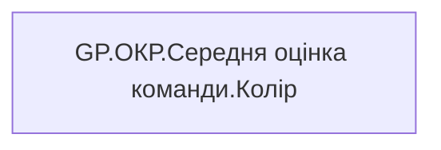

# GP.ОКР.Середня оцінка команди.Колір

| Властивість | Значення |
|---|---|
| Тип | міра |
| Home table | _Measures |
| displayFolder | `Group_Profile\_Main\ОКР` |
| formatString | — |
| dataType | — |
| Прихована | ні |

## DAX

```dax
VAR _res = IF(ISBLANK([GP.ОКР.Середня оцінка команди.Значення]), -1, [GP.ОКР.Середня оцінка команди.Значення])

VAR _color = 
SWITCH(
    TRUE(),
    _res >= 101, "Суперзелений",
    _res >= 91, "Зелений",
    _res >= 75, "Жовто-Зелений",
    _res >= 50, "Жовтий",
    _res >= 25, "Жовто-червоний",
    _res >= 0, "Червоний",
    "Неоціненно")

RETURN  _color 
```

## Джерела

—

## Бізнес-суть

!!! warning "Без бізнес-визначення"
    Поля міри не знайдено у wiki «Таблицях джерел даних». Заповніть `manualNotes`.

## Залежності

Міри: [GP.ОКР.Середня оцінка команди.Значення](../measures/gp-okr-serednia-otsinka-komandy-znachennia.md)


## Схема



## Нотатки

_порожньо_
