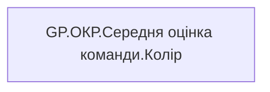

# GP.ОКР.Середня оцінка команди.Колір

*тека `Group_Profile\_Main\ОКР`*

## Технічний опис

| Властивість | Значення |
|---|---|
| Тип | міра |
| Home table | _Measures |
| displayFolder | `Group_Profile\_Main\ОКР` |
| formatString | — |
| dataType | — |
| Прихована | ні |

### DAX

```dax
VAR _res = IF(ISBLANK([GP.ОКР.Середня оцінка команди.Значення]), -1, [GP.ОКР.Середня оцінка команди.Значення])

VAR _color = 
SWITCH(
    TRUE(),
    _res >= 101, "Суперзелений",
    _res >= 91, "Зелений",
    _res >= 75, "Жовто-Зелений",
    _res >= 50, "Жовтий",
    _res >= 25, "Жовто-червоний",
    _res >= 0, "Червоний",
    "Неоціненно")

RETURN  _color 
```

### Джерела даних

—

### Залежності (таблиці й колонки)

—

### Схема



---

## Бізнес-суть

!!! note "Бізнес-визначення відсутнє"
    Поля міри не зіставлено з wiki «Таблицями джерел даних». Можна заповнити вручну в `manualNotes`.

## На сторінках звіту

_Не використовується на основних сторінках звіту._

## Пов'язані міри

**Використовує:** [GP.ОКР.Середня оцінка команди.Значення](../measures/gp-okr-serednia-otsinka-komandy-znachennia.md)

**Використовується в:** [GP.OKP.Color.Середня оцінка комади.Текстове поле](../measures/gp-okp-color-serednia-otsinka-komady-tekstove-pole.md), [GP.ОКР.Середня оцінка команди.Текстове поле](../measures/gp-okr-serednia-otsinka-komandy-tekstove-pole.md)

## Нотатки

_порожньо_
