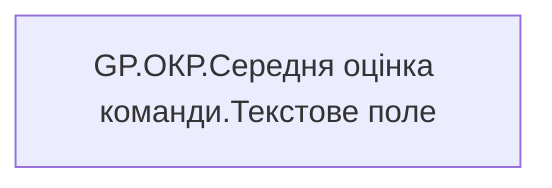

# GP.ОКР.Середня оцінка команди.Текстове поле

| Властивість | Значення |
|---|---|
| Тип | міра |
| Home table | _Measures |
| displayFolder | `Group_Profile\_Main\ОКР` |
| formatString | — |
| dataType | — |
| Прихована | ні |

## DAX

```dax
VAR _rate_value = [GP.ОКР.Середня оцінка команди.Значення]

VAR _color = [GP.ОКР.Середня оцінка команди.Колір]
RETURN 
    IF(
        ISBLANK(_rate_value),
        "Дані відсутні",
         _color & ", " & TRIM(_rate_value)
    )
```

## Джерела

—

## Бізнес-суть

!!! warning "Без бізнес-визначення"
    Поля міри не знайдено у wiki «Таблицях джерел даних». Заповніть `manualNotes`.

## Залежності

Міри: [GP.ОКР.Середня оцінка команди.Значення](../measures/gp-okr-serednia-otsinka-komandy-znachennia.md), [GP.ОКР.Середня оцінка команди.Колір](../measures/gp-okr-serednia-otsinka-komandy-kolir.md)


## Схема



## Нотатки

_порожньо_
