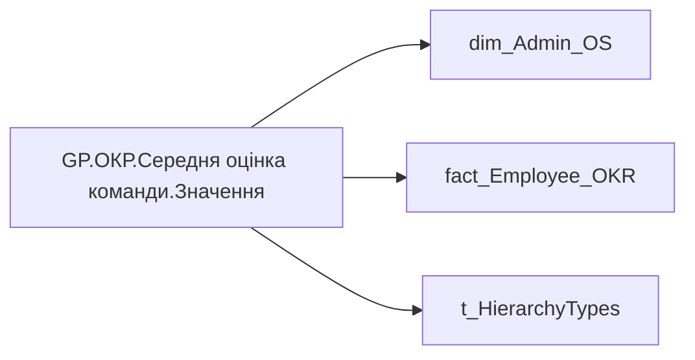

# GP.ОКР.Середня оцінка команди.Значення

| Властивість | Значення |
|---|---|
| Тип | міра |
| Home table | _Measures |
| displayFolder | `Group_Profile\_Main\ОКР` |
| formatString | — |
| dataType | — |
| Прихована | ні |

## DAX

```dax
//************* ROLE FILTERS **************
VAR _filter_lt = TREATAS(VALUES(dim_Admin_LT_OS[USER_ACCESS_ID]), 'dim_Admin_OS'[USER_ACCESS_ID])

VAR LastYears = [GP.ОКР.Останній рік]
    // SUMMARIZE(
    //     'fact_Employee_OKR', 
    //     'fact_Employee_OKR'[USER_ACCESS_ID], 
    //     "MaxYear", MAX('fact_Employee_OKR'[PLAN_YEAR])
    // )
/* *********** ADMIN *********** */
VAR _admin = 
    CALCULATE(
            AVERAGE('fact_Employee_OKR'[CALC_PERFORMANCE_STR_RATE]),
            'fact_Employee_OKR'[PLAN_YEAR] = LastYears
            // TREATAS(LastYearsPerPerson, 'fact_Employee_OKR'[USER_ACCESS_ID], 'fact_Employee_OKR'[PLAN_YEAR])
        )

/* *********** ADMIN LT *********** */
VAR _admin_lt = 
    CALCULATE(
            AVERAGE('fact_Employee_OKR'[CALC_PERFORMANCE_STR_RATE]),
            'fact_Employee_OKR'[PLAN_YEAR] = LastYears,
            // TREATAS(LastYearsPerPerson, 'fact_Employee_OKR'[USER_ACCESS_ID], 'fact_Employee_OKR'[PLAN_YEAR]),
            _filter_lt
        )

/* *********** RESULT *********** */
VAR _res = 
	SWITCH(
		SELECTEDVALUE( t_HierarchyTypes[Index] ),
		0, _admin_lt,
		1, _admin
	)

RETURN
ROUND(_res, 2)
```

## Джерела

Вихідні таблиці: `DM.R27_fact_OKR_Goals`, `DM.vw_R27_dim_Employee_Access_List`

Колонки: `CALC_PERFORMANCE_STR_RATE`, `Index`, `PLAN_YEAR`, `USER_ACCESS_ID`

Power Query: `dim_Admin_OS`

## Бізнес-суть

CALC_PERFORMANCE_STR_RATE → Загальна оцінка ОКР; CALC_PERFORMANCE_STR_RATE → Загальна оцінка OKR; CALC_PERFORMANCE_STR_RATE → Оцінка OKR; PLAN_YEAR → Рік ОКР; PLAN_YEAR → Значення останнього року оцінки ОКР; PLAN_YEAR → Значення передостаннього  року оцінки ОКР

Останнє НЕ пусте актуальне значення на дату (date) поточного запису Останнє доступне значення станом на дату поточного запису, релевантне відповідній оцінці результативності. Значення останнього року оцінки ОКР визначати в залежності від того, які дані доступні на поточний момент. Наприклад, протягом 2025 року в оцінку брати коефіцієнт індивідуального бонусу працівника за 2023-2024 роки, бо за 2025 рік оцінки ще немає. Тому останній рік буде 2024. На початку 2026 року, коли з'являться результати оцінки ОКР за 2025 рік, потрібно буде змістити період і брати 2025 рік.  <br>  <br>Для того, що виз

**Вимоги:** `Індивідуальний-профіль-працівника/Історія-по-посадам`, `Індивідуальний-профіль-працівника/Історія-по-посадам/Реліз-1.-Історія-по-посадам`, `Індивідуальний-профіль-працівника/Паспортна-частина-індивідуального-профілю-співробітника`, `Індивідуальний-профіль-працівника/Паспортна-частина-індивідуального-профілю-співробітника/Сторінка-Картка-(паспорт)-працівника/Редизайн-паспортної-частини`, `Індивідуальний-профіль-працівника/Сторінка-Результативність-та-оцінка`, `Допоміжні-вітрини-для-звіту/Таблиця-для-розрахунку-агрегованих-метрик-по-звіту`, `Командний-профіль/Паспортна-частина-групового-профілю/Редизайн-паспортної-частини-групового-профілю`, `Командний-профіль/Сторінка-Моя-команда/ТЗ.-Деталізація-метрик-групового-профілю-звіту`, `Командний-профіль/Сторінка-Результативність-та-оцінка-команди/Створити-блок-Виконання-OKR`

## Залежності

Міри: [GP.ОКР.Останній рік](../measures/gp-okr-ostannii-rik.md)

Таблиці: `dim_Admin_OS`, `fact_Employee_OKR`, `t_HierarchyTypes`

Колонки: `dim_Admin_OS[USER_ACCESS_ID]`, `fact_Employee_OKR[CALC_PERFORMANCE_STR_RATE]`, `fact_Employee_OKR[PLAN_YEAR]`, `fact_Employee_OKR[USER_ACCESS_ID]`, `t_HierarchyTypes[Index]`

## Схема



## Нотатки

_порожньо_
