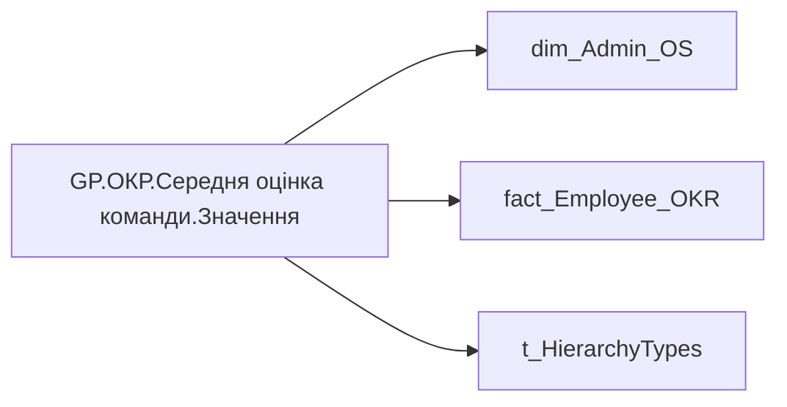

# GP.ОКР.Середня оцінка команди.Значення

*тека `Group_Profile\_Main\ОКР`*

## Технічний опис

| Властивість | Значення |
|---|---|
| Тип | міра |
| Home table | _Measures |
| displayFolder | `Group_Profile\_Main\ОКР` |
| formatString | — |
| dataType | — |
| Прихована | ні |

### DAX

```dax
//************* ROLE FILTERS **************
VAR _filter_lt = TREATAS(VALUES(dim_Admin_LT_OS[USER_ACCESS_ID]), 'dim_Admin_OS'[USER_ACCESS_ID])

VAR LastYears = [GP.ОКР.Останній рік]
    // SUMMARIZE(
    //     'fact_Employee_OKR', 
    //     'fact_Employee_OKR'[USER_ACCESS_ID], 
    //     "MaxYear", MAX('fact_Employee_OKR'[PLAN_YEAR])
    // )
/* *********** ADMIN *********** */
VAR _admin = 
    CALCULATE(
            AVERAGE('fact_Employee_OKR'[CALC_PERFORMANCE_STR_RATE]),
            'fact_Employee_OKR'[PLAN_YEAR] = LastYears
            // TREATAS(LastYearsPerPerson, 'fact_Employee_OKR'[USER_ACCESS_ID], 'fact_Employee_OKR'[PLAN_YEAR])
        )

/* *********** ADMIN LT *********** */
VAR _admin_lt = 
    CALCULATE(
            AVERAGE('fact_Employee_OKR'[CALC_PERFORMANCE_STR_RATE]),
            'fact_Employee_OKR'[PLAN_YEAR] = LastYears,
            // TREATAS(LastYearsPerPerson, 'fact_Employee_OKR'[USER_ACCESS_ID], 'fact_Employee_OKR'[PLAN_YEAR]),
            _filter_lt
        )

/* *********** RESULT *********** */
VAR _res = 
	SWITCH(
		SELECTEDVALUE( t_HierarchyTypes[Index] ),
		0, _admin_lt,
		1, _admin
	)

RETURN
ROUND(_res, 2)
```

### Джерела даних

Вихідні таблиці: `DM.R27_fact_OKR_Goals`, `DM.vw_R27_dim_Employee_Access_List`

Колонки: `CALC_PERFORMANCE_STR_RATE`, `Index`, `PLAN_YEAR`, `USER_ACCESS_ID`

Power Query: `dim_Admin_OS`

### Залежності (таблиці й колонки)

Таблиці: `dim_Admin_OS`, `fact_Employee_OKR`, `t_HierarchyTypes`

Колонки: `dim_Admin_OS[USER_ACCESS_ID]`, `fact_Employee_OKR[CALC_PERFORMANCE_STR_RATE]`, `fact_Employee_OKR[PLAN_YEAR]`, `fact_Employee_OKR[USER_ACCESS_ID]`, `t_HierarchyTypes[Index]`

### Схема



---

## Бізнес-суть

!!! note "Бізнес-визначення відсутнє"
    Поля міри не зіставлено з wiki «Таблицями джерел даних». Можна заповнити вручну в `manualNotes`.

## На сторінках звіту

_Не використовується на основних сторінках звіту._

## Пов'язані міри

**Використовує:** [GP.ОКР.Останній рік](../measures/gp-okr-ostannii-rik.md)

**Використовується в:** [GP.ОКР.Середня Оцінка.Formated](../measures/gp-okr-serednia-otsinka-formated.md), [GP.ОКР.Середня оцінка команди.Колір](../measures/gp-okr-serednia-otsinka-komandy-kolir.md), [GP.ОКР.Середня оцінка команди.Текстове поле](../measures/gp-okr-serednia-otsinka-komandy-tekstove-pole.md)

## Нотатки

_порожньо_
