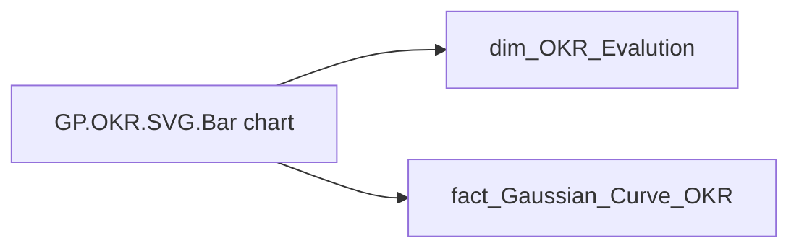

# GP.OKR.SVG.Bar chart

*тека `Group_Profile\_Main\ОКР\SVG`*

## Технічний опис

| Властивість | Значення |
|---|---|
| Тип | міра |
| Home table | _Measures |
| displayFolder | `Group_Profile\_Main\ОКР\SVG` |
| formatString | — |
| dataType | — |
| Прихована | ні |

### DAX

```dax
-- === НАЛАШТУВАННЯ РОЗМІРІВ ===
VAR _CanvasWidth = 440
VAR _CanvasHeight = 164
VAR _HalfBar = 16
VAR _TopMargin = 15
VAR _BottomMargin = 30
VAR _ChartTop = _TopMargin + 15 + _HalfBar
VAR _ChartBottom = _CanvasHeight - _BottomMargin
VAR _MaxBarHeight = _ChartBottom - _ChartTop
VAR _ZeroLineY = _ChartBottom - _HalfBar

-- === ОБЧИСЛЕННЯ (ФАКТ - БАРИ) ===
VAR _TotalEmployees = CALCULATE([GP.ОКР.Кількість співробітників (Останній період оцінки)], ALL('dim_OKR_Evalution'))

-- === ОБЧИСЛЕННЯ (ГАУС - КРИВА) ===
VAR _TotalGaussian = CALCULATE(SUM('fact_Gaussian_Curve_OKR'[EMPLOYEE_COUNT]), ALL('fact_Gaussian_Curve_OKR'))

VAR _Data = 
    ADDCOLUMNS(
        SUMMARIZE('dim_OKR_Evalution', 'dim_OKR_Evalution'[CALC_PERFORMANCE_DESC_RATE]), 
        
        "EmpCount", [GP.ОКР.Кількість співробітників (Останній період оцінки)],
        "ValuePct", DIVIDE([GP.ОКР.Кількість співробітників (Останній період оцінки)], _TotalEmployees, 0),
        
        "CurvePct", 
            VAR _GaussCategory = CALCULATE(SELECTEDVALUE('dim_OKR_Evalution'[CALC_PERFORMANCE_DESC_RATE]))
            RETURN DIVIDE(
                CALCULATE(
                    SUM('fact_Gaussian_Curve_OKR'[EMPLOYEE_COUNT]),
                    'fact_Gaussian_Curve_OKR'[CALC_PERFORMANCE_DESC_RATE] = _GaussCategory,
                    ALL('fact_Gaussian_Curve_OKR')
                ),
                _TotalGaussian, 
                0
            ),
        
        "SortOrder", SWITCH('dim_OKR_Evalution'[CALC_PERFORMANCE_DESC_RATE],
            "Супер зелений", 1, "Зелений", 2, "Жовто-зелений", 3, "Жовтий", 4, "Жовто-червоний", 5, "Червоний", 6, 7)
    )

VAR _MaxPctInGroup = 1 
VAR _CountItems = COUNTROWS(_Data)
VAR _BarWidth = _HalfBar * 2
VAR _Gap = ROUND((_CanvasWidth - _BarWidth * _CountItems) / (_CountItems + 1), 0)

-- === СТИЛІ ===
VAR _ColorText = "#1F4E79"
VAR _ColorLine = "#94C0FF"

-- === ПІДГОТОВКА ТОЧОК ===
VAR _Points = 
    ADDCOLUMNS(
        _Data,
        "X", _Gap + ([SortOrder] - 1) * (_BarWidth + _Gap) + (_BarWidth / 2),
        "Y_Bar", _ZeroLineY - (_MaxBarHeight * DIVIDE([ValuePct], _MaxPctInGroup, 0)),
        "Y_Curve", _ZeroLineY - (_MaxBarHeight * DIVIDE([CurvePct], _MaxPctInGroup, 0))
    )

-- === ГЕНЕРАЦІЯ ШЛЯХУ КРИВОЇ ===
VAR _PathDefinition = 
    CONCATENATEX(
        _Points,
        VAR _Idx = [SortOrder]
        VAR _X0 = [X]
        VAR _Y0 = [Y_Curve]
        VAR _X1 = MAXX(FILTER(_Points, [SortOrder] = _Idx + 1), [X])
        VAR _Y1 = MAXX(FILTER(_Points, [SortOrder] = _Idx + 1), [Y_Curve])
        VAR _X_1 = MAXX(FILTER(_Points, [SortOrder] = _Idx - 1), [X])
        VAR _Y_1 = MAXX(FILTER(_Points, [SortOrder] = _Idx - 1), [Y_Curve])
        VAR _X2 = MAXX(FILTER(_Points, [SortOrder] = _Idx + 2), [X])
        VAR _Y2 = MAXX(FILTER(_Points, [SortOrder] = _Idx + 2), [Y_Curve])
        VAR _P_1_X = IF(ISBLANK(_X_1), _X0, _X_1)
        VAR _P_1_Y = IF(ISBLANK(_Y_1), _Y0, _Y_1)
        VAR _P2_X = IF(ISBLANK(_X2), _X1, _X2)
        VAR _P2_Y = IF(ISBLANK(_Y2), _Y1, _Y2)
        VAR _CP1_X = _X0 + (_X1 - _P_1_X) / 6
        VAR _CP1_Y = _Y0 + (_Y1 - _P_1_Y) / 6
        VAR _CP2_X = _X1 - (_P2_X - _X0) / 6
        VAR _CP2_Y = _Y1 - (_P2_Y - _Y0) / 6
        RETURN 
            IF(_Idx = 1, "M " & _X0 & " " & _Y0 & " ", "") & 
            IF(_Idx < _CountItems, 
                "C " & _CP1_X & " " & _CP1_Y & ", " & _CP2_X & " " & _CP2_Y & ", " & _X1 & " " & _Y1 & " ", 
                ""
            ),
        "", [SortOrder], ASC
    )

VAR _FirstX = MAXX(FILTER(_Points, [SortOrder] = 1), [X])
VAR _LastX  = MAXX(FILTER(_Points, [SortOrder] = _CountItems), [X])

-- === ГЕНЕРАЦІЯ БАРІВ З TOOLTIP ===
VAR _BarsSVG = 
    CONCATENATEX(
        _Points,
        VAR _CurrentPct = [ValuePct]
        VAR _CurrentCount = [EmpCount]
        VAR _CurrentCurve = [CurvePct]
        VAR _CatName = 'dim_OKR_Evalution'[CALC_PERFORMANCE_DESC_RATE]
        
        VAR _ColorFill = SWITCH(_CatName,
            "Супер зелений", "#009051",
            "Зелений", "#02BD3D",
            "Жовто-зелений", "#C2E330",
            "Жовтий", "#FFE521",
            "Жовто-червоний", "#FF7E0D",
            "Червоний", "#F23711",
            "#CDE58E"
        )
        
        VAR _Line1 = SWITCH(_CatName, "Супер зелений", "Супер", "Жовто-зелений", "Жовто-", "Жовто-червоний", "Жовто-", _CatName)
        VAR _Line2 = SWITCH(_CatName, "Супер зелений", "зелений", "Жовто-зелений", "зелений", "Жовто-червоний", "червоний", "")
        
        VAR _XPos = [X]
        VAR _Y_Top_Fill = [Y_Bar]
        
        VAR _LabelValue = FORMAT(_CurrentPct, "0.0%") 
        VAR _LabelY = _Y_Top_Fill - _HalfBar - 3
        
        VAR _TooltipText = 
            _CatName & UNICHAR(10) & 
            "К-ть працівників: " & FORMAT(_CurrentCount, "#,0") & UNICHAR(10) & 
            "Факт: " & FORMAT(_CurrentPct, "0.0%") & UNICHAR(10) & 
            "Крива (Гаус): " & FORMAT(_CurrentCurve, "0.0%")

        RETURN 
        "<g>" &
            "<title>" & _TooltipText & "</title>" &
            "<rect x='" & (_XPos - _BarWidth/2) & "' y='0' width='" & _BarWidth & "' height='" & _CanvasHeight & "' fill='transparent' />" &
            IF(_CurrentPct > 0, 
                "<line x1='" & _XPos & "' y1='" & _ZeroLineY & "' x2='" & _XPos & "' y2='" & _Y_Top_Fill & "' 
                       stroke='" & _ColorFill & "' stroke-width='" & _BarWidth & "' stroke-linecap='round' />",
                "") &
            "<text x='" & _XPos & "' y='" & _LabelY & "' text-anchor='middle' font-family='Segoe UI' font-weight='bold' font-size='11' fill='" & _ColorText & "'>" & _LabelValue & "</text>" &
            "<text x='" & _XPos & "' y='" & (_ZeroLineY + _HalfBar + 11) & "' text-anchor='middle' font-family='Segoe UI' font-size='9' fill='" & _ColorText & "'>" & 
                   "<tspan x='" & _XPos & "' dy='0'>" & _Line1 & "</tspan>" &
                   "<tspan x='" & _XPos & "' dy='1.1em'>" & _Line2 & "</tspan>" &
            "</text>" &
        "</g>",
        "", [SortOrder], ASC
    )

RETURN
"<svg xmlns='http://www.w3.org/2000/svg' viewBox='0 0 " & _CanvasWidth & " " & _CanvasHeight & "' overflow='hidden'>" &
    "<path d='" & _PathDefinition & " L " & _LastX & " " & _ZeroLineY & " L " & _FirstX & " " & _ZeroLineY & " Z' 
           fill='" & _ColorLine & "' fill-opacity='0.2' stroke='none' />" &
    _BarsSVG &
    "<path d='" & _PathDefinition & "' 
           fill='none' stroke='" & _ColorLine & "' stroke-width='3' stroke-linecap='round' />" &
"</svg>"
```

### Джерела даних

Вихідні таблиці: `DM.R27_fact_OKR_Goals`

Колонки: `CALC_PERFORMANCE_DESC_RATE`, `EMPLOYEE_COUNT`

Power Query: `dim_OKR_Evalution`

### Залежності (таблиці й колонки)

Таблиці: `dim_OKR_Evalution`, `fact_Gaussian_Curve_OKR`

Колонки: `dim_OKR_Evalution[CALC_PERFORMANCE_DESC_RATE]`, `fact_Gaussian_Curve_OKR[CALC_PERFORMANCE_DESC_RATE]`, `fact_Gaussian_Curve_OKR[EMPLOYEE_COUNT]`

### Схема



---

## Бізнес-суть

!!! note "Бізнес-визначення відсутнє"
    Поля міри не зіставлено з wiki «Таблицями джерел даних». Можна заповнити вручну в `manualNotes`.

## На сторінках звіту

[Group Profile](../report/group-profile.md)

## Пов'язані міри

**Використовує:** [GP.ОКР.Кількість співробітників (Останній період оцінки)](../measures/gp-okr-kilkist-spivrobitnykiv-ostannii-period-otsinky.md)

## Нотатки

_порожньо_
