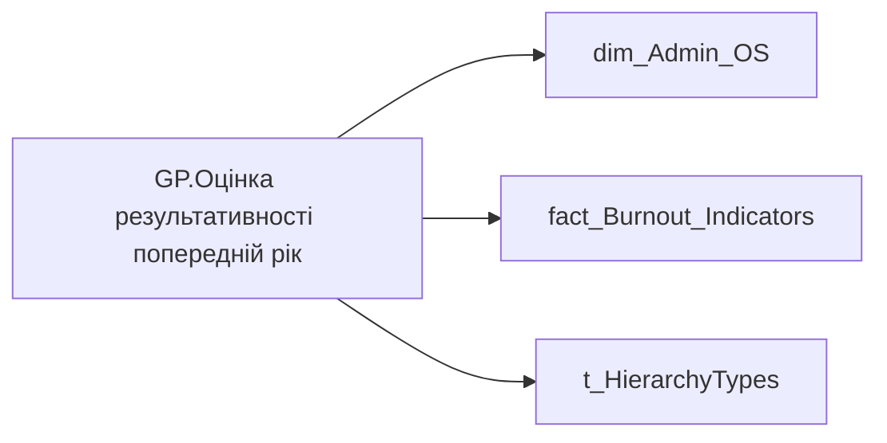

# GP.Оцінка результативності попередній рік

*тека `Group_Profile\_Main\SVG`*

## Технічний опис

| Властивість | Значення |
|---|---|
| Тип | міра |
| Home table | _Measures |
| displayFolder | `Group_Profile\_Main\SVG` |
| formatString | — |
| dataType | — |
| Прихована | ні |

### DAX

```dax
//************* ROLE FILTERS **************
VAR _roleIndex = SELECTEDVALUE ( 't_HierarchyTypes'[Index], 1 )   -- 0 = LT, 1 = Admin
VAR _filter_lt = TREATAS ( VALUES ( 'dim_Admin_LT_OS'[USER_ACCESS_ID] ),'dim_Admin_OS'[USER_ACCESS_ID] )

/* *********** ADMIN *********** */
VAR _admin = 
	CALCULATE(
		AVERAGEX(
			VALUES('dim_Admin_OS'[USER_ACCESS_ID]),
			CALCULATE(
				SUM('fact_Burnout_Indicators'[PREV_YEAR_PERFORMANCE_DESC_RATE])
			)
		)
	)

/* *********** LT *********** */
VAR _admin_lt =
	CALCULATE(
		AVERAGEX(
			VALUES('dim_Admin_OS'[USER_ACCESS_ID]),
			CALCULATE(
				SUM('fact_Burnout_Indicators'[PREV_YEAR_PERFORMANCE_DESC_RATE])
			)
		),
		_filter_lt
	)

VAR _res =
	SWITCH (
		_roleIndex,
		0, _admin_lt,    -- LT
		1, _admin,       -- Admin
		_admin
	)
RETURN _res
```

### Джерела даних

Вихідні таблиці: `DM.vw_R27_dim_Employee_Access_List`

Колонки: `Index`, `PREV_YEAR_PERFORMANCE_DESC_RATE`, `USER_ACCESS_ID`

Power Query: `dim_Admin_OS`

### Залежності (таблиці й колонки)

Таблиці: `dim_Admin_OS`, `fact_Burnout_Indicators`, `t_HierarchyTypes`

Колонки: `dim_Admin_LT_OS[USER_ACCESS_ID]`, `dim_Admin_OS[USER_ACCESS_ID]`, `fact_Burnout_Indicators[PREV_YEAR_PERFORMANCE_DESC_RATE]`, `t_HierarchyTypes[Index]`

### Схема



---

## Бізнес-суть

!!! note "Бізнес-визначення відсутнє"
    Поля міри не зіставлено з wiki «Таблицями джерел даних». Можна заповнити вручну в `manualNotes`.

## На сторінках звіту

_Не використовується на основних сторінках звіту._

## Пов'язані міри

**Використовується в:** [GP.SVG.Оцінка результативності команди](../measures/gp-svg-otsinka-rezultatyvnosti-komandy.md), [GP.Оцінка результативності пусто](../measures/gp-otsinka-rezultatyvnosti-pusto.md)

## Нотатки

_порожньо_
